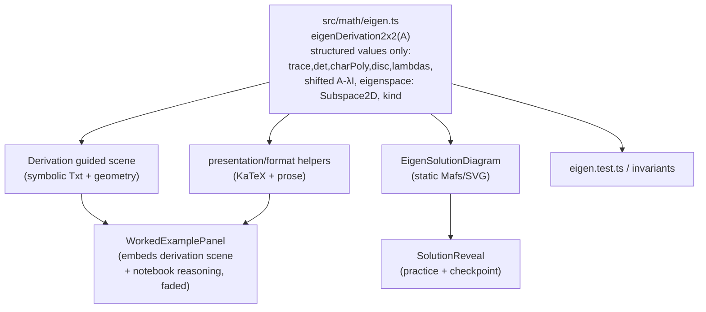

# Chapter 1 Expansion - Lesson 4 (Eigenvectors) first

Grounds the pedagogy in [docs/INTERACTIVE_TEXTBOOK_VISION.md](docs/INTERACTIVE_TEXTBOOK_VISION.md). Lesson 4 is the reference implementation because it has the widest gap between conceptual understanding (the current scene teaches "directions that stay on their line") and computational fluency (no ladder from `Av=λv` to actual eigenvalues/eigenspaces).

Design decisions confirmed: (1) the derivation ladder is a **new dedicated guided scene**, but it is **embedded as the visual core of the first worked example** (not a separate second Watch block), so the animation and the symbolic notebook reasoning read as one object; (2) solution/reveal visuals are **lightweight static diagrams driven by `src/math`**, not Motion Canvas.

Guardrails honored throughout: `src/math` stays the only source of truth and returns **structured mathematical values only** - no KaTeX/prose in the math layer (formatting lives in lesson/presentation helpers); [src/pages/LessonPage.tsx](src/pages/LessonPage.tsx) stays registry-driven with all new fields optional (no per-lesson branching, Lessons 1-3 unaffected until they add data); shared `exampleId: "eigen-distinct"` (`A = [[3,1],[0,2]]`) keeps guided/worked/explorer/reveal continuity.

### Lesson flow (avoid over-sequencing exposition)

To prevent a wall of "conceptual scene -> derivation scene -> worked example -> explorer -> practice," the derivation animation is folded into the worked example. Final flow:

1. Existing conceptual Watch scene (unchanged)
2. Quick conceptual Check
3. **Worked computation** - one block: derivation guided scene on the left/top, synchronized notebook reasoning on the right/below (this is where the ladder lives, taught once)
4. Explorer (unchanged)
5. Faded worked example + tiered practice

### Worked-example matrix design point

`A = [[3,1],[0,2]]` is a deliberately good teaching matrix precisely because its eigenvectors are **asymmetric**: `λ=3 -> (1,0)` (a coordinate axis) but `λ=2 -> (-1,1)` (a non-axis line). The scene and notebook must **explicitly exploit** this contrast so learners do not conclude eigenvectors are always coordinate axes - show the second eigendirection as an off-axis line through the origin.

## Data flow (one math source, many surfaces)



## Phase 0 - Math helpers (source of truth for the ladder)

In [src/math/eigen.ts](src/math/eigen.ts) (export via [src/math/index.ts](src/math/index.ts)), add pure 2x2 helpers that return **structured mathematical values only** - no display strings/TeX - so every surface reads identical numbers:

- `characteristicPolynomial2x2(m)` -> `{ coefficients: { a: 1, b: -trace, c: det }, trace, determinant }`. (No `tex`; formatting is a presentation concern.)
- `characteristicRoots2x2(m)` -> real roots `[]|[λ]|[λ1,λ2]` (reuse `discriminant2x2`); separates the "solve the quadratic" rung from full analysis.
- `matrixShift(m, lambda)` -> `A - λI` (currently inlined privately in `nullspaceForEigenvalue`).
- `nullspaceBasis2x2(m, tolerance?)` -> **returns a discriminated `Subspace2D`, not a raw array**, so meaning is explicit rather than inferred from length:

```ts
type Subspace2D =
  | { kind: "zero" }
  | { kind: "line"; basis: Vector2 }
  | { kind: "plane"; basis: [Vector2, Vector2] };
```

- `eigenDerivation2x2(m, tolerance?)` -> one structured ladder object `{ trace, determinant, charPoly, discriminant, lambdas, steps: [{ lambda, shifted: A-λI, eigenspace: Subspace2D }], kind }`. Shared spine for scene, worked example, static diagram, and tests. Using `Subspace2D` lets the derivation state honestly: distinct/defective -> `line` (one eigendirection); scalar -> `plane` (every nonzero vector is an eigenvector); no-real -> no real eigendirection.

Keep everything pure TS (no `mathjs` in production, per [.cursor/rules/project-core.mdc]). Reuse `matrixTrace`, `determinant2x2`, `verifiesEigenpair`.

**Presentation/formatting stays out of `src/math`.** KaTeX/prose composition of these values (e.g. rendering the characteristic polynomial, `A - λI`, or λ = (tr ± √Δ)/2) belongs in a lesson/formatting helper (e.g. `src/lessons/eigenFormat.ts` or component-local), never in the math layer, so `src/math` is not coupled to one display syntax.

## Phase 1 - Extend the lesson data model (generic, optional)

In [src/lessons/types.ts](src/lessons/types.ts), add optional fields so the model supports the vision's constructs without breaking existing lessons. Keep the abstractions minimal - let Lesson 4 reveal what the final shape should be before over-formalizing.

- `LessonDefinition.workedExamples?: WorkedExample[]`. (No separate `derivationSceneId` on the lesson - the derivation scene is carried by the worked example that embeds it, reinforcing "taught once.")
- `LessonSection.layers?: DepthLayer[]` and `WorkedExample`/exercise-level `layers?`.
- New `DepthLayer = { kind: "why"|"trap"|"math-note"|"history"|"looking-ahead"|"connection"|"recap"; title: string; body: string }`.
- New `WorkedExample = { id; title; prompt; guidedSceneId?; steps: WorkedStep[] }` and `WorkedStep = { id; symbolic?: string /*tex*/; object?: string; invariant?: string; picture?: string; whyNext?: string; learned?: string; solutionVisualId?: string; faded?: boolean }` (faded steps hide behind a self-explanation reveal). The embedded derivation scene is referenced via `WorkedExample.guidedSceneId`.
- **Misconceptions: stay flexible, do not build a DSL yet.** The proposed rigid `{ belief, confront, resolve, exampleId, solutionVisualId }` shape is pedagogically sound but too constraining before one real lesson exercises it - a misconception may need an MC commitment, an animation, a counterexample pair, a static diagram, a two-stage reveal, or no learner input at all. For Lesson 4, keep a **generic `MisconceptionCallout` component** that accepts authored content (children / structured slots), and attach loose authored blocks to sections/worked examples rather than a tight typed union. Formalize a shared type only after seeing the real variety.
- Extend `ExerciseDefinition` union: add `tier?: "check"|"drill"|"transfer"`, optional `hints?: string[]`, and a richer `reveal?: SolutionReveal` where `SolutionReveal = { prose: string; solutionVisualId?: string; derivation?: string; interpretation?: string; connection?: string }`. Add a new eigen-capable graded type if needed (e.g. `type: "eigenvalue"`), graded through Phase 0 helpers in [src/lessons/grading.ts](src/lessons/grading.ts).

## Phase 2 - Derivation ladder guided scene (symbolic + geometric)

New scene (embedded as the visual core of the first worked example, per the flow above), following the exact 5-step registration in [.cursor/rules/guided-scenes.mdc]:

- Segments in [src/guided-scenes/scenes/sceneTimings.ts](src/guided-scenes/scenes/sceneTimings.ts): `EIGEN_DERIVATION_SEGMENTS` with rungs `recap` (`Av=λv`), `shift` (`(A−λI)v=0`), `charpoly` (`det(A−λI)=0`), `solveLambda`, `solveV` (eigenspace line), `interpret`.
- Meta in [src/guided-scenes/scenes/sceneMeta.ts](src/guided-scenes/scenes/sceneMeta.ts): `pickMajor` selecting the 6 rungs as major steps.
- Scene body [src/guided-scenes/scenes/eigenvectorsDerivationScene.ts](src/guided-scenes/scenes/eigenvectorsDerivationScene.ts): reuse `sceneKit`/`safeFrame`; synchronize symbolic overlay (`setTop`/`setCaption`) with geometry at the start of each tween (the [determinantAreaScalingScene.ts](src/guided-scenes/scenes/determinantAreaScalingScene.ts) pattern). Key geometry: `shift` morphs the matrix to `A−λI` and collapses `v` to the origin; `charpoly` reuses the determinant unit-square-flatten visual (concept-graph callback to Lesson 3); `solveV` draws the eigenspace line via `nullspaceBasis2x2` (`Subspace2D`). All numbers from `eigenDerivation2x2` - no math in the scene. Honor the segment-budget invariant (`waitFor(seconds.<id> - spent)`).
- **Exploit the asymmetry of `A = [[3,1],[0,2]]`:** show `λ=3 -> (1,0)` (on the x-axis) and `λ=2 -> (-1,1)` (an off-axis line through the origin) as visibly different directions, so the second eigendirection breaks the "eigenvectors are coordinate axes" assumption. Draw the `λ=2` eigenspace as a slanted line, clearly not an axis.
- Loader in [src/guided-scenes/scenes/sceneDescriptions.ts](src/guided-scenes/scenes/sceneDescriptions.ts); scene id e.g. `eigenvectors-derivation`.
- Note (ERROR_LOG rule): any caption naming a geometric effect must animate that effect in the same beat.

## Phase 3 - Static solution-visual registry (reusable reveals)

- New [src/components/lesson/solutionVisuals/registry.ts](src/components/lesson/solutionVisuals/registry.ts) mapping `solutionVisualId` -> lazy static component (mirrors the explorer registry pattern in [src/explorations/registry.tsx](src/explorations/registry.tsx)).
- New [src/components/lesson/solutionVisuals/EigenSolutionDiagram.tsx](src/components/lesson/solutionVisuals/EigenSolutionDiagram.tsx): a small, static (near-motionless) Mafs/SVG diagram driven by `eigenDerivation2x2`/`summarizeEigenAnalysis` - draws `v`, `Av`, eigenspace line(s), and the collapsed `A−λI` picture. Exposes `data-testid`/`data-plain` readouts for testing (repo convention). This is the reusable "solution visualization" the vision doc calls for (need not be cinematic).

## Phase 4 - New lesson components (generic renderers)

All wired through [src/components/layout/LessonLayout.tsx](src/components/layout/LessonLayout.tsx) / [src/pages/LessonPage.tsx](src/pages/LessonPage.tsx) as optional slots (no per-lesson branching):

- `WorkedExamplePanel.tsx` - the single "worked computation" block: the embedded derivation `GuidedScenePlayer` (from `WorkedExample.guidedSceneId`) on the left/top and the synchronized notebook reasoning (steps with object/invariant/picture/why-next/learned annotations, faded later steps behind self-explanation reveals) on the right/below. The animation and symbolic work are one object - the derivation is taught here once, not in a separate Watch block. A worked example without a scene falls back to `EigenSolutionDiagram`.
- `SolutionReveal.tsx` - side-by-side prose + `EigenSolutionDiagram` (reused by `ExercisePanel`, `Checkpoint`, `WorkedExamplePanel`). Uses the CSS-grid side-by-side precedent from `LessonLayout.css` Watch phase.
- `DepthLayer.tsx` - `<details>/<summary>` disclosure (reuse styling from [src/components/lesson/LessonSummary.css](src/components/lesson/LessonSummary.css) / [src/components/lesson/ExplorationPanel.css](src/components/lesson/ExplorationPanel.css)); main line must read complete with all layers closed.
- `MisconceptionCallout.tsx` - elicit belief -> confront with the breaking case (static diagram) -> resolve.
- Extend [src/components/lesson/ExercisePanel.tsx](src/components/lesson/ExercisePanel.tsx): group exercises by `tier`, render `hints` progressively, and swap the text-only `Feedback` `<p>` for `SolutionReveal` when a reveal has a visual. Keep the existing reveal button/`aria-expanded` pattern.

## Phase 5 - Author the expanded Eigenvectors lesson content

In [src/lessons/eigenvectors.ts](src/lessons/eigenvectors.ts) (+ presets already in [src/lessons/exampleData.ts](src/lessons/exampleData.ts)):

- Add `workedExamples`: (1) fully-worked `A=[[3,1],[0,2]]` carrying `guidedSceneId: "eigenvectors-derivation"`, with all five annotations on meaningful steps, bookkeeping named as bookkeeping, and the `λ=3 -> (1,0)` vs `λ=2 -> (-1,1)` asymmetry called out explicitly in the notebook prose; (2) a faded example (`eigen-negative` or `diagnostic-asymmetric`) where learners supply steps.
- Tiered `exercises`: **check** (one prediction/interpretation), **drill** (compute λ, then an eigenvector for a given A - compact reveals), **transfer** ("will this map have real eigendirections, and why?" - rich `SolutionReveal`).
- Inline misconceptions (authored content into the generic `MisconceptionCallout`, not a rigid type) at their natural point: "same line, not same direction" at λ<0; "repeated λ != two eigendirections" using the defective preset; "eigenvectors are coordinate axes" refuted by the `λ=2 -> (-1,1)` off-axis direction.
- `layers`: Connection (to determinant collapse, span, transformations), Common trap, Math note (complex case), Looking ahead (diagonalization/change of basis).
- Explicit concept-graph callbacks: the `charpoly` rung reuses Lesson 3's "det = 0 is collapse"; Connection layers name determinants/collapse/span/transformations; note the seed toward "Later topics" in [src/lessons/curriculum.ts](src/lessons/curriculum.ts).

## Phase 6 - Tests (math + choreography) and sign-off

- Math: extend [src/math/__tests__/eigen.test.ts](src/math/__tests__/eigen.test.ts) for `characteristicPolynomial2x2` (coefficients + trace/determinant, no TeX), `characteristicRoots2x2`, `matrixShift`, `nullspaceBasis2x2`, `eigenDerivation2x2` using `requireMatrixExample` + `assertEigenpair`; assert `Subspace2D.kind` explicitly - must-cover cases: distinct (`line`), zero, negative, defective (`line`), scalar (`plane`), complex (no real eigendirection), asymmetric `diagnostic-asymmetric`; also assert the `A=[[3,1],[0,2]]` eigenvectors are `(1,0)` for λ=3 and a multiple of `(-1,1)` for λ=2. Extend [src/math/__tests__/m5-classify.test.ts](src/math/__tests__/m5-classify.test.ts) if new learner-facing summaries are added.
- New pure-data [src/guided-scenes/scenes/__tests__/sceneTimings.test.ts](src/guided-scenes/scenes/__tests__/sceneTimings.test.ts): `toSteps(...)[0].at === 0`, monotonic, every `pickMajor` id resolves, `totalDuration` sane. Add the new scene id to [src/guided-scenes/scenes/__tests__/sceneDescriptions.test.ts](src/guided-scenes/scenes/__tests__/sceneDescriptions.test.ts).
- Wiring: extend [src/lessons/__tests__/lessonWiring.test.ts](src/lessons/__tests__/lessonWiring.test.ts) for worked-example presence, resolution of each `WorkedExample.guidedSceneId`, and exercise-tier coverage.
- Components: add `WorkedExamplePanel`, `SolutionReveal`, `MisconceptionCallout`, `EigenSolutionDiagram` tests (render + `data-testid` readouts + reveal toggles) and an `ExercisePanel` test (tiers, hints, visual reveal) - the first direct tests for the reveal flow.
- E2E: extend [e2e/lesson-eigenvectors.spec.ts](e2e/lesson-eigenvectors.spec.ts) (harness: `collectConsoleErrors`, 1440x900) for phase headings, worked-example reveal, checkpoint reveal, tiered practice, and derivation idea-dot beat titles via `.guided-scene-player__stage-title`; assert diagram readouts via `data-plain`. Per ERROR_LOG, new scene beats get manual screenshot review (no pixel diffs in CI).
- Docs: complete the Lesson 4 section of [docs/LESSON_CORRECTNESS_CHECKLIST.md](docs/LESSON_CORRECTNESS_CHECKLIST.md), update [docs/m5-lessons.md](docs/m5-lessons.md), and add an [docs/ERROR_LOG.md](docs/ERROR_LOG.md) entry if any math/visual bug is found. Run `npm run lint`, `npm run test`, `npm run test:e2e`.

## Phase 7 - Generalize the reusable pattern to Lessons 1-3

Because every addition is generic and optional, Lessons 1-3 can adopt the depth pattern with zero shell changes. Deliverable: a short authoring note (append to [docs/LESSON_DESIGN.md](docs/LESSON_DESIGN.md) or a new `docs/lesson-depth-pattern.md`) with Lesson 4 as the worked reference and an adoption checklist mirroring the vision doc's acceptance checklist.

**Crucially, the pattern is medium-agnostic** - it must NOT imply every future lesson needs its own Motion Canvas derivation scene and a bespoke solution-diagram component (that would contradict the vision doc's warning against unnecessary animation/interaction). State the pattern as:

`math spine (structured values from src/math)` -> `an appropriate derivation representation` -> `an appropriate solution visual`

where each middle/right medium is chosen to fit the learning objective, and may be: a Motion Canvas scene, a static SVG, a Mafs diagram, an **equation-only** derivation, or synchronized text plus the existing explorer. Pick the lightest medium that teaches the idea; do not build a scene just because Lesson 4 has one.

## Notes / risks
- The page now hosts two `GuidedScenePlayer` instances (conceptual scene + the one embedded in the worked example). Verify autoplay/visibility handling in [src/components/lesson/GuidedScenePlayer.tsx](src/components/lesson/GuidedScenePlayer.tsx) behaves with two players (pause offscreen; only one autoplays at a time).
- Cognitive-load guardrail is now built into the flow: derivation is taught once, inside the worked example - not as a separate Watch block.
- Grading new eigen exercises must route through `src/math` (Phase 0), never ad-hoc UI math; all display TeX/prose is composed in the presentation layer, not `src/math`.
- Resist over-building the framework before Lesson 4 proves it: keep the new lesson fields generic and minimal, and let the first real lesson reveal the final abstraction (especially for misconceptions).