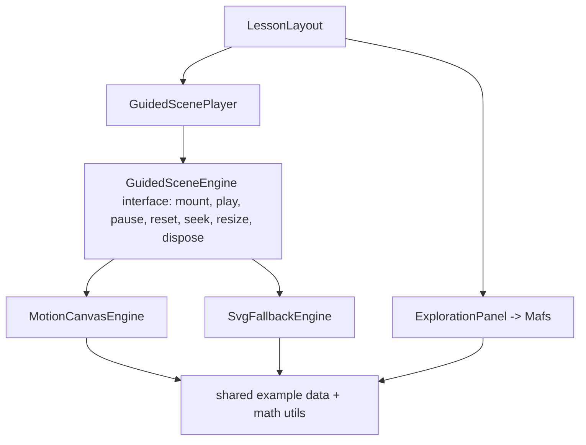

# Linear Algebra Visual Learning POC

## Context

Empty repo at `/home/thomas/Dev/technical-learning`. Tooling ready: Node v22.20, npm 10.9.3, pnpm 10.17.1. Package manager: **npm** (universal; assumption noted below).

Confirmed decision: **spike-first**. Attempt real Motion Canvas embedding via `@motion-canvas/vite-plugin` + a wrapped `Player`/`Stage`, hidden behind a `GuidedScenePlayer` interface. If the spike fails acceptance criteria, fall back to a custom SVG engine implementing the identical interface. All lessons build against that one abstraction, so the choice never leaks into lesson code.

## Integration findings (research)

- **Mafs 0.21** — standard React lib. Low risk. Use `Mafs`, `Coordinates.Cartesian`, `Vector`, `useMovablePoint`, `Transform`, `Polygon`, `vec`, `Theme`.
- **Motion Canvas** — not a drop-in component. Two paths:
  - vite-plugin + manual `Player`/`Stage`: exposes real `togglePlayback()`, `requestSeek(frame)`, `requestReset()`, `activate()/deactivate()` (the controls we need). Undocumented; plugin transforms (`?scene`, `.meta`, WebGL) can clash with a normal SPA build.
  - `@motion-canvas/player` custom element: loads a separately compiled `project.js`; weak scrub control.
- The player's own `deactivate()` before dispose is the documented way to stop the loop — central to the cleanup requirement.

## Core architecture

A single seam isolates all animation-engine risk:

- `src/guided-scenes/engine/types.ts` defines `GuidedSceneEngine` (imperative: `mount(container)`, `play/pause/reset/seek(t)`, `resize()`, `dispose()`, `getState()` with an `onStateChange` subscription) plus `GuidedSceneStep[]` metadata for step controls and reduced-motion discrete states.
- `GuidedScenePlayer.tsx` is engine-agnostic: renders a container ref, wires play/pause/reset/scrub/step UI, subscribes to state, and calls `dispose()` on unmount. React never touches the animation loop per-frame.
- Shared example data (`src/math/examples.ts`) + math utils are consumed by both the guided engine and the Mafs explorer, so constants are never duplicated (spec requirement).

## Lesson engine and data

- `src/lessons/types.ts` — `LessonDefinition`, `LessonSection`, `ExerciseDefinition` (multiple-choice | numeric | vector | prediction) exactly per spec; `Matrix2x2`, `MatrixExample`.
- `src/lessons/{vectors,transformations,determinants,eigenvectors}.ts` — typed content referencing a `guidedSceneId`, `explorationId`, shared example ids, and exercises.
- `src/lessons/registry.ts` — ordered array + id lookup; routing and Prev/Next derive from it. Maps `guidedSceneId -> engine factory` and `explorationId -> component`.

## Math layer (pure, tested)

- `src/math/vectors.ts` — add, scale, dot, equalsApprox.
- `src/math/matrices.ts` — matVec, matMat, determinant, identity, apply-to-unit-square.
- `src/math/interpolation.ts` — lerp, lerpMatrix (educational identity→A interpolation, explicitly labeled as visual, not a decomposition), easing.
- `src/math/eigen.ts` — real 2x2 eigenvalues/vectors via characteristic polynomial with a discriminant tolerance; classify real distinct / repeated / complex (no real eigenvectors); normalize direction. Cross-checked against `math.eigs` where real. Handles zero vectors, singular, repeated, complex, large values.
- `src/math/examples.ts` — shared `MatrixExample`s incl. presets: identity, scale, shear `[[1,1],[0,1]]`, rotation, reflection, singular collapse; lesson-2 matrix `[[2,1],[0,1]]`.

## UI / design system

- `src/styles/tokens.css` — dark neutral mathematical canvas; semantic color tokens with fixed roles used everywhere: `--role-original`, `--role-transformed`, `--role-basis-1`, `--role-basis-2`, `--role-selected`, `--role-invariant`, `--role-intermediate`. Roles also carry a non-color cue (dash/label/arrowhead) so meaning is never color-only.
- Layout components: `AppShell`, `LessonLayout` (two-column 40/60 grid, stacks on narrow screens), `LessonNavigation` (Prev / Reset / Next).
- Content components: `LessonHeader`, `ExplanationBlock`, `EquationBlock` (KaTeX), `GuidedScenePlayer`, `ExplorationPanel`, `ExercisePanel`, `LessonSummary`.
- Math display: `MatrixDisplay`, `VectorDisplay`, `CoordinateLabel`.
- Exercise grading in `src/lessons/grading.ts` (pure, tested): tolerant numeric/vector checks, choice checks, prediction reveal.

## Routing

`react-router` `createBrowserRouter`: `/` (index → lessons overview / redirect to first lesson) and `/lesson/:lessonId`. Route change unmounts `GuidedScenePlayer`, guaranteeing engine `dispose()`.

## Milestones and acceptance criteria

Stop after each: `npm run build` clean, `npm test` green, no critical console errors.

- **M1 — Shell**: Vite+React+TS, router, tokens/globals, `AppShell`/`LessonLayout`/`LessonNavigation`, typed registry with placeholder content for all 4 lessons. Accept: all 4 routes navigable, two-column layout, Prev/Next work.
- **M2 — Motion Canvas spike (gate)**: `MotionCanvasEngine` behind `GuidedSceneEngine`, one minimal grid/vector transform scene. Prove: render in lesson page, play, pause, reset, scrub (if reliable), responsive resize, cleanup on navigate-away, correct remount on return, single loop, no leaks/console errors. Accept: all bullets pass → proceed with Motion Canvas. If not → implement `SvgFallbackEngine` to the same interface and document why (the whole point of the seam). Either outcome unblocks M4+.
- **M3 — Mafs shell + math**: `ExplorationPanel` wrapper, shared examples/types, full math layer with unit tests. Accept: math tests pass incl. edge cases; a sample Mafs explorer with a slider + draggable vector renders and updates.
- **M4 — Lessons 1 & 2**: Vectors/linear-combinations and Matrices-as-transformations — guided scene, exploration (drag vectors, coefficients a/b, span toggle; matrix entries, grid transform, identity→A scrub, presets), exercises. Accept: guided + interactive + exercise all functional; shared example data reused.
- **M5 — Lessons 3 & 4**: Determinant (unit square → parallelogram, signed area, collapse, orientation flip) and Eigenvectors (invariant directions, eigenvalues as scale, negative eigenvalue, complex/no-real handling). Accept: eigen presentation stable under repeated/complex cases via tolerances.
- **M6 — A11y, tests, polish, README**: keyboard controls, focus states, ARIA labels, text equivalents of visual conclusions, reduced-motion (discrete steps), contrast; Vitest unit suite + Playwright critical-path tests; visual polish; README (install, dev/test commands, architecture, Motion-Canvas-vs-Mafs responsibilities, known limitations, how to add a lesson). Accept: full DoD met.

## Testing

- **Vitest**: vectors, matVec, determinant, interpolation, eigen (real/repeated/complex, tolerances), direction checks, exercise grading.
- **Playwright**: app loads; all 4 lessons navigable; guided scene play + reset; guided engine cleanup across route changes (no duplicate loop / lingering canvas); slider updates Mafs diagram; reset restores initial state; exercise feedback; no critical console errors.

## Performance guardrails

Motion Canvas/SVG engine owns its loop; state pushed to React only on discrete step/state changes (throttled), never per-frame. Mafs owns interactive rendering. Presets/examples memoized; inputs clamped to readable ranges; no unbounded history arrays.

## Risks

- **Motion Canvas ↔ Vite SPA build conflict** (primary): mitigated by the engine seam + M2 gate + SVG fallback of equal capability.
- **Scrubbing reliability**: if `requestSeek` mapping to a UI timeline is jittery, expose discrete step controls instead and document (spec allows "if supported reliably").
- **Eigen numerical edge cases**: tolerance-based classification + graceful "no real eigenvectors" presentation.
- **Sandbox network**: npm registry expected reachable; if a package install needs broader network, request it explicitly.

## Assumptions differing from / clarifying the spec

- Package manager **npm** (spec unspecified).
- Index route redirects to the first lesson (spec shows only lesson pages; a minimal overview index is added for navigation).
- The SVG fallback, if triggered, is a first-class engine (not a degraded stub) so the DoD ("each lesson contains a guided animation") holds regardless of the spike outcome.
- Educational identity→matrix interpolation is explicitly labeled in UI copy as a visual aid, not a mathematical decomposition (spec animation requirement).