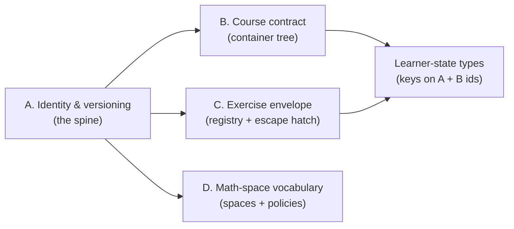

# Platform contracts scaffold

## Governing principle (applies to all four)

Contracts standardize **durable identities, integration boundaries, mathematical truthfulness, and reusable capabilities** — never pedagogy or composition. Concretely, every contract is built as a **registry + typed envelope + escape hatch**, mirroring the existing string-key indirection the codebase already uses ([`src/explorations/registry.tsx`](src/explorations/registry.tsx), [`src/guided-scenes/scenes/sceneDescriptions.ts`](src/guided-scenes/scenes/sceneDescriptions.ts)). No mandatory phases, quotas, templates, or closed DSL are introduced. The lesson `route` palette ([`src/lessons/types.ts`](src/lessons/types.ts) `RouteBlock`) is left untouched.

Non-negotiable invariant: existing behavior (the 7 lessons, sidebar output, Prev/Next, current exercises) is byte-for-byte preserved; all scaffolding is additive and guarded by tests.

## Dependency sequencing

## A. Identity & versioning contract (foundation)

New module `src/platform/identity.ts` (new `src/platform/` area for cross-cutting contracts):
- **ID grammar**: namespaced, lowercase, stable slugs for each entity kind — `course`, `unit`, `lesson`, `exercise`, `concept`, `block`. Document that lesson ids (`vectors`, `karatsuba`, ...) and the 52 hand-authored exercise ids (`vec-add-compute`, `karatsuba-z1`, ...) are **already stable** and frozen by this contract.
- **Immutability + alias map**: renaming is forbidden; instead an `ID_ALIASES: Record<string,string>` maps retired ids to current ones so stored learner progress never silently orphans. A `resolveId(id)` helper follows aliases.
- **`SCHEMA_VERSION`** constant + a `migrations` registry (`Record<number, (state) => state>`) so persisted shapes evolve deterministically. Pure functions only; no storage.
- **Escape hatch**: ids may carry an opaque namespace prefix for experimental content (e.g. `x-...`) exempt from curriculum validation.
- Tests: id-format validation, alias resolution is acyclic and terminating, migration chain is idempotent.

## B. Course contract (container tree)

Adopt the near-term shape from [`docs/MULTI_DOMAIN_CURRICULUM_ARCHITECTURE.md`](docs/MULTI_DOMAIN_CURRICULUM_ARCHITECTURE.md) §2, reconciling your vocabulary: `Subject -> Course -> Unit (chapter) -> Lesson -> { Blocks, Exercises, Concepts }`.
- Rewrite [`src/lessons/curriculum.ts`](src/lessons/curriculum.ts): replace flat `COURSE_SECTIONS` with `CURRICULUM: Subject[]`, where leaves **reference** lesson ids (registry stays the content source of truth; zero lesson files change, per the `project-core` layering rule). Karatsuba moves into its own `algorithms` subject/course (fulfilling "Karatsuba should belong to a separate algorithms course"), while the linear-algebra course keeps its units.
- Encode current content so the sidebar renders ~identically first, then flip Karatsuba to its own course as an explicit, tested step.
- Add path-aware helpers to [`src/lessons/registry.ts`](src/lessons/registry.ts): `getAdjacentInPath` / `getPositionInPath` (walk the active course), keeping the global-array helpers deprecated-but-present so migration is incremental.
- [`src/components/layout/CourseSidebar.tsx`](src/components/layout/CourseSidebar.tsx) + [`src/pages/HomePage.tsx`](src/pages/HomePage.tsx): read course identity (`title`/`subtitle`) from data instead of the hardcoded `Linear Algebra`.
- **New first-class `Concept` identity**: add optional `concepts?: ConceptRef[]` to `LessonDefinition` (ids only) to seed the concept graph from [`INTERACTIVE_TEXTBOOK_VISION.md`](docs/INTERACTIVE_TEXTBOOK_VISION.md) §14 — advisory, never gating, never a composition mandate.
- Deliberately deferred (stated out loud): prerequisite/DAG edges, namespaced routing, recommendations (doc'd as the long-term horizon, not built).
- Tests: every referenced `lessonId`/`conceptId` resolves; default course flattened order equals today's registry order; numbering restarts per course.

## C. Exercise-interaction envelope (expandable, with escape hatch)

Refactor the three closed switches into an **open capability registry** so new interactions never require editing a monolith, and novel one-offs are never blocked.
- [`src/lessons/types.ts`](src/lessons/types.ts): keep the discriminated `ExerciseDefinition` union for first-class, deterministically-gradable interactions. **Recommended first expansion of the envelope** (decision point — react at confirm):
  - `multi-numeric` — ordered/labeled numeric fields (grades method-specific intermediates, e.g. "enter each `z_i`"; the top gap named in [`docs/ASSESSMENT_PATTERNS.md`](docs/ASSESSMENT_PATTERNS.md)).
  - `ordering` — arrange steps/items into the correct sequence (reconstruction slices).
  - `custom` **escape hatch** — carries a `graderId` + `viewId` resolved through registries (same pattern as `explorationId`), for genuinely novel lesson experiences with no platform-wide type.
  - Explicitly deferred to the escape hatch / learner-validation pilot (not auto-graded in-app): free-text, region-shading, learner-built expressions.
- [`src/lessons/grading.ts`](src/lessons/grading.ts): introduce a `graders: Record<type, Grader>` registry; move the existing five graders into it unchanged; add graders for the new types; `custom` dispatches to a registered `graderId`.
- [`src/components/lesson/ExercisePanel.tsx`](src/components/lesson/ExercisePanel.tsx): replace the `ExerciseBody` `switch` with a `bodyRegistry` lookup; add bodies for the new types + a `custom` renderer slot. `Draft` becomes an open per-type bag so new interactions don't bloat one struct.
- Note for coordination: this is the "one branch owns these files until the contract lands" set (types + grading + ExercisePanel + any lesson content authored against them).
- Tests: registry has a grader **and** a renderer for every union member; `custom` round-trips through a fixture grader; existing exercises grade identically.

## D. Mathematical-space vocabulary (truthfulness contract)

Codify the convention the systems lesson already proved necessary (row picture vs column picture inhabit different spaces — [`src/explorations/SystemsExplorer.tsx`](src/explorations/SystemsExplorer.tsx), [`src/guided-scenes/scenes/linearSystemsScene.ts`](src/guided-scenes/scenes/linearSystemsScene.ts)).
- New doc `docs/MATH_SPACE_CONVENTIONS.md` defining the named spaces requested — input/coefficient, output, transformed, coordinate-relative-to-basis, graph-of-constraints — each with: canonical heading text, axis labeling rule, `--role-*` usage (values in [`src/styles/tokens.css`](src/styles/tokens.css)), superimposition policy (e.g. row+column must never share a plane), and transition rules (fade-out-before-fade-in).
- New typed descriptor `src/explorations/spaces.ts`: `MathSpace { id, heading, axisLabels, superimposeWith: [], transition }` registry. Explorers/scenes **opt in** by tagging a panel's space; it is advisory metadata + a lint-in-tests aid, **not** a mandatory wrapper. Escape hatch: a lesson may declare an ad-hoc space inline.
- Prove it on the existing case only: tag the two Systems panels via the registry (no visual change), asserting their space ids differ and the superimposition policy is recorded.
- Tests: registry ids are unique; Systems row/column resolve to distinct spaces with `superimposeWith` empty between them.

## Cross-cutting deliverables

- New `docs/PLATFORM_CONTRACTS.md` as the umbrella spec (links A-D, states the capability-envelope + escape-hatch philosophy and the "protects, does not reduce, creative freedom" scope boundary).
- Learner-state types `src/platform/learnerState.ts`: `LearnerState` / `LessonProgress` (completion, attempts, mistakes, bookmarks, mastery, review history) keyed by A's ids, carrying `schemaVersion` and an opaque `extra` bag; **types + pure migration only, no persistence wiring** (deferred until progress must outlive a tab, per the architecture doc).
- Verify per `project-core`: `npm run lint`, `npm run test`, and `npm run test:e2e` (touches sidebar/home/lesson flow). Complete [`docs/LESSON_CORRECTNESS_CHECKLIST.md`](docs/LESSON_CORRECTNESS_CHECKLIST.md) where visualization metadata is touched.