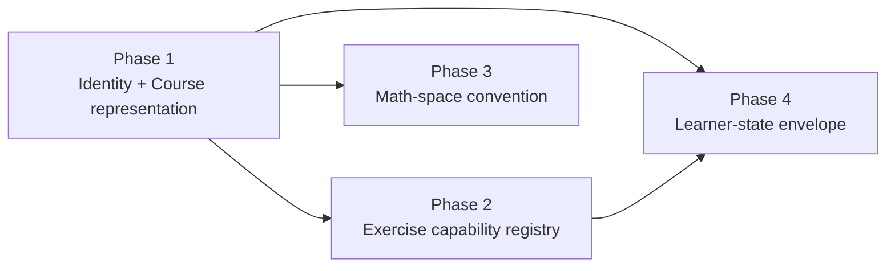

# Platform contracts scaffold

## Governing principle (unchanged)

Contracts standardize **durable identities, integration boundaries, mathematical truthfulness, and reusable capabilities** — never pedagogy or composition. Every contract is a **registry + typed envelope + escape hatch**, mirroring the string-key indirection the codebase already uses ([`src/explorations/registry.tsx`](src/explorations/registry.tsx), [`src/guided-scenes/scenes/sceneDescriptions.ts`](src/guided-scenes/scenes/sceneDescriptions.ts)). No mandatory phases, quotas, templates, or closed DSL. The lesson `route` palette ([`src/lessons/types.ts`](src/lessons/types.ts) `RouteBlock`) is untouched.

**Scope discipline (this revision).** This is a *thin, expandable foundation*, not a platform rewrite. It creates only the seams the next flagship lesson will actually exercise, defers everything speculative, and changes no visible behavior beyond the two intentional UI touches below. Build the minimum, prove it on one real case, then return to visible educational development.

**Intentional UI changes (acknowledged, not "no UI changes").** Two visible changes ship in this scaffold and are covered by e2e: (1) the Systems explorer captions are rewritten to explicitly name "Coefficient space (x, y)" and "Output space"; (2) the shared `ExercisePanel` is refactored to a capability registry and gains one pilot interaction. Everything else (navigation, order, numbering, Prev/Next, Karatsuba placement) is unchanged.

## Clarifications baked into this plan

1. "Render identically" means **semantic/behavioral equivalence**, not byte-identical markup — for both the curriculum adapter and the exercise-capability refactor.
2. **Experimental IDs are still validated** for syntax, uniqueness, referential integrity, and alias resolution; the only thing they are exempt from is being required to appear in the canonical curriculum tree.
3. **Math-space labels describe semantic roles**, and distinct labels do **not** always imply distinct underlying vector spaces (coefficient space and output space are both R^2 here). The convention governs semantic clarity, not vector-space identity claims.
4. **Temporary authoritative source during coexistence:** the existing [`src/lessons/registry.ts`](src/lessons/registry.ts) `lessons[]` plus the current navigation data remain authoritative; `CURRICULUM` is a secondary representation validated against them until a future, explicit cutover.
5. **Pure/UI layer separation:** capability grading and answer serialization live in the pure `src/lessons` / `src/platform` layers and must not import React or UI components; only rendering lives in the UI layer. One capability ID bundles the two across layers.

## Dependency direction (unchanged)

Delivery is split into four independently reviewable phases below.

---

## Phase 1 — Identity + Course representation

### Identity (`src/platform/identity.ts`, new)

- **Existing unnamespaced IDs remain canonical.** Lesson ids (`vectors`, `karatsuba`, ...) and the 52 hand-authored exercise ids (`vec-add-compute`, `karatsuba-z1`, ...) are frozen as-is; this contract does not renamespace them.
- **Entity-specific branded IDs**: `LessonId`, `ExerciseId`, `CourseId`, `UnitId`, `ConceptId` as TS branded string types, so a lesson id can never be passed where an exercise id is expected. Thin `asLessonId(...)` guards at boundaries.
- **Per-entity alias maps + `resolveId`**: retiring/renaming maps old id to current id per entity so stored progress never orphans. Renames go through aliases, not edits to the canonical id.
- **`SCHEMA_VERSION` + a migration runner**: a `runMigrations(state)` that applies the chained upgrades to reach the current version. Pure; no storage.
- **Escape hatch**: an experimental namespace prefix (e.g. `x-...`) so novel content is never blocked from *existing*. Experimental IDs are **still** subject to syntax, uniqueness, referential-integrity, and alias checks; they are only exempt from the requirement to appear in the canonical curriculum tree.
- Tests: exercise the **migration runner** end to end (v0 to current) and alias resolution / branding guards — we do **not** require each migration to be independently idempotent.

### Course representation (`src/lessons/curriculum.ts`, additive)

- Add a **new** `CURRICULUM` tree (`Subject -> Course -> Unit -> Lesson refs`, leaves referencing lesson ids) **alongside** the existing navigation data. Model Karatsuba in its own `algorithms` course *in the model*. Zero lesson files change (`project-core` layering preserved).
- **Unitless-course convenience:** a `Course` may list lessons directly without an explicit `Unit`; the adapter treats these as belonging to a single implicit default unit. Units are optional structure, not a required level.
- **Temporary authoritative source:** the existing `registry.ts` `lessons[]` and current navigation data stay authoritative during coexistence. `CURRICULUM` is a secondary representation, validated against them; the UI does not read from it yet.
- Add a **compatibility adapter** that maps `CURRICULUM` to the shape the current UI consumes. The live navigation ([`src/components/layout/CourseSidebar.tsx`](src/components/layout/CourseSidebar.tsx), [`src/pages/HomePage.tsx`](src/pages/HomePage.tsx), [`src/lessons/registry.ts`](src/lessons/registry.ts) helpers) keeps reading its **current** sources — no rewrite of Prev/Next, no path-aware helpers yet.
- **Do NOT change** visible order, numbering, Prev/Next behavior, or move Karatsuba in the UI. The new model coexists; the adapter is the bridge, proven by test to reproduce today's output.
- **Concepts (conditional):** only if we introduce `ConceptId` references does Phase 1 add a **minimal** `CONCEPTS` registry so those refs resolve. If no refs are authored yet, concepts are omitted entirely (no speculative graph).
- Tests: every `lessonId` (and any `conceptId`) in `CURRICULUM` resolves via the registry; the **adapter output is semantically equivalent to** (not byte-identical with) today's sidebar sections, home-page order, per-lesson numbering, and Prev/Next.

Deferred (stated out loud): path-relative numbering, prerequisite/DAG edges, namespaced routing, recommendations, and actually driving the UI from `CURRICULUM`.

---

## Phase 2 — Exercise capability registry

Turn the closed switches ([`src/lessons/grading.ts`](src/lessons/grading.ts) `gradeExercise`, [`src/components/lesson/ExercisePanel.tsx`](src/components/lesson/ExercisePanel.tsx) `ExerciseBody`) into an **open capability registry**, with no behavioral change to what ships today.

- **Layer split (required).** A capability is bundled under **one capability ID** but split across layers so the pure layer never depends on React:
  - Pure layer (`src/lessons`): a `GradingCapability` = `{ id, grade(def, answer), parseAnswer, serializeAnswer, answerSchemaVersion }` with capability-local, **JSON-safe** answer types. No React imports.
  - UI layer (`src/components/lesson`): a `RenderCapability` = `{ id, render(props), draft state }`, looked up by the same capability ID.
- Each capability **owns its own typed draft/answer serialization**. The shared mega-`Draft` in `ExercisePanel.tsx` is **not** replaced by an unrestricted bag; the panel stores per-capability typed drafts opaquely keyed by exercise id and round-trips answers through the capability's serializer.
- **Adapt the existing five types** (`multiple-choice`, `numeric`, `vector`, `eigenvalue`, `prediction`) as capabilities that reuse the current graders and bodies verbatim — a pure refactor, **semantically identical** behavior (not asserted byte-identical).
- **One custom escape hatch**: a `custom` exercise carries a **single `capabilityId`** that resolves the bundled grading+render capability by that one id — not independently composable grader/renderer ids.
- **Pilot interaction — committed prediction, via the custom path.** Implement committed prediction (learner commits a guess before the reveal — the testing-effect commit today's self-graded `prediction` lacks) as a **registered capability reached through the `custom` `capabilityId`**, so the pilot proves extension **without** editing the central union or any switch. This is the acceptance proof for the escape hatch.
- Tests: all existing exercises grade **and** render semantically identically after the refactor; the pilot round-trips its JSON-safe typed draft/answer; `custom` resolves and grades via its `capabilityId` with no change to the core union.

Coordination note: this is the "one branch owns these files until the contract lands" set — [`src/lessons/types.ts`](src/lessons/types.ts), [`src/lessons/grading.ts`](src/lessons/grading.ts), [`src/components/lesson/ExercisePanel.tsx`](src/components/lesson/ExercisePanel.tsx), and any lesson content authored against the pilot.

Deferred: multi-numeric, ordering, free-text, region-shading, learner-built expressions (each can arrive later as one more registered capability, or via the escape hatch — the envelope is expandable by construction).

---

## Phase 3 — Mathematical-space convention

Codify the semantic truth the systems lesson already demonstrates (row picture vs column picture inhabit different spaces — [`src/explorations/SystemsExplorer.tsx`](src/explorations/SystemsExplorer.tsx), [`src/guided-scenes/scenes/linearSystemsScene.ts`](src/guided-scenes/scenes/linearSystemsScene.ts)) **without prescribing a single presentation**.

- New doc `docs/MATH_SPACE_CONVENTIONS.md` naming the spaces (input/coefficient, output, transformed, coordinate-relative-to-basis, graph-of-constraints) and their `--role-*` usage (values in [`src/styles/tokens.css`](src/styles/tokens.css)).
- **Labels describe semantic roles, not vector-space identity.** The doc states explicitly that distinct space labels do **not** always imply distinct underlying vector spaces (here coefficient space and output space are both R^2). The convention governs semantic clarity for the learner, not a claim about vector-space equality/inequality.
- **The load-bearing rule (replaces "fade-out-before-fade-in"):** two *semantically distinct* spaces must be shown in **explicitly separate frames** or with an **explicitly mapped frame** (a stated transformation between them). A **labeled split-screen comparison remains allowed.** The rule protects against implying two roles silently share one frame; it does not mandate any particular animation or layout.
- **Systems integration proof (visible change, required):** rewrite the two figcaptions in [`src/explorations/SystemsExplorer.tsx`](src/explorations/SystemsExplorer.tsx) so the panels are explicitly labeled **"Coefficient space (x, y)"** and **"Output space"** as the primary space names (the current "Row picture — ..." / "Column picture — ..." captions are insufficient). This is a real visible change, not metadata only. Add a lightweight typed space descriptor only where it adds clarity; keep it advisory and opt-in.
- Tests: unit test asserts the systems row and column panels carry the distinct, visible space labels; e2e asserts they render on the systems lesson page.

---

## Phase 4 — Learner-state envelope

- `src/platform/learnerState.ts` (new): a **versioned envelope** and nothing more:
  - `{ schemaVersion, lessonProgress, exerciseAttempts, bookmarks }`, keyed by the branded IDs from Phase 1, where `lessonProgress` is **raw** (e.g. visited/completed flags) and `bookmarks` is a raw list.
  - `exerciseAttempts` are **JSON-safe, capability-aware serialized answer envelopes**: each attempt carries `{ exerciseId, capabilityId, answerSchemaVersion, answer (serialized via the capability), correct?, at }`. The `capabilityId` + `answerSchemaVersion` let a future migration reinterpret stored answers when a capability's answer shape evolves.
- Types + the Phase 1 migration runner only. **No persistence wiring.**
- **Explicitly deferred until their models are proven:** mastery, misconception inference, review scheduling, recommendations.

---

## Cross-cutting

- New `docs/PLATFORM_CONTRACTS.md` umbrella spec: links the four phases, states the capability-envelope + escape-hatch philosophy, and carries the Non-goals below.
- Verify per `project-core`: `npm run lint`, `npm run test`, and **`npm run test:e2e`** (targeted specs at minimum — the systems lesson caption change and the shared `ExercisePanel` refactor are visible UI changes, so e2e must run; do not claim there are no UI changes).

## Non-goals (guarantees)

- **No lesson-composition mandates.** No mandatory phases, exercise quotas, universal templates, or closed DSL; the `route` palette and authorial freedom are untouched.
- **No course-navigation changes.** Visible order, numbering, Prev/Next, and Karatsuba's UI placement are unchanged; the new course model is additive behind an adapter.
- **No persistence.** Learner state is types + migration only; no storage, backend, or accounts.
- **No full feature implementation.** Exactly one pilot exercise interaction; the math-space convention is proven on the one existing case; no speculative abstractions beyond what the next lesson will exercise.
