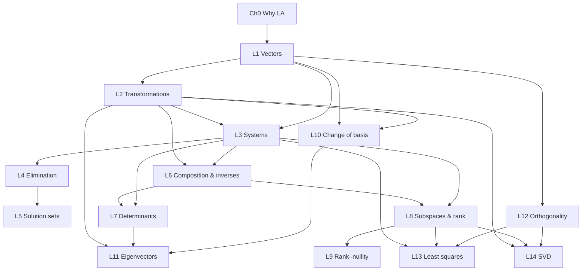

# Curriculum Architecture

The **encoding-facing** companion to the course spine. Where
[LINEAR_ALGEBRA_COURSE_SPINE.md](./LINEAR_ALGEBRA_COURSE_SPINE.md) answers
*"what is the whole course and why in this order?"* in prose, this document makes
that architecture **explicit and machine-encodable** so later waves can wire it
without re-deriving intent:

1. the full course **sequence** reconciled with the built lessons and `future`
   stubs, and the **renumbering** implications of inserting the missing lessons;
2. an **explicit prerequisite graph** (edge table + Mermaid), replacing today's
   implicit array-order ordering;
3. a **concept-ID catalog** — stable `ConceptId`-shaped slugs for the first-class
   concepts, each with a definition, its introducing lesson, and its reusers;
4. the **recurring canonical examples** and why each recurs;
5. a **"which lesson proves each platform feature"** matrix;
6. a prioritized **next-lesson recommendation**.

It sits between its neighbors and duplicates neither:

- [LINEAR_ALGEBRA_COURSE_SPINE.md](./LINEAR_ALGEBRA_COURSE_SPINE.md) — the
  authoritative **content sequence** and per-lesson central insights. This doc
  *consumes* that sequence and formalizes its edges and concepts.
- [MULTI_DOMAIN_CURRICULUM_ARCHITECTURE.md](./MULTI_DOMAIN_CURRICULUM_ARCHITECTURE.md)
  — the **platform data model** (subjects → courses → units → lessons; the
  eventual typed-edge graph). This doc supplies the *content* those edges would
  carry (the prerequisite list in §2 is exactly the `prerequisite` edge set that
  model's §3 defers).
- [LESSON_DESIGN.md](./LESSON_DESIGN.md) / [INTERACTIVE_TEXTBOOK_VISION.md](./INTERACTIVE_TEXTBOOK_VISION.md)
  — how a *single* lesson is built and why. §5's feature matrix references the
  block palette defined there.
- [LINEAR_ALGEBRA_BENCHMARK_MATRIX.md](./LINEAR_ALGEBRA_BENCHMARK_MATRIX.md) — the
  per-profile depth calibration for each spine node (what a computational /
  applied / proof-based course expects), and the honest gap list against this
  built sequence.

> **Scope note (durable).** This document is **architecture, not an authoring
> reopening.** Per `.cursor/rules/project-core.mdc`, the active product surface is
> the built vertical slice plus M4.5 polish. Listing L4–L14 here — and
> recommending L4 in §6 — does not authorize building them without an explicit
> reopen. Concept ids and edges are a *commitment* so the pieces land coherently
> when each lesson is actually built.

Verified source-of-truth files this doc reconciles against:

- `src/lessons/registry.ts` — the built, ordered lessons (content authority).
- `src/lessons/curriculum.ts` — `COURSE_SECTIONS` (sidebar spine + `future` stubs).
- `src/lessons/courseModel.ts` — `Subject → Course → Unit → LessonRef` (validated).
- `src/platform/identity.ts` — `ConceptId` brand + `ID_SYNTAX`.
- `src/math/examples.ts`, `src/lessons/exampleData.ts` — the shared examples.

---

## 1. Full course sequence, reconciled

Two orderings coexist today and must not be confused:

- **Spine position** (`Ch0`, `L1…L14`) — the *authoritative pedagogical
  sequence* from the spine doc. Stable; a lesson's spine position does not change
  when other lessons are built.
- **Built-registry index** — the positional badge the sidebar prints today,
  computed by `getLessonNumber` as the 1-based index among non-intro lessons in
  `registry.ts`. This **shifts** every time a lesson is inserted earlier.

| Spine | Lesson | Curriculum id | Status | Track | Built badge today |
| --- | --- | --- | --- | --- | --- |
| Ch 0 | Why linear algebra? | `why-linear-algebra` | built | LA | Chapter 0 |
| L1 | Vectors, combinations, span, basis, coordinates | `vectors` | built | LA | Lesson 1 |
| L2 | Linear transformations & the columns rule | `transformations` | built | LA | Lesson 2 |
| L3 | Linear systems: row & column pictures | `systems` | built | LA | Lesson 3 |
| L4 | Elimination as reversible constraint manipulation | `elimination` | future | LA | — |
| L5 | Solution sets & homogeneous systems | `solution-sets` | future | LA | — |
| L6 | Matrix composition & inverses | `matrix-composition` | future | LA | — |
| L7 | Determinants | `determinants` | built | LA | **Lesson 4** |
| L8 | Subspaces, column space, null space, rank | `subspaces-rank` | future | LA | — |
| L9 | Dimension & rank–nullity | `rank-nullity` | future | LA | — |
| L10 | Change of basis | `change-of-basis` | future | LA | — |
| L11 | Eigenvectors & diagonalization | `eigenvectors` | built (intro) | LA | **Lesson 5** |
| L12 | Orthogonality & projections | `orthogonality` | future | LA | — |
| L13 | Least squares | `least-squares` | future | LA | — |
| L14 | Singular value decomposition | `svd` | future | LA | — |
| — | Karatsuba multiplication | `karatsuba` | built | Algorithms | **Lesson 6** |

### 1.1 Renumbering implications (no code change proposed here)

Because `getLessonNumber` is **positional over the built registry**, the printed
badge already disagrees with the spine position for every built lesson after
`systems`:

- `determinants` prints **"Lesson 4"** but is spine **L7**.
- `eigenvectors` prints **"Lesson 5"** but is spine **L11**.
- `karatsuba` prints **"Lesson 6"** but is not on the LA spine at all — it is a
  separate **Algorithms** track (already modeled as its own course in
  `courseModel.ts`; it only shares the platform, not the LA dependency order).

Consequences to plan for when future lessons are promoted:

- **Every insertion before a built lesson shifts that lesson's badge.** Building
  `elimination` (L4) alone bumps `determinants` 4→5, `eigenvectors` 5→6,
  `karatsuba` 6→7. This is why **no L-number may be baked into any id, route, test
  fixture, or learner-facing string.** Numbers are a *view*, ids are the identity.
- **Prefer path-relative numbering.** The fix is the path-aware numbering in
  `MULTI_DOMAIN_CURRICULUM_ARCHITECTURE.md` §2 (number within the active course's
  flattened path, and drop `karatsuba` out of the LA count). Until then, treat the
  badge as positional and cite the **spine position** in docs/tests.
- **`karatsuba` should stop counting as an LA lesson.** It already lives in its
  own course in the validated `courseModel.ts`; the visible badge is the last
  place still treating it as "LA Lesson 6."

### 1.2 Section grouping (matches `curriculum.ts` today)

| Section id | Title | Spine members |
| --- | --- | --- |
| `foundations` | Foundations | Ch0, L1, L2 |
| `systems-elimination` | Systems & elimination | L3, L4, L5 |
| `maps-inverses-determinants` | Composition, inverses & determinants | L6, L7 |
| `structure` | Structure of linear maps | L8, L9, L10 |
| `spectra-geometry-data` | Spectra, geometry & data | L11, L12, L13, L14 |
| `algorithms` | Algorithms & complexity | `karatsuba` |

No section change is proposed; this table is the reconciliation, not an edit.

---

## 2. Explicit prerequisite graph

The spine's §5 states the dependency order in prose and a code fence; this makes
it an explicit **edge list** (the content for the `prerequisite` edges that
`MULTI_DOMAIN_CURRICULUM_ARCHITECTURE.md` §3 defers to the platform model). An
edge `A → B` means **B genuinely needs an idea introduced in A** (hard, directed,
must stay acyclic).

### 2.1 Hard prerequisite edges (lesson level)

| From | To | Why B needs A |
| --- | --- | --- |
| `why-linear-algebra` | `vectors` | Motivates "four numbers move space"; vectors are the first object. |
| `vectors` | `transformations` | Columns rule is derived from unique standard-basis coordinates. |
| `transformations` | `systems` | Column picture of `Ax=b` reuses "columns are images of the basis." |
| `vectors` | `systems` | Row/column pictures reuse span, dependence, unique coordinates. |
| `systems` | `elimination` | Elimination rewrites a *system* while preserving its solution set. |
| `elimination` | `solution-sets` | You must reduce before reading off free variables / null directions. |
| `transformations` | `matrix-composition` | "Apply B then A" composes two transformations. |
| `systems` | `matrix-composition` | Inverses are motivated as "solve `Ax=b` by undoing A." |
| `matrix-composition` | `determinants` | Invertibility should be *wanted* before the determinant detects it. |
| `systems` | `determinants` | Determinant zero = the non-unique/collapse case met in systems. |
| `matrix-composition` | `subspaces-rank` | Column/null space formalize composition & solvability. |
| `systems` | `subspaces-rank` | Column space = reachable `b`; null space = non-uniqueness. |
| `subspaces-rank` | `rank-nullity` | Conservation law counts the rank/nullity just named. |
| `vectors` | `change-of-basis` | Pays off "coordinates are a choice, not the vector." |
| `transformations` | `change-of-basis` | A map's matrix is re-expressed in a new basis. |
| `transformations` | `eigenvectors` | Eigen-directions are directions the *map* only scales. |
| `determinants` | `eigenvectors` | `det(A − λI) = 0` reuses "det = 0 is collapse." |
| `change-of-basis` | `eigenvectors` | Diagonalization = the basis where the matrix is diagonal. |
| `vectors` | `orthogonality` | Dot product / projection act on vectors. |
| `systems` | `least-squares` | Least squares is the inconsistent-`Ax=b` rescue. |
| `subspaces-rank` | `least-squares` | Project `b` onto the **column space**. |
| `orthogonality` | `least-squares` | Projection is the engine of the normal equations. |
| `transformations` | `svd` | SVD = rotate → scale → rotate (composition of maps). |
| `subspaces-rank` | `svd` | Singular values count rank; reunifies structure. |
| `orthogonality` | `svd` | U and V are orthonormal; geometry of the factorization. |

`karatsuba` has **no** prerequisite edge into the LA graph (separate track).

### 2.2 Prerequisite DAG (Mermaid)

The graph is acyclic; a topological sort of it reproduces the spine order
`Ch0, L1…L14` (with the L4/L5 vs L6/L7 branches interleavable — see §2.3).

### 2.3 Ordering notes

- **`elimination` (L4) branch vs. `composition` (L6) branch are independent.**
  Both depend only on `systems` (L6 also on `transformations`). The spine
  interleaves them L4→L5→L6→L7 for narrative flow, but the DAG permits building
  L6/L7 before L4/L5. This matters for §6: the next lesson need not be L4.
- **`determinants` (built, L7) currently ships before its ideal prerequisite
  `matrix-composition` (L6) exists.** The built lesson stands; when L6 lands, the
  determinant lesson should reference L6's non-invertibility motivation rather
  than introducing collapse cold (spine §3, L7 note).
- **`eigenvectors` (built intro, L11) ships before `change-of-basis` (L10).** The
  built intro is deliberately pre-diagonalization; the full treatment waits on
  L10. The `det → eigen` edge is already honored (the derivation ladder reuses
  "det = 0 is collapse").

---

## 3. Concept-ID catalog

Stable, path-independent slugs for the course's first-class concepts. Ids follow
`identity.ts` `ID_SYNTAX` = `/^(x-)?[a-z0-9]+(?:-[a-z0-9]+)*$/` and are intended
to become `ConceptId`s (the brand exists in `identity.ts` but is **unused by the
curriculum today** — this catalog is the proposed seed, not a wiring change).

Rules for this catalog:

- **Ids are identity, not order.** Never encode an L-number (§1.1).
- **"Introduces"** = the lesson that first *defines/derives* the concept.
- **"Reuses"** = later lessons that fire the concept in a new context
  (INTERACTIVE_TEXTBOOK_VISION §14: strengthen edges, don't just add nodes).
- Ids for future lessons' concepts are reserved now so foreshadowing in built
  lessons can point at a stable target.

| Concept id | Short definition | Introduces | Reuses |
| --- | --- | --- | --- |
| `vector` | A quantity with direction and magnitude; data you can combine. | L1 `vectors` | L2, L3, L12, L13, all |
| `linear-combination` | A weighted sum `a·v + b·w` of vectors. | L1 `vectors` | L2, L3, L8, L12 |
| `span` | The set of all points reachable by combinations — reachability. | L1 `vectors` | L3, L8, L13 |
| `linear-independence` | Vectors none of which is a combination of the others ("not on the same line"). | L1 `vectors` | L3, L8, L9 |
| `basis` | A minimal independent set that spans — a coordinate language. | L1 `vectors` | L2, L10, L11, L12 |
| `coordinates` | The weights naming a vector *in a chosen basis*; a choice, not the vector. | L1 `vectors` | L2, L10, L11 |
| `linear-transformation` | A map that moves every point consistently (grid stays straight, evenly spaced). | L2 `transformations` | L3, L6, L7, L10, L11, L14 |
| `matrix-columns` | A map is fixed by where the basis lands — its columns. | L2 `transformations` | L3, L6, L8, L14 |
| `linear-system` | `Ax = b`: constraints (rows) and a combination question (columns). | L3 `systems` | L4, L5, L6, L8, L13 |
| `row-picture` | Each equation is a line/plane; solutions are their intersection. | L3 `systems` | L4, L5 |
| `column-picture` | "Which recipe of A's columns reaches b?" | L3 `systems` | L6, L8, L13 |
| `consistency` | Whether `b` is reachable — `b` in the column space. | L3 `systems` | L5, L8, L13 |
| `elimination` | Replacing a system with an easier one having the same solution set. | L4 `elimination` | L5, L6, L8 |
| `echelon-form` | The reduced staircase a system reaches under elimination. | L4 `elimination` | L5, L8 |
| `pivot` | A leading entry marking a bound variable / an independent direction. | L4 `elimination` | L5, L8, L9 |
| `free-variable` | An unpivoted variable parameterizing the solution set. | L4 `elimination` | L5, L8, L9 |
| `solution-set` | Particular solution + all null directions; affine vs linear. | L5 `solution-sets` | L8, L13 |
| `homogeneous-system` | `Ax = 0`; its solutions are the null directions. | L5 `solution-sets` | L8, L9 |
| `matrix-composition` | "Apply B then A" is a new map `AB`; order matters. | L6 `matrix-composition` | L7, L10, L11, L14 |
| `invertibility` | A map can be undone exactly when nothing collapses. | L6 `matrix-composition` | L7, L8, L9 |
| `determinant` | Signed area/volume scale; a detector of invertibility (zero = collapse). | L7 `determinants` | L11 (`det(A−λI)=0`) |
| `orientation` | The sign of the determinant — handedness, not negative area. | L7 `determinants` | L14 |
| `subspace` | A closed-under-combination flat through the origin. | L8 `subspaces-rank` | L9, L10, L12, L13 |
| `column-space` | Span of the columns — the reachable outputs. | L8 `subspaces-rank` | L9, L13, L14 |
| `null-space` | Inputs sent to zero — the source of non-uniqueness. | L8 `subspaces-rank` | L9 |
| `rank` | Number of independent output directions = dim(column space). | L8 `subspaces-rank` | L9, L13, L14 |
| `nullity` | Dimension of the null space. | L9 `rank-nullity` | L14 |
| `rank-nullity` | Conservation: `rank + nullity = n` (dimensions survive or collapse). | L9 `rank-nullity` | L14 |
| `dimension` | The number of independent directions spanning a space. | L9 `rank-nullity` | L10, L14 |
| `change-of-basis` | The same vector/map re-described in a different basis. | L10 `change-of-basis` | L11, L12, L14 |
| `eigenvector` | A direction the map only scales — it stays on its own line. | L11 `eigenvectors` | L14 |
| `eigenvalue` | The scale factor `λ` on an eigen-direction (`Av = λv`). | L11 `eigenvectors` | L14 |
| `eigenspace` | All eigenvectors for a given `λ` (plus 0). | L11 `eigenvectors` | L14 |
| `diagonalization` | Choosing the basis where the map is pure scaling. | L11 `eigenvectors` | L14 |
| `dot-product` | The inner product measuring alignment and length. | L12 `orthogonality` | L13, L14 |
| `orthogonality` | Right angles; the geometry of best approximation. | L12 `orthogonality` | L13, L14 |
| `projection` | The closest point in a subspace to a given vector. | L12 `orthogonality` | L13, L14 |
| `orthonormal-basis` | An independent, unit-length, mutually perpendicular basis. | L12 `orthogonality` | L14 |
| `least-squares` | Best fit when `Ax = b` is inconsistent: project `b` onto the column space. | L13 `least-squares` | L14 |
| `singular-value-decomposition` | Every matrix = rotate → scale → rotate (`A = UΣVᵀ`). | L14 `svd` | — (capstone) |

Notes:

- `linear-independence` is spelled out (not `independence`) to avoid ambiguity
  with statistical independence in a future data course; `x-` is reserved only
  for experimental/off-tree concepts per `identity.ts`.
- The **column-space / null-space / rank cluster** (L8) are the named forms of
  ideas *used informally* in L3 — encoding these ids lets L3 foreshadow with a
  stable link (`consistency` → `column-space`).
- `karatsuba` concepts (divide-and-conquer, cross-terms, recurrence) are
  intentionally **out of this catalog** — they belong to the Algorithms track's
  own concept set.

---

## 4. Recurring canonical examples

Shared example ids (from `src/math/examples.ts` and `src/lessons/exampleData.ts`)
are the concrete thread that keeps continuity real rather than asserted
(`LESSON_DESIGN.md` "Guided-to-interactive continuity"). Reusing the *same
numbers* across lessons is how an edge gets strengthened instead of a new example
being introduced.

| Example id | Matrix / data | Recurs across | Why it recurs |
| --- | --- | --- | --- |
| `shear-2-1` | `A = [[2,1],[0,1]]` | L2 (main), L7 (main), presets in L2/L7 | The canonical "moving space" map: `Ae₁=(2,0)`, `Ae₂=(1,1)`, area 2. Same A carries L2→L7 so the determinant reads *this* map's area, not a new one. |
| `vectors-default` | `v=(1,2)`, `w=(3,-1)`, dependent `2v=(2,4)`, `p=(4,1)` | L1 (main), reused *as columns* in L3 | Establishes span/independence/coordinates; its `v,w` become the columns of L3's `A`, so `Ax=b` is literally the combination L1 solved by hand. |
| `systems-default` | `A` cols `(1,2),(3,-1)`; `b=q=(-1,5)`; dependent/`bInfinite`/`bNone`; near-singular variant | L3 (main), seeds L4/L5/L8 | The one/none/infinite trichotomy in one dataset; the dependent columns + on/off-line targets pre-stage elimination, solution sets, and column/null space. |
| `eigen-distinct` | `A = [[3,1],[0,2]]` | L11 (main) | Two independent eigendirections with different `λ` — the clean case the eigen-derivation ladder runs on. |
| `singular-collapse` | `A = [[2,4],[1,2]]` | presets in L2/L7; motivates L8 | The plane collapsing to a line — the shared image of `det=0`, dependent columns, and a nontrivial null space (foreshadows L8). |
| `near-singular` | `A = [[1,1],[0.99,1]]` (and `aNearSingular` in `exampleData`) | preset in L7; seeds L13 | Tiny nonzero determinant: information is *not* lost (invertible) but conditioning is bad — an early seed for least-squares conditioning. |
| `diagnostic-asymmetric` | `A = [[1,2],[3,4]]` | **dev/test only** (not a learner preset) | Rows ≠ columns, so transpose/packing bugs are visible; the correctness rule's preferred regression matrix. |
| `grid-bug-repro` | `A = [[1.8,0],[1.8,2.2]]` | **dev/test only** | The `ERROR_LOG` regression: `Ae₂=(0,2.2)` must keep one grid family vertical; guards the transformed-grid path. |

Authoring rule (carried from the spine's application threads): when a future
lesson reuses one of these ids, it must **name the earlier appearance**
("the same A you sheared in L2"), so the example reads as one thread. The two
diagnostic matrices are the exception — they are never learner-facing and exist
purely to catch the math-visualization bugs enumerated in `ERROR_LOG.md`.

---

## 5. Which lesson proves each platform feature

The platform capabilities (block palette in `LESSON_DESIGN.md`; exercise
capabilities in `src/lessons/capabilities.ts`) each want a *reference lesson*
that best exercises and validates them. "Best proof" = the lesson whose content
most naturally stresses the feature; "also uses" = other current coverage.

| Capability | Best proof (lesson) | Also used by | Notes / gaps |
| --- | --- | --- | --- |
| Guided scene (Motion Canvas "Watch") | `transformations` — deforming grid, the base "moving space" idiom | all lessons have a `guidedSceneId` | The canonical concept-visualization; `eigenvectors` adds a *derivation* scene. |
| Interactive explorer (Mafs) | `systems` — synchronized dual-picture (drag `b`, edit `A`, solution count moves together) | `vectors` (linear-combination), L2, L7, L11 | The interactivity a textbook cannot match; the strongest explorer case. |
| Formal blocks (definition/theorem/…) | `systems` — multiple `formalBlocks` | `vectors`, `transformations`, `chapter0` | `determinants`/`eigenvectors` currently have none — a coverage gap. |
| Worked example (equation sequence) | `eigenvectors` — worked example with an embedded derivation `guidedSceneId` (the ladder) | `vectors`, `transformations`, `systems`, `karatsuba` | The reference for "equations + synchronized derivation scene." |
| Exercise: multiple-choice | `systems` (heaviest use) | every content lesson | Baseline; universally covered. |
| Exercise: numeric | `determinants` — compute `det(A)` | `karatsuba` | Best where the answer *is* a single number. |
| Exercise: vector | `transformations` — compute `Av` / image of a basis | `vectors`, `systems`, `eigenvectors` | Best where the answer is a point in the plane. |
| Exercise: prediction (self-reveal) | `transformations` | `vectors`, `systems`, `eigenvectors`, `karatsuba` | Widely used; the "commit then reveal" is the *committed* variant below. |
| Exercise: eigenvalue | `eigenvectors` (only user) | — | Type exists solely for this lesson; order-insensitive multi-λ grading. |
| Exercise: `custom` / `committed-prediction` | **none yet** (pilot) | tests only (`capabilities.test.ts`, `ExercisePanel`) | **Gap:** the escape-hatch capability is built and tested but *no lesson exercises it.* A future lesson should prove it (see §6). |
| Misconception callouts | `eigenvectors` — "same line, not same direction"; defective-λ | `vectors`, `systems`, `karatsuba` | The elicit→confront→resolve pattern (VISION §12). |
| Multiple checkpoints | `vectors` (uses `checkpoints[]`) | others use the single `checkpoint` | Proves more-than-one-check-per-lesson. |
| Depth layers (why/trap/connection/…) | `eigenvectors` / `systems` | most lessons | Main line must read complete with all closed. |
| Reference summary ("Remember this" / `keyTakeaway`) | any content lesson | all content lessons | The compression payoff (VISION §3). |
| Progress / learner state | — (contract only) | `platform/learnerState.ts` (validated envelope) | **Gap:** persisted shape + migrations exist; UI is still positional, not path-aware (see MULTI_DOMAIN §2). |
| Glossary | **none** | — | **Gap:** no glossary feature exists. The concept catalog (§3) is its natural data source when built. |
| Handoff (CTA to next lesson) | route block available | check per-lesson routes | Low-risk; wire when path-aware navigation lands. |

Two clear **platform gaps** fall out of this matrix and should shape lesson
selection: (a) the `committed-prediction` custom capability has no real
consumer, and (b) there is no glossary surfacing the §3 catalog. Both are cheap
to prove with the right next lesson.

---

## 6. Next-lesson recommendation

**Recommendation: build `elimination` (L4) next — scoped explicitly as a platform
scale-test — with `matrix-composition` (L6) as the lower-risk fallback.**

### Why L4 (for)

- **Spine contiguity.** It is the immediate successor to the built `systems`
  (L3), keeping the built LA prefix `Ch0→L1→L2→L3→L4` unbroken, and it unlocks
  L5 (`solution-sets`), which depends only on it (§2.1).
- **Continuity is free.** It reuses `systems-default` verbatim — the dependent
  columns and on/off-line targets in that example were *authored to pre-stage
  elimination* (`exampleData.ts` comments). No new canonical example is needed.
- **It stress-tests the two biggest platform gaps at once:**
  - a **process/timeline guided scene** — elimination is a *sequence* of
    reversible row operations reaching echelon form, which pushes the Motion
    Canvas layer beyond the single-transform "deform the grid" idiom it has
    proven so far (a genuinely new scene shape to validate);
  - the **`committed-prediction` custom capability** — "which of these operations
    preserves the solution set?" is a natural committed-prediction, finally
    giving that built-but-unproven escape hatch a real consumer (§5 gap a).
- **New, reusable concept ids.** Introduces `elimination`, `echelon-form`,
  `pivot`, `free-variable` (§3) — the vocabulary L5, L8, and L9 all reuse.

### Why not L4 (against)

- **The procedure trap.** Elimination is the course's most "algorithmic" topic;
  done carelessly it becomes "memorize Gaussian elimination," directly violating
  VISION §5.2/§5.3 (objects before procedures, every procedure answers "why").
  The insight must lead: *replace a system with an easier one having the same
  solution set.* This is a real authoring risk, not just a platform one.
- **The visualization is subtle.** "Rewrite the constraints without moving their
  intersection" does not map onto the deforming-grid grammar the platform is
  strongest at; it may need a new visual idiom (row picture animating while the
  solution point stays fixed), which is exactly the scale-test — but also the
  risk.
- **L6 is the safer platform test.** `matrix-composition` (L6) depends only on
  L2+L3 (both built, §2.3), reuses `shear-2-1` and the *existing* moving-space /
  transform-composition grammar, and would validate composition visuals at lower
  risk — at the cost of leaving the L4/L5 gap open.

### Verdict

Build **L4 `elimination`** because it advances the spine, reuses existing data,
and deliberately exercises the platform's two weakest-proven capabilities
(process animation + the custom-capability escape hatch). Gate it on the
anti-procedure framing above. If the wave's goal is a *low-risk* platform
validation rather than spine progress, fall back to **L6 `matrix-composition`**,
which reuses the most-proven visual grammar.

Either way: **do not bake an L-number into any id or fixture** (§1.1), reserve the
§3 concept ids at authoring time, and complete
[LESSON_CORRECTNESS_CHECKLIST.md](./LESSON_CORRECTNESS_CHECKLIST.md) plus the
spine's promotion checklist (`future → built`).
