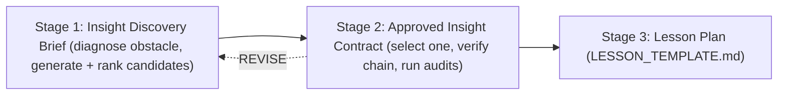

# Insight Discovery Gate

An operational gate that must be cleared **before** any lesson plan is written.
It exists to guarantee that a lesson is built around one verified conceptual
breakthrough, not a definition, a routine derivation, or a relatable story.

This is a checklist, not a pedagogy essay. Keep each artifact short and concrete.

---

## What counts as an insight

> **Guiding principle.** The goal of insight discovery is to find the *smallest
> defensible change* — in **representation, interpretation, context, or
> mathematical organization** — that changes the learner's model and makes an
> important inference feel **motivated or inevitable**.

A change qualifies as an insight when it is (a) mathematically correct, (b)
model-changing (the learner predicts or reasons differently afterward), and (c)
teachable at the target level. It does **not** have to be a surprising algebraic
fact. The gate values the following mechanisms **on equal footing** and does not
privilege structural rearrangement by default:

1. **Structural compression** — hidden redundancy or organization is exposed, and
   several procedural facts collapse into one derivation.
   *Example: Karatsuba recovers the middle term from a shared product, cutting four
   recursive multiplications to three.*
2. **Semantic grounding** — an abstract relation becomes meaningful through a
   familiar **goal, obligation, action, or consequence**, so the correct inference
   becomes naturally available.
   *Example: enforcing a drinking-age rule makes the Wason `P` and `¬Q` cards the
   obvious ones to check.*
3. **Operational grounding** — a formal relation is understood as a **process or
   guarantee**.
   *Example: reading `P → Q` as a one-way guarantee produced by a `P`-controlled
   code path.*
4. **Representational change** — a different diagram, coordinate system, notation,
   animation, or embodiment makes an invariant or relationship **visible**.
5. **Predictive / causal reorganization** — the learner gains a model that
   **correctly predicts what happens next** instead of memorizing a result.

These are **discovery lenses, not a rigid checklist**. Strong insights often
**combine** mechanisms — propositional implication, for instance, uses semantic
grounding for purpose, operational grounding for the one-way guarantee, a formal
"forbidden state" for structure, and the Wason task as an observable prediction of
learner reasoning. Do not force a candidate into exactly one category, and do not
assume every topic has a single magical representation.

**Anti-decoration rule (applies from the first candidate onward).** Renaming
`P, Q` with themed nouns, wrapping a formula in a story, or adding an entertaining
skin is **not** an insight. A context earns credit only when it changes the
learner's *intelligible goal* or makes the relevant reasoning *naturally
available* — and only when the intuition can be carried **back to the abstraction**
(see [abstraction return](#abstraction-return-required-when-grounded)).

---

## The three stages

1. **Insight Discovery Brief** — diagnose the cognitive obstacle, generate 8–12
   candidate insights across the mechanisms above, and rank them.
   Output lives at `docs/insight-brief-<topic>.md`.
2. **Approved Insight Contract** — select one primary breakthrough and verify its
   complete mathematical and pedagogical chain, plus the mathematical audit and
   (when grounding is used) the grounding & model-change audit.
   Output lives at `docs/insights/<topic>.md` and must end with a gate result.
3. **Lesson Plan** — may begin **only after** the Insight Contract result is
   `PASS`. Use [LESSON_TEMPLATE.md](./LESSON_TEMPLATE.md).

A lesson plan started without a `PASS` contract is out of process.

---

## Stage 1 — Insight Discovery Brief

Purpose: breadth then triage. Keep it lean — Stage 1 should cost less than the
insight quality justifies. Every element below is **required** except where marked
**(conditional)**.

### 1a. Diagnose the cognitive obstacle (required, brief)

State, in one or two lines, **why the conventional presentation is hard**. Name
the obstacle(s) from this list — this choice steers which mechanisms to search:

- missing mathematical structure;
- missing purpose (the learner cannot say why the concept exists);
- misleading notation;
- an unhelpful representation;
- semantic unfamiliarity (symbols carry no meaningful goal);
- procedural overload;
- an incorrect prior mental model;
- inability to predict or transfer.

"Students find this confusing" is **not** an acceptable diagnosis — it names a
symptom, not an obstacle. If the difficulty may be semantic or representational
rather than structural, note that here so Stage 1c is triggered.

### 1b. Generate candidates across mechanisms

Produce **8–12 candidates**. Deliberately search beyond surprising mathematical
facts — cover, as applicable, model-changing: mathematical reorganizations, visual
representations, operational models, semantic framings, counterexamples,
contrasts, interactive manipulations, and changes of perspective.

The central generation heuristic:

> **What is the smallest change that causes learners to make the correct
> prediction *before* the formal rule is simply stated?**

Each candidate records these **core fields** (always):

- initial mental model;
- tension / redundancy / obstacle it resolves;
- structural or interpretive reveal;
- minimal derivation (or minimal correct formal backing);
- visual / interactive / discovery mechanism;
- new prediction the learner can make;
- adjacent transfer;
- **insight mechanism(s)** from the taxonomy (one or more).

And these **grounding fields (conditional — required only when the candidate uses
a semantic/operational/representational bridge or analogy)**:

- **the bridge** — the familiar goal, process, or representation introduced;
- **preserved correspondences** — which formal relations map exactly;
- **analogy limits / pragmatic additions** — properties the context adds that the
  formal system does **not** have (causality, time, agency, obligation, etc.), and
  which intuitions must be **discarded**;
- **abstraction-return sketch** — how the learner gets back to the symbolic form.

### 1c. Compare isomorphic presentations (conditional)

When 1a flags the difficulty as **semantic or representational**, include a
side-by-side comparison of:

- a conventional **abstract** presentation, and
- a mathematically **isomorphic** grounded / alternative presentation.

The brief must state: what relations stay **mathematically unchanged**; what
becomes **easier to infer**; what **meaningful goal or background knowledge** was
introduced; and whether the improvement is **likely to transfer**. Do **not**
manufacture a real-world analogy for concepts where it adds nothing.

### 1d. Rank the strongest three

Rank against these criteria. (1)–(6) are the original bar; (7)–(8) add semantic
power without displacing rigor:

1. surprise before / inevitability after;
2. explanatory compression;
3. transfer value;
4. mathematical correctness *(a gate, not a tradeable score — a shaky candidate
   cannot be ranked #1 no matter how vivid)*;
5. interactive teachability;
6. prerequisite fit;
7. **semantic / cognitive leverage** — see the
   [criterion](#semantic-leverage-criterion). A themed relabel scores **0** here;
8. **abstraction-return strength (conditional)** — for grounded candidates, how
   credibly the learner returns to the symbolic form.

**Do not automatically rank semantic insights above structural ones, or vice
versa.** Compare their power fairly. Use this discriminator to keep the types
distinct:

| Candidate type | Leverage (7) | Compression (2) | Correctness (4) | Abstraction return (8) | Verdict |
| --- | --- | --- | --- | --- | --- |
| Correct but conventional explanation | low | low | ok | n/a | Not an insight (baseline to beat) |
| Memorable but structurally misleading analogy | high-seeming | — | **fails** | poor | **Reject** (imports a false property) |
| Themed example, no cognitive benefit | **0** | low | ok | n/a | **Reject** (decoration) |
| Context that naturally elicits the reasoning | high | some | ok | must be shown | Strong — if it returns to abstraction |
| Formal reorganization (Karatsuba-type) | n/a | high | exact | n/a | Strong structural insight |
| Semantic motivation **+** formal compression | high | high | exact | shown | **Strongest** — prefer when available |

Finish Stage 1 with a **discovery sequence** for the top candidate (discover, not
tell), ending in a *predict-not-recall* exit test. For grounded candidates the
sequence must include the return to an unfamiliar/symbolic case.

**PASS (advance to Stage 2)** when: at least one candidate is a genuine
model-changing insight, correctly stated, teachable at the target level, ranked #1
with a discovery sequence — and, if it relies on grounding, it carries a credible
abstraction return.

**REVISE** when: the top candidate is a definition/derivation in disguise; the
ranking ignores prerequisite fit; the strongest candidate is mathematically shaky;
the "insight" is a themed relabel with no semantic leverage; or a grounded
candidate has no path back to the abstraction.

---

## Stage 2 — Approved Insight Contract

Purpose: commit to one primary insight and prove it end-to-end. This is the
gate's core.

### Required contents of the primary insight

Items 1–11 are **always required**. Items 12–14 are **conditional**: required
**whenever the insight uses a semantic, operational, or representational bridge**,
and omitted for a purely structural insight (do not burden a structural lesson
with a forced real-world analogy).

1. **Diagnosed cognitive obstacle** — the Stage 1a obstacle this insight removes.
2. **Insight mechanism(s)** — which of the five mechanisms are at work.
3. **Initial mental model** — what the learner believes at the start.
4. **Tension or redundancy** — the concrete fact/obstacle their model can't explain.
5. **The model change (structural / interpretive reveal)** — the reframing that
   resolves the tension. State plainly *what the learner now believes instead*.
6. **Full causal chain** — every reconstruction step, with no gaps. A reader must
   get from the naive object to the result without inventing a step.
7. **Minimal formal derivation** — the smallest rigorous derivation (or, for a
   semantic insight, the formal structure that validates it — e.g. `P → Q ≡ ¬P ∨ Q`
   and the forbidden `P ∧ ¬Q`).
8. **Equivalence to the original object** — why the new view yields exactly the
   same result (same value/meaning, including any normalization/carrying).
9. **Cost / model change** — why it changes computational or conceptual cost, or
   which inferences it now licenses, stated precisely (constant vs exponent;
   sufficiency vs lower bound; which inference rules follow and which fail).
10. **What the learner can predict or do afterward** — a new, checkable prediction
    or action the learner makes **without being told** (e.g. selects `P` and `¬Q`;
    predicts branch count and exponent).
11. **Transfer assessment** — the adjacent concept(s) it generalizes to, and
    whether the connection is exact, approximate, or architectural.
12. **Semantic / operational bridge (conditional)** — the familiar goal, process,
    obligation, or representation used, and *why it makes the inference natural*.
13. **Preserved correspondences & analogy limits (conditional)** — an explicit,
    two-column account: relations that map **exactly**, and properties the context
    **adds** (causality, time, agency, enforcement, permission/obligation, domain
    knowledge, social expectation) that must be **named and then discarded**. The
    gate rejects a contract that smuggles an added property into the mathematics.
14. **Abstraction return (conditional)** — the credible path
    `grounded case → explicit structural correspondence → unfamiliar case →
    symbolic case`, plus how the lesson/validation will detect a learner who
    solved only the familiar scenario.

Also state, always: **prerequisites, limitations, and likely misconceptions**.

### Semantic-leverage criterion

A candidate has **semantic leverage** only if the grounding reveals at least one
of:

- **why the concept exists** / what problem it solves;
- **what counts as success or violation**;
- **what action or inference the structure licenses**;
- **why the learner should attend to particular cases** and not others.

Merely substituting themed nouns for `P` and `Q` scores **zero** leverage, however
relatable. Leverage is about changing the learner's *goal* or making the *relevant
reasoning available*, not about familiarity of vocabulary.

### Abstraction return (required when grounded)

A grounded insight is only credited if the contract shows the learner can leave
the story behind. The return path is graded in four distinguishable steps —
recognizing the familiar story, explaining the structural mapping, transferring
the inference to a different context, and solving the abstract form. A candidate
that lands only the familiar scenario (e.g. drinking-age but not an unfamiliar
symbolic `P → Q`) is **downgraded or rejected**: the learner acquired the scenario,
not the concept.

### Review signoff (required)

The contract must record a review-signoff block so it does not silently
self-certify:

- **Contract author**
- **Mathematical reviewer**
- **Pedagogical reviewer**
- **User / domain-owner approval**
- **Outstanding concerns**

One person or model may temporarily fill several roles, but that must be stated
honestly (e.g. "self-review, not independent"). Record the true current status.

### PASS / REVISE

PASS the contract only when **all** hold:

- **Pedagogical chain complete:** required items present (1–11, plus 12–14 when
  grounded), and the causal chain (item 6) has no missing reconstruction step.
- **Mathematical audit clean** ([Audit A](#audit-a--mathematical-stage-2)): every
  check answered, with any overreach corrected in the text.
- **Grounding & model-change audit clean** ([Audit B](#audit-b--grounding--model-change-stage-2)):
  every applicable check answered.

(The review-signoff block should also be filled in honestly; a `PASS` with all
review roles self-filled is allowed but flags that independent review is still
advisable.)

REVISE when any of:

- a reconstruction step is asserted rather than derived;
- a sufficient construction is presented as a lower bound (or vice versa);
- an analogy is used that does not preserve the required structure, **or imports a
  property the formal system lacks** (causality, time, obligation) without naming
  and discarding it;
- carrying/normalization is hidden inside an "equivalence";
- a broader connection is claimed as exact when it is only architectural;
- advanced notation is treated as a prerequisite for the target learner;
- the "insight" is a **themed relabel** with no semantic leverage, or a **grounded
  candidate lacks a credible abstraction return**;
- the candidate is not more illuminating than a strong conventional explanation.

The contract must end with an explicit line:

`Gate result: PASS` (or `REVISE`) and the **exact primary insight** sentence.
Stage 3 keeps this sentence **verbatim in its planning metadata** for
traceability; the learner-facing lesson must preserve the insight's meaning and
causal chain but **may use shorter, clearer wording** (do not require the long
contract sentence to appear verbatim in learner-facing prose).

---

## Stage 3 — Lesson Plan

Begins only after `Gate result: PASS`. Use [LESSON_TEMPLATE.md](./LESSON_TEMPLATE.md).

Beyond the template's usual sections, a Stage 3 plan must include an **insight
traceability** mapping. For **every** obligation in the approved contract's causal
chain — and, for a grounded insight, its **bridge**, **named analogy limits**, and
**abstraction return** — the plan states:

- where the learner encounters or discovers it;
- the scene, checkpoint, explorer, or exercise responsible;
- the observable evidence the learner understood it (for a grounded insight, this
  includes evidence of the *return to abstraction*, not just success on the story).

A lesson plan does **not** pass merely because it links the contract or repeats the
primary-insight sentence. Every causal step, and every grounding obligation, must
have a learner-facing location and observable evidence.

---

## Audit A — Mathematical (Stage 2)

Mandatory. Run every candidate that reaches Stage 2 — and especially the primary —
through these checks. Record the answer to each; fix the artifact where a check
fails.

1. **Does the conclusion follow from the derivation?** No hidden steps; each claim
   is either derived or explicitly cited as assumed.
2. **Sufficiency vs lower bound.** Is a *construction* (this works) being confused
   with a *lower bound* (nothing cheaper works)? State which is proven. Redundancy
   / rank–nullity motivates but does not prove multiplicative complexity.
3. **Structure-preserving analogy.** Does any analogy or reinterpretation preserve
   the mathematical structure it borrows (dimensions, weights, operations)? Name
   objects precisely (e.g. subrectangles, not "squares," unless dimensions match).
4. **Hidden carrying/normalization.** Is positional carrying, modular reduction, or
   normalization silently folded into an "equivalence"? Make it an explicit,
   separate step (e.g. $xy=z_2B^{2m}+z_1B^{m}+z_0$, then carry).
5. **Nature of a broader connection.** Is a claimed link exact, approximate, or
   merely architectural (same phases, different mechanism)? Say which. Do not
   describe FFT multiplication as literally "Toom-Cook with $k\to n$."
6. **Notation level.** Is any advanced notation (tensor rank, projective/∞ nodes,
   inverse Vandermonde) necessary for the target learner, or expert-only? Keep
   expert material labeled and out of the elementary chain.

## Audit B — Grounding & model-change (Stage 2)

The **universal** questions (B1–B3) apply to **every** primary insight. The
**grounding** questions (B4–B7) apply **only when a semantic/operational/
representational bridge is used**; mark them *N/A* for a purely structural insight.

1. **Model change vs clearer wording (universal).** Would fixing this make the
   learner *understand something new*, or is it only clearer phrasing of the same
   model? Only the former is an insight.
2. **New prediction (universal).** Does the candidate let the learner make a new,
   checkable prediction or take a correct action **without being told**? Name it.
3. **Compression / purpose exposed (universal).** Does it compress several facts,
   rules, cases, or procedures, **or** expose the concept's purpose, structure, or
   consequence — as opposed to only renaming variables?
4. **Genuine isomorphism (grounding).** Are the abstract and grounded presentations
   **actually isomorphic in the relevant respects** (same truth conditions,
   operations, or relations)? Name what stays fixed.
5. **Named pragmatic additions (grounding).** Which extra assumptions does the
   context introduce (causality, time, agency, obligation/permission, enforcement,
   domain knowledge)? Each must be **named**, and the intuitions that do **not**
   transfer must be explicitly discarded. (For the code analogy: keep the *one-way
   guarantee*, discard the claim that every material implication is program
   execution or causation. For the deontic Wason story: keep *violation
   detection*, name that an *obligation* rule is not identical to a descriptive
   material conditional.)
6. **Abstraction return present (grounding).** Is there a credible path back to the
   symbolic form, and a way to tell a learner who solved **only** the familiar
   scenario from one who acquired the concept?
7. **Theme-removal test (grounding).** Would the lesson still work if the
   entertaining theme were stripped to its structure? If the theme is load-bearing
   *decoration* rather than *leverage*, REVISE.

Both audits share one closing question: **is the proposed insight more illuminating
than a strong conventional explanation?** If not, it is not worth the gate.

---

## Calibration examples

Two internal reference cases. They anchor the gate so it keeps rewarding strong
structural insights **and** recognizes semantic/operational leverage — without
approving decoration. (These are illustrations embedded here; the only fully
worked artifacts on disk are the Karatsuba brief and contract.)

### Karatsuba — structural compression

- **Obstacle:** missing mathematical structure (four FOIL pieces, but only three
  place-value levels — the redundancy is hidden).
- **Mechanism:** structural compression (with a representational aid: the area
  rectangle).
- **Model change:** $AD$ and $BC$ share a place-value level, so the answer needs
  only their **sum**; the separate $(A+B)(C+D)$ rectangle recovers it with one
  extra product.
- **Why the gate rewards it:** exposes hidden redundancy; reduces four recursive
  multiplications to three; the derivation makes the algorithm feel inevitable;
  transfers to recurrence/complexity reasoning (branching factor sets the
  exponent). Audit A keeps sufficiency vs lower bound honest; Audit B4–B7 are
  *N/A* (no real-world bridge is forced). Worked artifacts:
  [insight-brief-karatsuba.md](./insight-brief-karatsuba.md),
  [insights/karatsuba.md](./insights/karatsuba.md).

### Propositional implication — layered (semantic + operational + structural)

The value here is **not** one surprising fact; it is a stack of layers, and the
gate should prefer the *combination*, not the story alone. Obstacle (1a): **missing
purpose** and an **incorrect prior model** — learners memorize modus
ponens/tollens and the two fallacies without knowing why "if" is asymmetric, and
misread `→` as causation.

| Layer | What it is | Mechanism | How the gate treats it |
| --- | --- | --- | --- |
| Truth table only | `P → Q` defined by its four rows | — | Correct but **conventional**; low model change. Baseline to beat, not the insight. |
| Forbidden corner `P ∧ ¬Q` | The single row that makes `P → Q` false | structural | Correct and useful, but close to conventional exposition; it is the **formal structure**, not the motivating model. |
| One-way guarantee (`if (P) { Q }`) | Entering the `P`-controlled path guarantees `Q` | operational grounding | **Credited** as motivation: explains modus ponens (path forward), modus tollens (missing `Q` ⇒ path not taken), and why affirming the consequent / denying the antecedent fail (other paths can produce `Q`). **Audit B5 required:** keep the one-way guarantee; **discard** causality/time and "every implication is code." |
| Wason drinking-age | Enforce "if drinking alcohol, must be of age"; find violations | semantic grounding | **Credited:** rule-enforcement supplies a goal, so checking the drinker (`P`) and the underage person (`¬Q`) — and ignoring `Q`, `¬P` — becomes natural. **Audit B4:** isomorphic truth conditions to the abstract card task. **Audit B5:** name that a **deontic obligation** rule is not identical to a descriptive material conditional. **Audit B6 required.** |
| `P → Q ≡ ¬P ∨ Q` | The formal equivalence / generalization | structural | Validates and generalizes the intuitions above. |
| Decontextualized transfer | An unfamiliar symbolic `P → Q` selection | — (evidence) | The **abstraction-return** check: a learner who aces drinking-age but fails this has learned the scenario, not implication. |

- **Strongest packaging (what the gate should prefer):** the **one-way-guarantee
  model** (motivation) **+** the **forbidden `P ∧ ¬Q` / `¬P ∨ Q`** (formal
  structure) **+** the **Wason task** (observable prediction of learner reasoning)
  **+** a **decontextualized transfer** (abstraction return). The stronger
  one-sentence model is: *"An implication is a one-way guarantee, not a complete
  history of how `Q` came about,"* with `P ∧ ¬Q` as the formal structure beneath it.
- **What the gate must reject or downgrade here:**
  - a truth-table-only presentation dressed with themed nouns ("rain → wet ground")
    that still just lists rows — **decoration**, semantic leverage 0 (Audit B3, B7);
  - reading `→` as **causation** or as **temporal** program execution — an imported
    false property (Audit A3, B5); vacuous truth alone breaks it;
  - a lesson that succeeds only on the drinking-age story — **no abstraction
    return** (Audit B6), downgraded.

---

## Rejected as non-insights

Sharpen rejections during Stage 1 (`rejected as non-insights` list) and enforce
them in Stage 2:

- **Definitions / mechanics** ("split each number in half"), **historical trivia**,
  and **routine derivations** (grinding an expansion by hand).
- **Decorative analogy** — "it's like sharing work between friends," or `P, Q`
  renamed as themed nouns: relatable, no structure, **zero semantic leverage**.
- **Structurally misleading analogy** — memorable but importing a property the
  mathematics lacks (implication as causation; "wider operands fixed by carrying").
- **Grounded-only candidate** — works solely in the familiar scenario with no
  credible return to the abstraction.
- **Clearer-wording-only** — a cleaner restatement that changes no prediction and
  is no more illuminating than a strong conventional explanation.

---

## File layout

- `docs/insight-brief-<topic>.md` — Stage 1.
- `docs/insights/<topic>.md` — Stage 2 approved contract (ends with gate result).
- Lesson plan (Stage 3) via `docs/LESSON_TEMPLATE.md`, which requires a linked
  `PASS` contract before planning begins.

Worked reference: [insight-brief-karatsuba.md](./insight-brief-karatsuba.md)
(Stage 1) and [insights/karatsuba.md](./insights/karatsuba.md) (Stage 2, PASS).
The propositional-implication case above is an **inline calibration example only** —
the gate does not ship a brief or contract for it.
