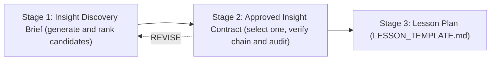

# Insight Discovery Gate

An operational gate that must be cleared **before** any lesson plan is written.
It exists to guarantee that a lesson is built around one verified conceptual
breakthrough, not a definition or a routine derivation.

This is a checklist, not a pedagogy essay. Keep each artifact short and concrete.

## The three stages

1. **Insight Discovery Brief** — generate 8–12 candidate insights and rank them.
   Output lives at `docs/insight-brief-<topic>.md`.
2. **Approved Insight Contract** — select one primary breakthrough and verify its
   complete mathematical and pedagogical chain, plus the mathematical audit.
   Output lives at `docs/insights/<topic>.md` and must end with a gate result.
3. **Lesson Plan** — may begin **only after** the Insight Contract result is
   `PASS`. Use [LESSON_TEMPLATE.md](./LESSON_TEMPLATE.md).

A lesson plan started without a `PASS` contract is out of process.

---

## Stage 1 — Insight Discovery Brief

Purpose: breadth then triage.

Requirements:

- 8–12 candidates, each with: initial mental model; tension/redundancy;
  structural reveal; minimal derivation; visual/interactive mechanism; new
  prediction; adjacent transfer.
- An explicit "rejected as non-insights" list (definitions, historical trivia,
  routine derivations, decorative analogies, non-model-changing facts).
- A ranked top three against: (1) surprise/inevitability; (2) explanatory
  compression; (3) transfer value; (4) mathematical correctness; (5) interactive
  teachability; (6) prerequisite fit.
- A discovery sequence for the top candidate (discover, not tell).

PASS (advance to Stage 2) when: at least one candidate is a genuine
model-changing insight, correctly stated, teachable at the target level, and
ranked #1 with a discovery sequence.

REVISE when: the top candidate is a definition/derivation in disguise; the ranking
ignores prerequisite fit; or the strongest candidate is mathematically shaky.

---

## Stage 2 — Approved Insight Contract

Purpose: commit to one primary insight and prove it end-to-end. This is the
gate's core.

### Required contents of the primary insight

All of the following must be present and correct:

1. **Initial mental model** — what the learner believes at the start.
2. **Tension or redundancy** — the concrete fact their model cannot explain.
3. **Structural reveal** — the reframing that resolves the tension.
4. **Full causal chain** — every reconstruction step, with no gaps. A reader must
   be able to get from the naive object to the result without inventing a step.
5. **Minimal formal derivation** — the smallest rigorous derivation.
6. **Equivalence to the original object** — why the new computation yields exactly
   the same result (same value, including any normalization/carrying).
7. **Cost change** — why it changes computational or conceptual cost, stated
   precisely (constant vs exponent; sufficiency vs lower bound distinguished).
8. **Visual/interactive discovery mechanism** — how a learner would find it.
9. **What the learner can predict afterward** — a new, checkable prediction.
10. **Transfer assessment** — the adjacent concept(s) it generalizes to, and
    whether the connection is exact, approximate, or architectural.
11. **Prerequisites, limitations, likely misconceptions** — explicit.

### Review signoff (required)

The contract must record a review-signoff block so it does not silently
self-certify:

- **Contract author**
- **Mathematical reviewer**
- **Pedagogical reviewer**
- **User / domain-owner approval**
- **Outstanding concerns**

One person or model may temporarily fill several roles, but that must be stated
honestly (e.g. "self-review, not independent"). Record the true current status.

### PASS / REVISE

PASS the contract only when **both** hold:

- Pedagogical chain complete: items 1–11 present, and the causal chain (item 4)
  has no missing reconstruction step.
- Mathematical audit clean: every check in the audit below is answered, with any
  overreach corrected in the text.

(The review-signoff block should also be filled in honestly; a `PASS` with all
review roles self-filled is allowed but flags that independent review is still
advisable.)

REVISE when any of:

- a reconstruction step is asserted rather than derived;
- a sufficient construction is presented as a lower bound (or vice versa);
- an analogy is used that does not preserve the required structure;
- carrying/normalization is hidden inside an "equivalence";
- a broader connection is claimed as exact when it is only architectural;
- advanced notation is treated as a prerequisite for the target learner.

The contract must end with an explicit line:

`Gate result: PASS` (or `REVISE`) and the **exact primary insight** sentence.
Stage 3 keeps this sentence **verbatim in its planning metadata** for
traceability; the learner-facing lesson must preserve the insight's mathematical
meaning and causal chain but **may use shorter, clearer wording** (do not require
the long contract sentence to appear verbatim in learner-facing prose).

---

## Stage 3 — Lesson Plan

Begins only after `Gate result: PASS`. Use [LESSON_TEMPLATE.md](./LESSON_TEMPLATE.md).

Beyond the template's usual sections, a Stage 3 plan must include an **insight
traceability** mapping. For **every** obligation in the approved contract's causal
chain, the plan states:

- where the learner encounters or discovers it;
- the scene, checkpoint, explorer, or exercise responsible;
- the observable evidence the learner understood it.

A lesson plan does **not** pass merely because it links the contract or repeats the
primary-insight sentence. Every causal step must have a learner-facing location and
observable evidence.

---

## Mathematical Audit (Stage 2, mandatory)

Run every candidate that reaches Stage 2 — and especially the primary — through
these checks. Record the answer to each; fix the artifact where a check fails.

1. **Does the conclusion follow from the derivation?** No hidden steps; each claim
   is either derived or explicitly cited as assumed.
2. **Sufficiency vs lower bound.** Is a *construction* (this works) being confused
   with a *lower bound* (nothing cheaper works)? State which is proven. Redundancy
   / rank–nullity motivates but does not prove multiplicative complexity.
3. **Structure-preserving analogy.** Does any analogy or reinterpretation preserve
   the mathematical structure it borrows (dimensions, weights, operations)? Name
   objects precisely (e.g. subrectangles, not "squares," unless dimensions match).
4. **Hidden carrying/normalization.** Is positional carrying, modular reduction, or
   normalization silently folded into an "equivalence"? Make it an explicit,
   separate step (e.g. $xy=z_2B^{2m}+z_1B^{m}+z_0$, then carry).
5. **Nature of a broader connection.** Is a claimed link exact, approximate, or
   merely architectural (same phases, different mechanism)? Say which. Do not
   describe FFT multiplication as literally "Toom-Cook with $k\to n$."
6. **Notation level.** Is any advanced notation (tensor rank, projective/∞ nodes,
   inverse Vandermonde) necessary for the target learner, or expert-only? Keep
   expert material labeled and out of the elementary chain.

---

## File layout

- `docs/insight-brief-<topic>.md` — Stage 1.
- `docs/insights/<topic>.md` — Stage 2 approved contract (ends with gate result).
- Lesson plan (Stage 3) via `docs/LESSON_TEMPLATE.md`, which requires a linked
  `PASS` contract before planning begins.

Worked reference: [insight-brief-karatsuba.md](./insight-brief-karatsuba.md)
(Stage 1) and [insights/karatsuba.md](./insights/karatsuba.md) (Stage 2, PASS).
