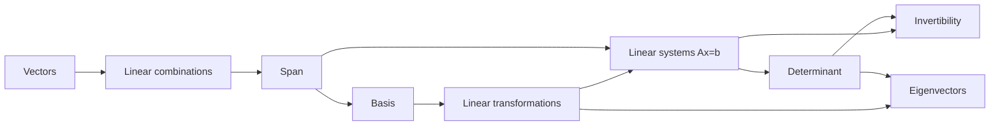

# Interactive Textbook Vision

The canonical **educational** design document for this project. Where
[LESSON_DESIGN.md](./LESSON_DESIGN.md) specifies *how* a lesson is built (phase
flow, visual language, notation, continuity, accessibility), this document
specifies *why* — the learning theory, the explanation craft, and the standard of
conceptual understanding every lesson must reach.

> **Primary objective.** This document should be able to guide the next several
> years of educational content. It is written to be **stable**: a future lesson
> author should be able to follow it without re-deriving the project's philosophy
> from scratch. Treat it not as "a nice design doc" but as **the canonical
> educational specification**. When a new chapter or a redesign raises a
> pedagogical question, the answer should be here, or added here.

Read alongside:

- [LESSON_DESIGN.md](./LESSON_DESIGN.md) — the mechanical lesson standard.
- [COURSE_MASTERY_STANDARD.md](./COURSE_MASTERY_STANDARD.md) / [LESSON_MASTERY_CONTRACT.md](./LESSON_MASTERY_CONTRACT.md) — the mastery-assurance standard. This document defines *what understanding means*; the mastery standard defines *how we verify the learner acquired it* (coverage, rigor, assessment, retention). The "enough depth" test in §17 is the pedagogical seed of the mastery gate's evidence levels.
- [MATH_CORRECTNESS.md](./MATH_CORRECTNESS.md) — mathematical conventions (source of truth for geometry).
- [ERROR_LOG.md](./ERROR_LOG.md) — known math/visualization failure modes.
- [LESSON_CORRECTNESS_CHECKLIST.md](./LESSON_CORRECTNESS_CHECKLIST.md) — per-lesson sign-off.

---

## How to read this document: durable principles vs. current examples

This document operates at **two levels**, and it is important not to confuse them.

- **Durable principles** are intended to last for years. They are binding. They
  describe *how learning works* and *what understanding means* in this product,
  independent of any particular chapter.
- **Current chapter examples** are concrete illustrations drawn from today's four
  lessons — a particular block composition, the `--role-*` colors, the
  eigenvector derivation, the entries in the mental-model table. They exist to
  make a principle tangible. **They are illustrations, not permanent mandates.**

Throughout, examples that could be mistaken for mandates are marked with a note
like *(Example, not a mandate.)* A future author is free to add a lesson whose
mental model, palette usage, or worked example differs from today's, **as long as
the durable principle is honored.** The value source of truth for anything
concrete lives in code — [src/styles/tokens.css](../src/styles/tokens.css) for
colors, the files in [src/lessons/](../src/lessons/) for examples — not in this
document. This document owns the *meaning*; the code owns the *values*.

A quick test when in doubt: *"If we deleted every current lesson tomorrow, would
this sentence still be true?"* If yes, it is a durable principle. If no, it is an
example, and should read like one.

---

## 1. Purpose, audience, and north star

**Audience.** College-level learners meeting linear algebra as a *conceptual*
subject, not a computational chore. They can handle symbols and paper-and-pen 
calculations; what they usually lack is the picture behind the techniques and 
the reason the techniques were invented.

**North star.** The learner should feel they are reading a *beautifully
illustrated live notebook* — not a traditional textbook, and not a playlist of
disconnected videos. A textbook is authoritative but inert; a video is vivid but
un-pausable and non-interactive. This product aims for the intersection: the
authority and precision of a good textbook, the visual intuition of the best
explanatory video, and the agency of an interactive notebook the learner can
poke at.

**Scope of this document.** Pedagogy only. It does not define infrastructure,
milestones, or implementation tasks, and it does not restate the mechanics in
LESSON_DESIGN.md — it cross-references them. When this document and
LESSON_DESIGN.md appear to overlap (e.g. "one conceptual change at a time"), this
document explains the *learning reason*; LESSON_DESIGN.md specifies the
*production rule*.

**What we are not building** (durable): a graphing calculator, a formula
reference, a gamified app with points and streaks, or a video library. Interaction
serves understanding; it is never the point in itself (see §5, principle 10, and
§16).

---

## 2. Central thesis

> **Every mathematical symbol should correspond to something the learner can
> mentally visualize, and every important visualization should eventually become
> something the learner can compute symbolically.**

This is the defining law of the project. Intuition and algebra are not two
subjects to be taught in sequence; they are two views of one object, and the
lessons must continuously translate between them. The learner should never file
"the picture" and "the formula" in separate mental folders.

The translation runs in both directions, and both directions are obligations:

- **Symbol to picture.** No symbol is introduced without the learner being shown
  what it *is*. \(\det(A)\) is not "a number you compute with a formula"; it is
  the signed area of the parallelogram that the unit square becomes. The formula
  is the *last* thing the learner meets, not the first.
- **Picture to symbol.** No picture is left as "mere intuition." The learner who
  has watched the unit square stretch into a parallelogram must eventually be able
  to *compute* its area from the columns of \(A\), and to read the sign as
  orientation. A picture the learner cannot eventually operationalize is a
  decoration, not a concept.

Worked correspondence (from the determinants lesson, an example of the thesis in
action): the symbol \(\det\begin{bmatrix} 2 & 1 \\ 0 & 1 \end{bmatrix} = 2\)
means "the unit square's image — the parallelogram spanned by \(A\mathbf{e}_1 =
(2,0)\) and \(A\mathbf{e}_2 = (1,1)\) — has area 2, orientation preserved." The
picture and the number are the *same statement*, and the lesson's job is to make
that identity unmistakable.

---

## 3. Desirable compression

A good lesson does not merely add facts. It **progressively compresses many
separate observations into one reusable idea**. Mathematics is, in large part,
the discipline of finding compact representations for broad patterns, and lessons
should visibly enact that.

The learner in the determinants lesson first meets a scattering of observations:

- the unit square becomes a parallelogram;
- that parallelogram has an *area*;
- sometimes the parallelogram *collapses* onto a line;
- sometimes the orientation *flips*;
- collapse coincides with the map being *singular* / columns dependent.

By the end, all five compress into a single handle: \(\det(A)\). Its magnitude is
the area factor, zero is collapse, its sign is orientation, and its vanishing is
singularity. One symbol now *carries* the whole cluster of experiences.

Be precise about the important *consequence*, though: the determinant's magnitude
measures oriented-area scaling, not "how much information is preserved" on a
sliding scale. A tiny nonzero determinant is still fully invertible; the
qualitative information-loss boundary is at **zero**. The sharp statement is: **a
zero determinant means some distinct inputs become indistinguishable under the
transformation** (the map crushes a dimension), whereas any nonzero determinant,
however small, keeps every input recoverable. Use "information loss" as this
crisp consequence of collapse, not as a gradual gloss on the magnitude.

Likewise, the entire geometric behavior of "a direction the transformation only
scales" compresses into \(A\mathbf{v} = \lambda\mathbf{v}\).

**Compression is the goal state of a lesson.** Design each lesson so there is a
moment where the many things the learner has seen *snap together* into the
compact object, and the learner feels the relief of holding one idea instead of
five. The **mental model** (§7) is the intuitive form of that compressed handle;
the symbol is its formal form. A lesson that never compresses has taught facts,
not mathematics.

Corollary for authors: know your compression target before you write. Ask "what
one idea should all of this collapse into?" and design the beats so they visibly
converge on it. *(The determinant and eigenvector targets above are examples; a
future chapter will have its own.)*

---

## 4. The learning model (the lesson beats, by pedagogical job)

The named beats below are a **palette of pedagogical jobs**, not a fixed pipeline.
LESSON_DESIGN.md lists the same blocks (Motivate, Watch, Check, Explore, Practice,
Summarize, plus formal statements and worked examples) and is explicit that each
lesson **composes its own order** — blocks repeat, reorder, or drop out per
lesson, with only *guided Watch before learner Explore* fixed. Here each beat is
described by its *pedagogical job* — what it is responsible for in the learner's
head — independent of where it lands in any given lesson. (For the UI mechanics
and the `route` mechanism, see LESSON_DESIGN.md.)

| Beat | Learner-facing | Pedagogical job |
| --- | --- | --- |
| Introduction / Think | "Think about it" | Orient the learner and open a **genuine question** they can hold. Create the itch the rest of the lesson scratches. Invite a prediction *only* where it would materially expose a misconception or set up an important contrast — not before every explanation. |
| Watch | "Watch the idea" | Show the idea forming, one conceptual change at a time, with symbol and geometry synchronized. Build the mental model before the learner has to steer. |
| Check | "Quick check" | Retrieve, don't restate. Ask for an interpretation (or a prediction, where it sets up a contrast) *before* revealing. This is a learning event (testing effect), not an assessment. |
| Explore | "Try it yourself" | Hand over the *same* example to manipulate, in service of a specific question. Let the learner test the boundaries of the model they just built. |
| Practice | "Practice" | Apply and transfer. Every reveal continues teaching (see §11). |
| Remember | "Remember this" | Compress. State the one reusable idea the lesson collapses into (see §3). |

Two durable ordering commitments underlie this flow:

- **Watch before Explore.** The learner sees a guided formation of the idea
  before manipulating it. Unguided manipulation of a concept the learner does not
  yet have is the "playground" failure mode (§5, principle 10).
- **Question before procedure.** Every computational method is preceded by the
  question that makes it necessary (§5, principle 3).
- **Prediction is a tool, not a ritual.** Open a genuine question the learner can
  hold; use *prediction* when it materially exposes a misconception or prepares
  the learner for an important contrast. Do **not** require a prediction before
  every animation or explanation — that quickly becomes repetitive and hollow.
  Prediction stays valuable for selected checks, exercises, and misconception
  confrontations (§12), and nowhere else by default.

*(The exact number and naming of beats is the current instance. A short concept
lesson may merge Introduction+Watch; a two-idea lesson may run two Explore/Practice
cycles. The durable commitments — a real question first, guided watch before
learner control, and a compression at the end — are what must survive.)*

---

## 5. The ten principles, refined

The following ten principles were developed for this project. They are kept, but
each is **refined and, where appropriate, critiqued** against mathematics- and
learning-education research. The critiques are the point: a principle applied
without its failure mode in view tends to backfire.

### 5.1 Multiple coordinated representations

*Principle.* Present every important idea through synchronized representations —
geometric, symbolic, numerical, verbal — that reinforce one another rather than
appearing as separate explanations.

*Refinement.* Multiple representations reinforce **only when the learner can
integrate them**; presented carelessly they *compete* for attention and increase
load. Cognitive Load Theory's split-attention and redundancy effects warn that
four simultaneous panels can teach *less* than one. So: prefer **sequentially
coordinated** reveals (introduce the geometry, then bind the symbol to it, then
the number), keep representations **spatially integrated** (label on the object,
not in a distant legend), and **drop a representation once it is redundant**. The
goal is one idea seen four ways, not four things to track.

### 5.2 Objects before procedures

*Principle.* Students fail when they learn procedures before understanding the
objects those procedures act on. Follow: object, intuition, visualization, formal
definition, computation, interpretation. Never begin with an algorithm alone.

*Refinement.* Mostly right, with one honest caveat from APOS theory: for many
learners the object is not available *before* any action — it is **encapsulated
from** repeated actions and processes. A little computation can be what *builds*
the object, not a betrayal of it. So treat the progression as a **spiral, not a
strict gate**: lead with the object and its picture, but allow small,
purpose-built computations early when they are what makes the object thinkable.
The durable rule is narrower and safer: **never begin with a bare algorithm whose
object the learner cannot yet picture.**

### 5.3 Every procedure answers "Why?"

*Principle.* Don't introduce a computation; introduce the *question* that makes it
necessary. Not "compute the determinant" but "how can we tell whether a
transformation destroys information without testing infinitely many vectors?" Then
derive it. Every algorithm should feel inevitable.

*Refinement.* Keep this — it is one of the strongest principles here — but beware
**false inevitability**. A too-smooth derivation can induce the *illusion of
understanding*: the learner nods along and retains nothing, because they never had
to want the answer. Two guards: (1) let the learner **feel the difficulty first**
(a brief productive struggle or a failed naive attempt) so the resolution lands;
(2) be honest that some steps are a **motivated choice of definition**, not a
logical necessity — "we *define* it this way because it makes the picture work,"
not "it could not have been otherwise." Inevitability is a feeling to earn, not a
claim to assert.

### 5.4 Synchronize symbolic manipulation with visualization

*Principle.* Every important derivation has a synchronized visual counterpart;
each symbolic step corresponds to an animation or transition. Students should
always know what the equations mean geometrically.

*Refinement.* Yes — this is the central thesis (§2) made operational, and it is
the backbone of the worked-example philosophy (§10). One caution: **not every
algebraic step has an equally meaningful picture.** Manufacturing a visual for a
purely bookkeeping step (clearing a denominator) dilutes the ones that matter.
Synchronize the steps that carry *meaning* (e.g. "\((A - \lambda I)\mathbf{v} =
\mathbf{0}\) means the auxiliary map \(A - \lambda I\) sends this direction to the
origin"), and let routine algebra be routine.

### 5.5 Worked examples teach reasoning

*Principle.* Worked examples explain why each step is performed, its geometric
interpretation, the invariant being used, why the next step follows, and why
alternatives fail — a professor thinking aloud, not a solution key.

*Refinement.* Strongly supported (the worked-example effect), with two research
caveats. First, the **self-explanation effect**: learners gain most when they
generate explanation, so a fully spelled-out example should include **prompts that
make the learner explain**, not just read. Second, the **expertise-reversal
effect**: heavy worked guidance helps novices but *hurts* once competence grows.
The remedy is **fading** — later examples omit steps and ask the learner to
supply them. So the whiteboard-professor standard is the ceiling for a *first*
example of a procedure, and guidance should fade across a lesson and a chapter.
See §10.

### 5.6 Build conceptual connections

*Principle.* Make relationships explicit; construct a connected graph of concepts
(vectors, linear combinations, span, basis, transformations, determinant,
invertibility, eigenvectors). The learner should keep revisiting earlier ideas;
nothing should feel isolated.

*Refinement.* Kept and strengthened in §14: the graph is not a syllabus, it is
the learner's **internal model**, and new lessons should **strengthen existing
edges**, not merely append nodes.

### 5.7 Address misconceptions proactively

*Principle.* Each lesson anticipates common misconceptions where they naturally
arise (coordinates are not the vector; span is reachability not just "linear
combinations"; independence is not perpendicularity; determinant sign is
orientation not negative area; eigenvectors stay on a line not necessarily a
direction; repeated eigenvalues need not give multiple eigendirections).
Misconceptions become a recurring feature.

*Refinement.* Right, but **labeling a misconception is not correcting it.**
Conceptual-change research (and refutation-text studies) show that durable
correction requires **eliciting the wrong belief, confronting it with conflicting
evidence, and then resolving** — not a parenthetical "note: don't think X." So
misconceptions should be staged as *events*: surface the learner's likely
prediction, show the case where it breaks, then repair. See §12.

### 5.8 Practice continues teaching

*Principle.* Practice never ends at "Correct." Every reveal is a miniature
lesson: reasoning, synchronized visualization, symbolic derivation,
interpretation, and connection back to the concept. Revealing a determinant
answer should animate the transformed basis, build the parallelogram, highlight
the signed area, and *only then* give the number.

*Refinement.* Excellent, with a load caveat: a cinematic reveal for *every*
routine item is expensive and can become noise. Tier it (see §9 and §11): rich,
model-rebuilding reveals for conceptually pivotal items; compact reveals for
drill. Also exploit the **testing effect** — the learner should commit to an
answer *before* the teaching reveal, so the reveal lands on a prepared mind.

### 5.9 Layer information

*Principle.* Avoid overwhelming beginners: core explanation first, optional
expandable layers after (Why do we care / Common trap / Mathematical note /
Historical note / Looking ahead / Connection / Intuition recap). Textbook depth
without textbook verbosity.

*Refinement.* Kept. The discipline is editorial: the **main line must be complete
and correct without any layer opened.** Layers are for the curious and the
returning, never a place to hide something the learner actually needs. If a fact
is required to understand the core, it is not a layer. See §13.

### 5.10 Narrative over encyclopedia

*Principle.* Aim for a coherent story, not maximum density. Each section motivates
the next; the learner rarely asks "why are we doing this?"

*Refinement.* Kept, with the tension named in §14: strong narrative aids first
learning but can hinder *review and reference*. Provide re-entry points (a concept
map, callbacks, a scannable summary) so the story does not trap a returning
learner mid-plot.

### 5.11 (Added) Interactivity is not automatically learning

Not in the original ten, but essential to state, because this product is
interactive by nature. **Manipulating a slider is not the same as understanding.**
Many otherwise good tools decay into *playgrounds*: lots to fiddle with, little
learned. The inquiry-learning literature is blunt here — for novices,
minimal-guidance discovery reliably **underperforms** guided instruction
(Kirschner, Sweller & Clark, 2006), though well-designed *productive failure* can
help when it is deliberately scaffolded and followed by consolidation.

Durable rule: **every interactive component must have a clearly stated learning
objective, and should answer a question the learner is already asking** — not
merely offer something to manipulate. Interaction comes *after* a guided watch
(§4), is *bounded* to the concept under test, and *concludes* in a stated
takeaway. This is why the product leans "guided exploration," and this principle
makes that lean explicit rather than accidental.

---

## 6. Explanation style

**Voice.** A knowledgeable person explaining to a capable friend: warm, precise,
unhurried, never padded. Prefer the concrete noun to the abstract one, the short
sentence to the compound one. Assume intelligence; do not assume prior fluency.

**Concision.** The objective is *maximum conceptual understanding*, not maximum
information density. Every sentence should either build the mental model, bind a
symbol to a picture, or motivate the next step. If it does none of these, cut it.
Density is a cost, not a virtue.

**Objects before procedures, in practice.** For any computational method, walk the
progression (as a spiral, per §5.2):

1. **Object** — name the thing and why it is worth naming.
2. **Intuition** — the one-sentence feel for it.
3. **Visualization** — the picture that makes the intuition precise.
4. **Formal definition** — the symbol, introduced *as a name for the picture*.
5. **Computation** — how to actually get it, now that we know what it is.
6. **Interpretation** — read the result back as meaning, closing the loop to §2.

**Every procedure answers "Why?"** Open with the question, not the recipe. The
learner should reach each computation already wanting it.

**Notation.** Follow LESSON_DESIGN.md and MATH_CORRECTNESS.md exactly (KaTeX,
column vectors, standard basis \(\mathbf{e}_1, \mathbf{e}_2\) without hats, no raw
array notation in prose). Notation is part of the picture, not a separate code.

---

## 7. Mental models

*(Likely the highest-leverage section in this document.)*

**Every lesson must name the single core mental model the learner is expected to
build** — one sentence, in plain language, that is the intuitive form of the
lesson's compressed idea (§3). Then **every** explanation, animation, worked
example, exercise, and reveal must reinforce *that same model*. The model is the
spine; a beat that does not strengthen it should be cut or moved.

Current core models (an *example* table drawn from today's lessons and the
near-future topics — **not a mandate**; a future lesson names its own):

| Concept | Core mental model |
| --- | --- |
| Vector | An arrow representing displacement or quantity. |
| Span | Reachability using the directions you have. |
| Basis | A minimal coordinate language for the space. |
| Linear transformation | A machine that moves every point consistently. |
| Determinant | How a transformation scales oriented area, with zero marking dimensional collapse. |
| Eigenvector | A direction the transformation refuses to mix. |

Notes on using the table:

- The model is **one sentence**, deliberately. If it takes a paragraph, it is not
  yet compressed enough to be a handle.
- The model is a **commitment across the whole lesson**. In the transformations
  lesson, "a machine that moves every point consistently" is why we read *columns*
  as the images of \(\mathbf{e}_1, \mathbf{e}_2\), why the grid deforms but stays
  straight and evenly spaced, and why knowing two arrows' fates predicts all the
  rest. The prose, the guided scene, and the exercises all say the same thing.
- Authoring order: **pick the model first**, then write the beats to serve it.
  This is the practical test that keeps a lesson from becoming a tour of facts.
- When two models could fit, choose the one that **connects to the most prior
  models** (§14). "Eigenvector = a direction the transformation refuses to mix"
  reaches back to *direction* (vectors), *transformation as motion*, and *staying
  on a line* (span) in a single image.

A misconception (§12) is very often a *competing wrong model*. Naming the correct
model precisely is the first line of defense: "coordinates are not the vector; the
*arrow* is the vector" is both the model and the misconception repair.

---

## 8. Animation philosophy (the pedagogy layer)

LESSON_DESIGN.md owns animation *choreography* (autoplay rules, safe frame,
Play/Pause/Replay, one-change-at-a-time, establishing first frame). This section
owns what an animation is *for*.

An animation exists to **make a change of state thinkable**. Its pedagogical jobs:

- **Show idea formation, not idea decoration.** Motion must carry meaning. If the
  same understanding survives a still image, a still image is better (and cheaper
  in attention). Reserve motion for genuine *change* — a transformation acting, a
  quantity crossing zero, a direction snapping onto its line.
- **Bind symbol to geometry in time.** The highest-value animations are the ones
  where a symbolic step and its geometric meaning move *together*, so the learner
  literally watches an equation mean something (§2, §5.4).
- **Respect the establishing frame as an orienting act.** The paused first frame
  is not idle; it tells the learner what they are about to see and primes the
  question. (Mechanics in LESSON_DESIGN.md; the *reason* is that orientation
  before motion reduces load and improves what the motion teaches.)
- **One conceptual change at a time** — for the learning reason, not just the
  production rule: working memory cannot track several simultaneous changes, so
  simultaneous motion of unrelated objects teaches the *relationship between
  nothing*. Dim what is not the point.

Honesty constraint (durable, and echoing MATH_CORRECTNESS.md): **an educational
transition must not imply a mathematical claim it is not.** The identity-to-\(A\)
scrub in the transformations lesson is explicitly labeled an educational visual
transition, *not* a matrix factorization. Never let a pretty interpolation assert
false mathematics.

---

## 9. Visual vocabulary

The application has something textbooks do not: a **persistent visual language**.
Documenting it here keeps future lessons from inventing new, conflicting
conventions. This section is the **meaning dictionary**;
[src/styles/tokens.css](../src/styles/tokens.css) remains the **value** source of
truth (see LESSON_DESIGN.md's Visual language section for production usage).

### 9a. Three kinds of visuals

A durable taxonomy. Every visualization in the product is one of three kinds, and
knowing which one you are building sets its budget and its job:

- **Concept visualizations** — *build the mental model.* These are the guided,
  authored scenes and the first exploration of an idea. They are worth full care:
  pacing, staged reveals, symbol-geometry binding. Their job is §7.
- **Derivation visualizations** — *synchronize geometry with symbolic steps.*
  These accompany a worked derivation (the ladder in §10), each meaningful line of
  algebra paired with its geometric event. Their job is §2 and §5.4.
- **Solution visualizations** — *help the learner reconstruct the mental picture
  while reviewing a revealed answer.* These live in practice reveals (§11). They
  sit **beside or alongside** the revealed reasoning and **do not need to be full
  cinematic scenes for every routine problem** — a compact static diagram or a
  light, short animated recap is usually enough. Reserve full guided scenes for
  genuinely new ideas; do not re-film the whole concept for a drill item.

Getting the kind right is a load-management decision: over-producing a solution
visual for routine practice wastes attention that the concept visual needed.

### 9b. The color and grammar dictionary

**Semantic color roles** (the meanings; values in `tokens.css` — do not hardcode
colors, always reference `--role-*`):

| Role token | Value today | Meaning |
| --- | --- | --- |
| `--role-original` | `#7ec5e6` (light blue) | The original / input vector; also the span (reachable) region. |
| `--role-transformed` / `--role-result` | `#e6b566` (amber) | The image under a transformation; the result vector. |
| `--role-basis-1` | `#7fd0a0` (green) | The first basis vector \(\mathbf{e}_1\). |
| `--role-basis-2` | `#b9a3ef` (violet) | The second basis vector \(\mathbf{e}_2\). |
| `--role-selected` / `--role-highlight` | `#ecd484` (gold) | The currently highlighted concept / selected object. |
| `--role-invariant` | `#f0879f` (pink) | An invariant or measured/emphasized quantity (e.g. eigen-directions, a combination result). |
| `--role-intermediate` | `#9aa6b5` (gray) | Supporting / helper geometry, component lines. |
| `--role-reachable` | `#7ec5e6` | The span / reachable region (shares the "original" hue). |

> **Correction to the informal palette.** An earlier informal description of the
> visual language said "pink = highlighted concept." In the actual tokens,
> **highlight/selected is gold (`#ecd484`)** and **pink (`#f0879f`) is the
> *invariant / measured emphasis* role** (used for things like eigen-directions).
> This document follows the code. If a future palette change is desired, change
> `tokens.css` and update this table — do not let prose and code drift.

**Non-color grammar** (durable conventions; pair with color, never rely on color
alone, per LESSON_DESIGN.md accessibility):

- **Dashed** — a reference or prior state (e.g. where a vector *was*, the
  pre-transformation grid).
- **Ghost vectors** — temporary reasoning objects; scaffolding shown mid-thought
  and expected to disappear.
- **Highlight pulse** — a momentary "look here"; attention direction, not a
  persistent state.
- **Shaded region** — an invariant or a measured quantity (a span, a
  parallelogram whose area is the point).

*(The specific hex values are the current instance and may be re-tuned; the
role-to-meaning mapping and the non-color grammar are the durable part. A new
lesson reuses these roles rather than introducing a fresh color with a private
meaning.)*

---

## 10. Worked-example philosophy

A worked computation is a professor at a whiteboard — but the whiteboard is
mostly *mathematics*, not prose. **The default is to show the sequence of
expressions and stop there.** The equations, the spacing between them, and the
adjacent visualization already carry most of the meaning. Trust the learner to
read a calculation.

**Author a worked computation as a plain, ordered list of expressions** (this is
literally what `WorkedExample.equations` is). There is deliberately **no**
per-step explanatory schema. Do not describe every step with an "object /
invariant / picture / why-next / learned" template — that framework has been
removed. An equation standing alone is the normal case.

Add prose only where it earns its place, and put it **beside** the calculation
rather than on every line:

- **A subtle connection** to an earlier idea (a depth layer, §11).
- **A likely misconception** the calculation would otherwise leave intact (a
  callout — the "why a tempting wrong path fails" from §5.5).
- **A genuinely non-obvious transition** whose motivation the expression does not
  reveal on its own.

If none of these apply, write nothing. *Explanatory completeness is not the same
as explanatory volume.* One well-placed sentence beats five labels on every rung.

Fading and self-explanation prompts (§5.5) remain available when they help, but
they are a tool, not a requirement: a later example may simply be a shorter
equation sequence.

### Reference example (not a template): the eigenvector derivation ladder

The table below is one *illustration* of a computation whose geometry is worth
showing — not a mandatory shape. A future procedure may keep the geometric
column, drop it, or restructure the rungs entirely when a different presentation
serves the concept better. The retained insights (rungs 2 and 3) live in a
callout and a depth layer in the actual lesson, not as per-rung annotations.

| Rung | Symbolic step | Geometric meaning (the synchronized picture) |
| --- | --- | --- |
| 1 | \(A\mathbf{v} = \lambda\mathbf{v}\) | "Find a nonzero direction the map only scales — it stays on its own line." |
| 2 | \((A - \lambda I)\mathbf{v} = \mathbf{0}\) | "Under the *auxiliary* transformation \(A - \lambda I\), that direction collapses to zero. This happens precisely because \(A\mathbf{v}\) and \(\lambda\mathbf{v}\) coincide — it is \(A - \lambda I\), not \(A\), that sends \(\mathbf{v}\) to the origin." |
| 3 | \(\det(A - \lambda I) = 0\) | "The auxiliary map \(A - \lambda I\) sends a nonzero direction to zero exactly when it collapses area — determinant zero (reusing the determinant model, §3)." |
| 4 | Solve for \(\lambda\) | "Which scale factors make a direction collapse? These are the eigenvalues." |
| 5 | Solve \((A - \lambda I)\mathbf{v} = \mathbf{0}\) for \(\mathbf{v}\) | "For each \(\lambda\), which direction does the auxiliary map \(A - \lambda I\) send to zero? That is its eigenvector / eigenspace." |
| 6 | Interpret | "Read \(\lambda\) as stretch/shrink/reverse/collapse along that invariant line — back to the mental model (§7)." |

Notice rung 3 *reuses* the determinant lesson's compressed idea ("det = 0 is
collapse") — this is a concept-graph edge being strengthened (§14), not a new
fact. That reuse is the point: the ladder is where earlier compressions pay off.

### The motivating gap this fixes

The current eigenvectors lesson ([src/lessons/eigenvectors.ts](../src/lessons/eigenvectors.ts))
explains *what* eigenvectors are — directions preserved up to scaling, with honest
edge cases (scalar, defective, rotation) — and this is good. But it does **not yet
teach the learner to compute them.** There is no ladder from \(A\mathbf{v} =
\lambda\mathbf{v}\) to actual eigenvalues and eigenspaces. This is the clearest
current example of the project's real remaining weakness: **educational depth, not
architecture.** The architecture to build the ladder already exists; the pedagogy
above says what it should contain. Every future computational procedure should
ship its own version of this ladder.

---

## 11. Practice philosophy

**Practice continues teaching.** A correct answer is not the end of a practice
item; the *reveal* is a second lesson. Distinguish three kinds of practice, each
with a different job and reveal budget:

- **Check for understanding** (the "Quick check" beat) — a single prediction or
  interpretation, revealed after the learner commits. Its job is retrieval and a
  small course-correction, not drill (testing effect, §5.8).
- **Deliberate practice** — repeated application of the procedure to build
  fluency. Reveals here are **compact** (a short reasoning line + a solution
  visualization per §9a), tuned so as not to drown drill in cinematics.
- **Transfer** — a problem in a slightly new setting that forces the learner to
  *choose* the idea, not just execute it. These deserve **rich** reveals that
  reconnect to the concept and the graph (§14).

Every reveal, at whatever budget, should contain as much of the following as its
tier warrants:

1. **Reasoning** — why this approach, not just the steps.
2. **Synchronized visualization** — the solution visual (§9a) that lets the
   learner *replay the picture* while reading.
3. **Symbolic derivation** — the actual work, to the worked-example standard
   (§10) for pivotal items, faded for drill.
4. **Interpretation** — read the answer back as meaning (§2).
5. **Connection back** — tie it to the lesson's mental model and to a prior
   concept (§14).

The learner should **commit before the reveal.** The reveal teaches a prepared
mind; an unprepared reveal is just exposition. This is why prediction-type
exercises exist across the current lessons (e.g. the vectors independence
prediction, the eigenvector drag-to-find-the-line prediction).

*(The determinant reveal described in the source principles — animate the
transformed basis, build the parallelogram, highlight signed area, then give the
number — is an example of a rich reveal, appropriate for a pivotal item, not the
mandatory treatment for every drill.)*

---

## 12. Misconception strategy

Misconceptions are a **recurring, first-class feature**, not occasional footnotes.
A misconception is usually a *competing wrong mental model* (§7), so it must be
**confronted**, not merely labeled. The durable pattern (from conceptual-change /
refutation research, §5.7):

1. **Elicit** — get the learner to commit to the likely-wrong prediction.
2. **Confront** — show the specific case where that prediction breaks.
3. **Resolve** — replace it with the correct model, and show why the wrong model
   felt right.

A living catalog (seeded from the current lessons; extend it as chapters grow):

| Concept | Misconception | The confrontation |
| --- | --- | --- |
| Vectors | "The coordinates *are* the vector." | The same fixed arrow \(\mathbf{p}\) is \((4,1)\) in the standard basis and \((1,1)\) in \(B=(\mathbf{v},\mathbf{w})\); the arrow is the invariant. Coordinates describe it, they are not it. |
| Span | "Span is just 'linear combinations.'" | Reframe as *reachability*: which points can you actually get to? Dependent vectors "combine" endlessly yet reach only a line. |
| Independence / Basis | "Independent means perpendicular" / "a basis must be the coordinate axes." | Show \((1,2)\) and \((3,-1)\): not perpendicular, not axis-aligned, yet independent — they span the plane and form a valid basis. Independence is "not on the same line," not "at right angles," and any independent pair is a basis. |
| Basis | "Any two vectors form a basis." | The dependent pair \(\mathbf{w}=(2,4)=2\mathbf{v}\) reaches only a line, so it cannot name a point like \((4,1)\) off it. A basis needs *independence*, resolved inline with the dependent case rather than a separate warning. |
| Determinant | "A negative determinant is a negative area." | Area is \(|\det|\); the **sign is orientation** (handedness flip), not a negative amount of area. |
| Determinant | "det = 0 is just a small number." | It is *collapse*: the parallelogram loses a dimension; the columns are dependent; the map is singular. |
| Eigenvectors | "An eigenvector keeps the same direction." | \(\lambda < 0\) reverses the arrow while keeping it on the **same line**. "Same line," not "same direction." |
| Eigenvectors | "A repeated eigenvalue means two eigendirections." | A defective matrix can have a repeated \(\lambda\) with only **one** eigendirection. Do not invent a second. |

Two authoring rules: (1) place the confrontation **where the misconception
naturally arises**, not in a terminal "common mistakes" appendix; (2) prefer
**showing the breaking case** over asserting the rule. A misconception the learner
has personally watched fail is corrected; one they have merely been warned about
is not.

---

## 13. Information layering

Organize depth so beginners are not overwhelmed and the curious are not starved.

**The main line comes first and must stand alone.** A learner who opens **no**
optional layer must still get a complete, correct explanation. Layers add depth;
they never hold a load-bearing fact. If something is required to understand the
core, it belongs in the core.

Recurring optional layers (use as needed; not every section needs every layer):

- **Why do we care?** — motivation and application.
- **Common trap** — a misconception confrontation (§12), inline where it arises.
- **Mathematical note** — rigor, edge cases, a proof sketch for the curious.
- **Historical note** — where the idea came from, lightly.
- **Looking ahead** — a forward concept-graph edge (§14).
- **Connection** — a backward concept-graph edge to a prior idea (§14).
- **Intuition recap** — the one-line mental model, restated for the returning
  learner.

This produces textbook *depth* without textbook *verbosity*: the story stays
short and driven, while the substance is a click away for those who want it.

---

## 14. Narrative and the concept graph

**Narrative.** The chapter is a *story*, not an encyclopedia. Each section should
make the next feel necessary; the learner should rarely wonder "why are we doing
this?" The current spine reads as one argument: *we have arrows; we can combine
them to reach regions; a minimal set of arrows is a language for the plane;
matrices move the whole plane; the determinant measures what that motion does to
area and information; some directions survive the motion unmixed.*

**The concept graph is the learner's evolving internal model — not a syllabus.**
This distinction is durable and important. A curriculum ordering is a list; an
internal model is a *web* in which each idea is held in place by its links to the
others. The current graph:

**The linear-systems keystone (2026 addition).** `A x = b` is deliberately its
own lesson placed *after* vectors and transformations and *before* determinants,
because it is where the most edges converge: it re-reads Lesson 1's span,
dependence, and unique-coordinates ideas and Lesson 2's columns rule as one
equation seen two ways — the **row picture** ("which point satisfies every
constraint?") and the **column picture** ("which recipe of the columns reaches
`b`?"). The no/one/infinitely-many trichotomy then unifies consistency (`b` in
the column space), uniqueness (independent columns), and invertibility — which
is exactly the boundary the determinant lesson is built to *detect*, so the
determinant no longer arrives as an isolated formula. This answers the
sequencing question in §15's checklist for this topic: the vector-first
progression is kept, and systems are introduced as the moment the equation,
geometric, row, column, and transformation viewpoints become one object. The
interactive payoff a textbook cannot match is the synchronized dual-picture
explorer, where dragging the target `b` or editing `A` moves the intersecting
lines, the column combination, and the solution count together.

**The durable rule: every new lesson should strengthen existing edges, not merely
add a new node.** Adding an isolated node grows a list; strengthening edges grows
understanding. Concretely, a new lesson should **reactivate and re-use** prior
compressed ideas (§3): the eigenvector ladder (§10) strengthens the
determinant edge by *using* "det = 0 is collapse" as a rung, rather than
re-teaching it. Design each lesson to fire at least one prior concept in a new
context.

This has research backing on both sides and a tension worth managing: strongly
connected knowledge transfers and is retained far better than isolated facts, but
a tight narrative can make a lesson hard to **re-enter** for review. Mitigate with
re-entry points — the concept map above, explicit "Connection" / "Looking ahead"
layers (§13), and a scannable "Remember this" close — so a returning learner can
rejoin mid-story without replaying the whole plot.

The `Vectors → … → Basis` edge is delivered **within Lesson 1**
([src/lessons/vectors.ts](../src/lessons/vectors.ts), retitled "Vectors, Linear
Combinations, and Basis"), not as a separate lesson: it teaches span, independence,
basis, and coordinates-relative-to-a-basis, landing on the fixed point
\(\mathbf{p}=(4,1)=[\mathbf{p}]_E\) being \([\mathbf{p}]_B=(1,1)\) in \(B=(\mathbf{v},\mathbf{w})\).
Lesson 2 then recalls unique standard-basis coordinates to *derive* the matrix-columns
rule. Forward edges to the current "Later topics"
([src/lessons/curriculum.ts](../src/lessons/curriculum.ts)) — change of basis and
SVD — are therefore seeded explicitly: "the same arrow has different coordinates in
a different basis" is the direct seed of change of basis.

---

## 15. Future-chapter philosophy

The principles here are chapter-independent; a new chapter (change of basis, SVD,
and beyond) applies the same thesis (§2), compression discipline (§3), mental-
model rule (§7), derivation ladder (§10), and misconception staging (§12).

**Every future chapter must answer this authoring checklist before it is built:**

1. **What new object is introduced?**
2. **Why does it exist?** — the motivating question (§5.3).
3. **What problem could not previously be solved?** — the gap it fills.
4. **What previous concepts are reused?** — which graph edges it strengthens (§14).
5. **What new mental model is created?** — the one-sentence handle (§7).
6. **What misconceptions are expected?** — staged as confrontations (§12).
7. **What symbolic manipulations deserve synchronized animation?** — the
   derivation ladder's meaningful rungs (§10), not every algebraic line (§5.4).

And the standing rule: **every new computational method ships with a synchronized
derivation ladder (§10), a misconception set (§12), and teaching reveals (§11).**
A procedure without these has been *implemented*, not *taught*.

A worked application of the checklist (illustrative): *Change of basis.* New
object: coordinates of the same vector in a different basis. Why: the arrow is
invariant but its description is not — a claim the vectors lesson already planted.
Previously unsolvable: describing a transformation in the coordinate language that
makes it simplest. Reuses: vectors (arrow vs coordinates), basis (a coordinate
language), transformations. New model: "the same arrow, described in a different
language." Expected misconception: "changing basis moves the vector" (it does
not — it re-describes it). Deserves animation: the arrow held fixed while two
coordinate grids swap beneath it.

---

## 16. Anti-goals and honest tensions

**Anti-goals** (durable):

- **Maximum information density.** The goal is understanding, not coverage.
- **Gamification.** No points, streaks, or badges; motivation comes from the ideas
  (consistent with LESSON_DESIGN.md navigation rules).
- **Video replacement.** We are not making watch-only content; interactivity and
  pausability are the point.
- **Playground-for-its-own-sake.** Interaction without a learning objective (§5.11).
- **A formula reference / graphing calculator.** Symbols always carry meaning here.

**Honest tensions** (name them; do not pretend they resolve cleanly):

- **Rich reveals vs. attention budget.** Cinematic reveals teach, but not for
  every drill item. Tier them (§11).
- **Multiple representations vs. cognitive load.** Coordinate them sequentially;
  drop the redundant (§5.1).
- **Inevitability vs. honesty.** Make derivations feel motivated without claiming
  false necessity (§5.3).
- **Narrative flow vs. reference/review.** Provide re-entry points (§14).
- **Guidance vs. expertise reversal.** Fade the scaffold as competence grows
  (§5.5, §10).
- **Objects-first vs. APOS encapsulation.** Some computation *builds* the object;
  allow a spiral (§5.2).

Naming a tension is not a failure of the design; pretending it away is.

---

## 17. Pedagogical acceptance checklist

Complete this per lesson, alongside the mechanical
[LESSON_CORRECTNESS_CHECKLIST.md](./LESSON_CORRECTNESS_CHECKLIST.md) and the
LESSON_DESIGN.md acceptance checklist. This one checks **educational depth**.

### The "enough depth" test (the target)

A lesson is sufficiently deep when a learner who has finished it can:

1. **Explain the concept verbally** — in their own words, without symbols.
2. **Connect its symbols to a mental picture** — say what each symbol *is* (§2).
3. **Perform the expected calculation** — actually compute the thing.
4. **Interpret the result** — read the number/vector back as meaning.
5. **Recognize at least one important edge case or misconception** — and why it
   trips people (§12).
6. **Explain how it connects to an earlier concept** — name a graph edge (§14).

This is the concrete target. "Make it more textbook-like" is not a target; *these
six abilities* are. If a learner cannot do all six, the lesson is not done.

### Checklist

- [ ] The lesson **names one core mental model** in a single sentence (§7), and
      every beat reinforces it.
- [ ] It **opens with a genuine question** the learner can hold, not a definition
      (§5.3).
- [ ] Every symbol is **bound to a picture**; every key picture is eventually
      **made computable** (§2).
- [ ] The lesson has a clear **compression payoff** — a moment where the pieces
      snap into one reusable idea (§3).
- [ ] Any computational procedure is shown as a **clean equation sequence**; an
      adjacent visualization accompanies it where geometry helps (§10).
- [ ] Worked computations are **equations first** — prose (a callout or depth
      layer) appears only for a subtle connection, a likely misconception, or a
      non-obvious transition, never as a per-step template (§10).
- [ ] Fading / self-explanation is used **where it helps**, not as a requirement
      (§5.5).
- [ ] At least one **misconception is staged as a confrontation** (elicit,
      confront, resolve), where it naturally arises (§12).
- [ ] **Practice reveals continue teaching**, tiered by kind; the learner commits
      before the reveal (§11).
- [ ] Optional depth uses **layers**; the main line is complete without opening any
      (§13).
- [ ] The lesson **strengthens at least one existing concept-graph edge**, not just
      adds a node (§14).
- [ ] Every **interactive component has a stated learning objective** and answers a
      question the learner is already asking (§5.11).
- [ ] The **"enough depth" test** above is met.
