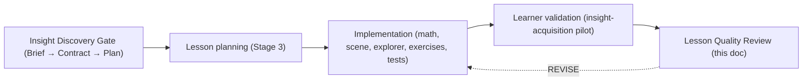

# Lesson Quality Review

The **final review layer** for a *completed* technical lesson. It runs **after**
everything else has already happened:



This is a checklist and a scoring rubric, not a design essay. It does **not**
re-open design decisions the gate already approved; it verifies that the *shipped*
lesson honors the approved insight, the design standard, and the correctness
docs. Pair it with:

- [authoring/insight-discovery-gate.md](../../authoring/insight-discovery-gate.md) — the upstream gate.
- [authoring/lesson-design.md](../../authoring/lesson-design.md) — six-phase flow, continuity, tokens, a11y basics.
- [quality/lesson-correctness-checklist.md](../../quality/lesson-correctness-checklist.md) and
  [engineering/math-correctness.md](../../engineering/math-correctness.md) — correctness gates (feed hard blockers).
- [authoring/animation-quality-bar.md](../../authoring/animation-quality-bar.md) — clip rubric (feeds
  guided-scene clarity + visual attention control).
- The learner-validation protocol / insight-acquisition pilot (0–4 acquisition
  rubric) — supplies the evidence consumed [below](#how-learner-test-evidence-affects-the-score).

---

## Scoring scale

Every category is scored **0–3** against crisp, observable descriptions:

| Score | Meaning |
| --- | --- |
| **0** | Unacceptable / absent. |
| **1** | Major problems. |
| **2** | Acceptable; minor issues only. |
| **3** | Excellent / exemplary. |

Score what the lesson **actually does** (in artifacts and in the browser), not
what the plan intended. Cite evidence: a beat id, an exercise id, a test name, a
screenshot, a pilot result. The score is a review aid, **not** a substitute for
judgment, and it can never override a [hard blocker](#hard-blockers).

### Category clusters

Categories group into three clusters. The cluster a category belongs to governs
how [conceptual vs polish problems](#distinguishing-conceptual-problems-from-polish-problems)
move its score and how the [threshold](#minimum-shipping-threshold) treats it.

| Cluster | Categories | Rule |
| --- | --- | --- |
| **Concept** | insight acquisition · mathematical correctness · causal completeness · prerequisite fit · transfer · misconception repair | Held highest; polish **cannot** buy these back. |
| **Delivery** | guided-scene clarity · explorer usefulness · continuity · assessment quality | Teaching craft; both conceptual and polish faults can move these. |
| **Polish** | visual attention control · cognitive load · accessibility · responsive behavior · performance | Presentation; a concept fault does **not** cap these, and vice versa. |

---

## The 15 categories (0–3)

### Concept cluster

**1. Insight acquisition** — does the lesson land the approved primary insight
(not just the formula)?

- **0** — The lesson teaches a definition/derivation, not the contract's insight; the model-changing "aha" is absent.
- **1** — The insight is stated but never discovered; learners could recite it without the reframing landing.
- **2** — The insight is discoverable and reachable, but a step is told rather than felt; pilot evidence is thin or mixed.
- **3** — The insight is discovered by the learner along the contract's chain, and pilot evidence confirms acquisition ([see gating](#how-learner-test-evidence-affects-the-score)).

**2. Mathematical correctness** — every learner-facing number, equation, and
visualization is true.

- **0** — Any learner-facing math or visualization is wrong (a mislabeled column, a faked area, a false identity). *(Hard blocker.)*
- **1** — Math is right but a visual transition implies a false claim, or an edge case is mishandled.
- **2** — Correct throughout; a caption or interpolation could be read as slightly overreaching but is defensible.
- **3** — Correct throughout; all geometry from `src/math`, edge/asymmetric cases covered, interpolations labeled honestly, verified against [engineering/math-correctness.md](../../engineering/math-correctness.md).

**3. Causal completeness** — the primary-insight causal chain has no gap.

- **0** — A reconstruction step in the contract's chain has no learner-facing location; the learner must invent a step. *(Hard blocker for the primary chain.)*
- **1** — Every step exists somewhere, but one is asserted rather than motivated/derived.
- **2** — The full chain is present and motivated; one transition is terse but inferable.
- **3** — Every contract obligation maps to a beat/checkpoint/exercise with observable evidence (matches the Stage-3 traceability table); nothing is skipped or hand-waved.

**4. Prerequisite fit** — pitched at the target learner.

- **0** — Requires knowledge the target learner lacks (e.g. big-O formalism, tensor rank in the elementary chain), or is trivially below them.
- **1** — Mostly fits, but an unstated prerequisite blocks a core step.
- **2** — Fits the target profile; a supporting concept is built in-lesson where needed; expert material is labeled.
- **3** — Cleanly scoped to the target learner; prerequisites explicit, expert/depth material sealed behind depth layers, nothing load-bearing is out of reach.

**5. Transfer** — the learner can apply the principle beyond the worked instance.

- **0** — Teaches only the specific instance; no path to the general principle.
- **1** — A transfer claim is made but not exercised.
- **2** — A transfer exercise exists and follows from the model; generalization is stated.
- **3** — Learner can restate the principle generally and apply it to an unfamiliar case; pilot transfer evidence (T1) supports it ([see gating](#how-learner-test-evidence-affects-the-score)).

**6. Misconception repair** — likely wrong models are named and confronted.

- **0** — Known misconceptions are ignored, or the lesson actively reinforces one.
- **1** — A misconception is mentioned but not confronted with the learner's own reasoning.
- **2** — The main misconceptions are confronted and resolved at natural points.
- **3** — Each likely misconception is surfaced where it bites (belief → confront → resolve), with an exercise/discriminator that catches it (e.g. the "25% faster" trap).

### Delivery cluster

**7. Guided-scene clarity** — the Watch clip teaches one idea per beat and reads cleanly.

- **0** — Broken or blank scene at paused `t=0`, or the clip fails the clip rubric's correctness trio. *(Broken t=0 is a hard blocker.)*
- **1** — Runs, but beats blur several ideas or the establishing/landing frames don't communicate.
- **2** — One idea per beat, establishing frame present, mostly meets [authoring/animation-quality-bar.md](../../authoring/animation-quality-bar.md) (≥16/20).
- **3** — Exemplary: named major steps, honest transitions, holds for inspection, passes the clip rubric with honesty = 2 and no zeros.

**8. Explorer usefulness** — the interactive earns its place and lands a takeaway.

- **0** — No explorer, or it is a playground with no conclusion / disconnected from the concept.
- **1** — Works but exposes every control at once, or its readouts don't tie to the concept.
- **2** — Primary controls first, shared `src/math`, reset, numeric + drag, text readouts; a takeaway is reachable.
- **3** — Progressive disclosure, clamped meaningful ranges, live readouts that make the insight manipulable, and an explicit landed conclusion.

**9. Continuity (guided ↔ interactive)** — same example carried across surfaces.

- **0** — The explorer opens on an unrelated default; example/notation/colors differ from the guided scene.
- **1** — Same topic but a name, color role, or datum drifts between surfaces.
- **2** — Same main example, names, semantic roles, and math utilities across scene/explorer/exercises.
- **3** — Seamless "now take control of what you just watched": identical ids, notation, `--role-*` tokens, and shared helpers everywhere.

**10. Assessment quality** — exercises test the concept, deterministically, with explanatory feedback.

- **0** — No exercises, non-deterministic answers, or exercises unrelated to the visual model.
- **1** — Exercises exist but grade on shape not understanding, or feedback is bare right/wrong.
- **2** — ≥2 deterministic exercises via shared math; feedback explains why; a checkpoint prediction exists.
- **3** — Tiered (check/drill/transfer), each with a clear objective, feedback that names the misconception, and coverage of the full chain incl. transfer.

### Polish cluster

**11. Visual attention control** — the learner always knows where to look.

- **0** — Competing motions/labels scatter attention; color-only cues.
- **1** — Focus wanders on some beats; dimming/labels inconsistent.
- **2** — One focal object per beat; irrelevant objects dimmed; non-color cues present.
- **3** — Deliberate choreography every beat (contrast/scale/position/timing), labels introduced exactly when needed, scaffolding retired.

**12. Cognitive load** — pacing and density respect working memory.

- **0** — Everything at once: wall of cards, all controls exposed, motion while reading.
- **1** — Noticeably dense; some phases overload before the idea lands.
- **2** — Reasonable chunking; progressive disclosure; time to orient/follow/inspect.
- **3** — One conceptual change at a time throughout; whitespace/typography do the grouping; pauses sized to the idea.

**13. Accessibility** (basic bar) — keyboard, labels, text alternatives, reduced motion.

- **0** — A core interaction is unreachable by keyboard or has no text alternative. *(Hard blocker.)*
- **1** — Focusable but missing labels/readouts, or autoplay ignores `prefers-reduced-motion`.
- **2** — Focusable controls, labeled inputs, diagram labels, text equivalents for key conclusions, reduced-motion-aware autoplay.
- **3** — All of level 2, plus meaning never conveyed by color alone and every important visual conclusion has a clean readout/legend.

**14. Responsive behavior** — stable framing across the required viewports/zoom.

- **0** — Horizontal overflow or clipped diagrams/controls at a required viewport.
- **1** — Usable at the default size but crowded/clipped at a narrow viewport or 125% zoom.
- **2** — Stable at 1366×768 / 1440×900 / 1920×1080 + narrow, and 80/100/125% zoom; safe frame intact.
- **3** — Clean framing at all required sizes; controls never crush the visualization; sidebar adapts; no reflow surprises.

**15. Performance** — smooth, bounded, no per-frame React churn.

- **0** — Jank/leak that impedes use; React re-renders per animation frame; unbounded traces.
- **1** — Occasional stutter or a wasteful render path, but usable.
- **2** — Engines own their loops; progress throttled; no unbounded history; offscreen scenes idle.
- **3** — Consistently smooth; cleanup/lifecycle verified; no invisible complex scenes rendered.

---

## Hard blockers

A lesson **does not ship** if any of these is true, regardless of total score.
Each ties to the correctness docs and cannot be offset by polish:

- **Math incorrect in any learner-facing visualization or answer** — a wrong
  column, a faked area, a false identity, a fabricated eigendirection, a
  mislabeled interpolation presented as fact (see
  [engineering/math-correctness.md](../../engineering/math-correctness.md),
  [quality/lesson-correctness-checklist.md](../../quality/lesson-correctness-checklist.md)).
- **Broken guided scene at paused `t=0`** — blank/black stage instead of an
  establishing frame (grid/origin/caption), per the Watch rule in
  [authoring/lesson-design.md](../../authoring/lesson-design.md).
- **Inaccessible core interaction** — a primary control unreachable by keyboard
  **or** with no text alternative for its conclusion (basic-a11y bar).
- **Primary-insight causal-chain gap** — a contract §4 reconstruction step has no
  learner-facing location; the learner must invent it.
- **Failing verification on the lesson surface** — `npm run lint`, `npm run test`,
  or `npm run test:e2e` failing for this lesson (per
  [project-core](../../../.cursor/rules/project-core.mdc)).

Any hard blocker ⇒ **REVISE**. Fix it and re-review; do not average it away.

---

## Minimum shipping threshold

Ship only when **all** of the following hold:

1. **No hard blockers.**
2. **Mathematical correctness = 3 and insight acquisition = 3.** These are the
   reason the lesson exists; a "2" here means the lesson is not yet trustworthy or
   not yet shown to teach its insight.
3. **No category below 2** — everything must be at least acceptable.
4. **Concept cluster ≥ 15/18** (average ≥ 2.5) — polish cannot compensate for a
   weak concept, so the concept cluster carries a higher floor than the overall.
5. **Overall ≥ 36/45** (average ≥ 2.4).

**Why these numbers.** With 15 categories the max is 45. "No category below 2"
already sets a floor of 30/45; that alone is too permissive because it would ship
a lesson that is merely acceptable everywhere. Requiring the two anchor categories
at 3, a concept-cluster average of 2.5, and an overall 2.4 forces the lesson to be
genuinely strong on *understanding* while allowing a couple of polish "2"s that a
POC can defensibly carry. The per-cluster floor is the important lever: it encodes
that a beautiful lesson that doesn't land the insight fails, while a conceptually
excellent lesson with minor polish gaps can ship.

---

## Cold-review procedure

Review from artifacts, code, and plan — **no browser**. Preferably done by someone
other than the author; if not, do a delayed self-review without re-reading the
source's intent first (authors mentally fill gaps a learner cannot).

1. **Read the plan and the insight contract.** Confirm the shipped lesson still
   targets the approved primary insight; note any drift.
2. **Walk the Stage-3 traceability table.** For every contract §4 obligation,
   confirm a real learner-facing location exists in the code (beat id, checkpoint,
   exercise, depth layer) — this scores causal completeness and flags the
   causal-gap hard blocker.
3. **Read the lesson definition** (`src/lessons/<topic>.ts`): sections,
   checkpoint, worked examples, callouts, exercises, key takeaway. Check
   six-phase coverage, KaTeX usage, no raw array notation, misconception coverage.
4. **Read the math + tests** (`src/math/<topic>.ts`, `__tests__`): verify shared
   helpers are the source of truth, asymmetric/edge cases are tested, and
   displayed identities are proven (e.g. `assertMiddleCoefficientIdentity`,
   `assertRecombinationEqualsProduct`). Hand-check one asymmetric case.
5. **Read the scene module + timings/meta**: confirm an establishing frame at
   `t=0`, named major steps, honest transitions, geometry via shared grid helpers.
6. **Read the explorer + registry**: continuity of example ids/notation/roles,
   progressive disclosure, reset, text readouts, shared math.
7. **Check continuity on paper**: same example, names, `--role-*` tokens, and
   utilities across scene → explorer → exercises.
8. Record provisional scores and every issue with its evidence; mark anything
   that can only be confirmed live for the browser pass.

---

## Browser-review procedure

Hands-on pass in a **fresh context** (do not open the source first). Run the app
and exercise the lesson as a learner.

1. **Walk the six phases in order** (Motivate → Watch → Check → Explore → Practice
   → Summarize); confirm the flow reads and phases don't collapse into one viewport.
2. **Scrub the guided scene**: confirm the **paused `t=0`** establishing frame
   (grid/origin/caption, never blank), step through every major step with
   Next/Prev idea, watch continuously once, and confirm each named effect visibly
   occurs. Run the clip's visual-only and script-only passes.
3. **Exercise the explorer**: change primary controls, hit each preset, reset;
   confirm readouts stay correct and a takeaway lands; confirm continuity with the
   scene's example.
4. **Test keyboard + reduced motion**: tab through all controls with visible
   focus; enable `prefers-reduced-motion` and confirm autoplay pauses while step
   navigation still works; confirm no meaning is color-only.
5. **Check responsive breakpoints**: 1366×768, 1440×900, 1920×1080, and a
   narrow/tablet viewport, at 80/100/125% zoom — no overflow, no clipping, safe
   frame intact.
6. **Check performance**: smooth playback, no per-frame React churn, no jank when
   scrubbing or dragging; offscreen scene idles.
7. **Grade exercises live**: confirm deterministic grading and that feedback
   explains the concept / names the misconception.

**Screenshots:** save review captures **only** under `screenshots/` in the
workspace, always with an absolute path (e.g.
`/home/thomas/Dev/technical-learning/screenshots/<name>.png`). Never write review
captures to the home directory, Downloads, or unrelated locations
([project-core](../../../.cursor/rules/project-core.mdc)).

---

## How learner-test evidence affects the score

The insight-acquisition pilot (0–4 acquisition rubric per learner; cohort pass bar
≈ **≥60% at rubric ≥3** with **≥2 at rubric 4** and no objective failing a
majority) is the empirical check on whether the lesson *teaches*, not just looks
taught. It **gates two categories**:

| Pilot evidence | Effect on **insight acquisition** | Effect on **transfer** |
| --- | --- | --- |
| **Strong** — cohort meets the pass bar; acquisition tied to the intended beats | May be **3** (evidence confirms the aha lands) | May be **3** if T1 (independent transfer) also succeeds |
| **Weak / mixed** — below the cohort bar, or acquisition attributed to recall | **Capped at 2** however polished the lesson looks | **Capped at 2** |
| **Failed** — majority fail the primary-insight objective (e.g. O1 place-value) | **Capped at 1** (a recurring failure signal ⇒ REVISE the implicated element) | **Capped at 1** |
| **Not yet run** | **Capped at 2** — a 3 requires evidence, not confidence | **Capped at 2** |

Consequences:

- Because the [threshold](#minimum-shipping-threshold) requires insight
  acquisition = 3, **a lesson cannot ship on cold + browser review alone** — it
  needs strong pilot evidence. Polish and craft cannot substitute.
- Only score improvement that reflects a **reasoning shift** counts. A learner who
  now says "$n^{\log_2 3}$" but still explains it as "25% faster" has *not*
  acquired the exponent idea; do not credit it (per the pilot's before/after rule).
- Interface-only struggles observed in the pilot do **not** count against insight
  acquisition — they feed accessibility/cognitive-load/responsive instead.

---

## Distinguishing conceptual problems from polish problems

Decide the **kind** of each issue before deciding how much it costs. The kind
determines which cluster it can touch.

**Decision procedure**

1. Ask: *if this were fixed with zero visual change, would the learner now
   understand something they did not before?* If yes → **conceptual**. If it is
   purely how something looks/reads → **polish**.
2. **Conceptual problems** block or cap the **concept-cluster** categories (and the
   correctness/clarity aspects of the delivery cluster). They **cannot** be bought
   off by polish: a gorgeous animation of a wrong or misleading model is still a
   low mathematical-correctness / guided-scene-clarity score, and a slick lesson
   whose insight doesn't land is still capped by pilot evidence.
3. **Polish problems** affect **only** the polish-cluster categories (visual
   attention control, cognitive load, accessibility, responsive, performance). A
   spacing or copy nit never lowers mathematical correctness, causal completeness,
   or transfer.

**Signals of a conceptual problem** (cap the concept cluster; may be a hard blocker):

- A visualization implies a false statement (wrong column, faked area, misleading
  tween presented as the transformation).
- The primary insight is asserted, not discovered; a causal step is missing.
- A misconception is left intact, or the lesson reinforces one.
- The pilot shows learners can execute but not explain *why*.
- A metaphor/analogy survives past its valid mathematical domain.

**Signals of a polish problem** (polish cluster only):

- Spacing, alignment, typography, or card density.
- Minor motion timing, an easing choice, a non-load-bearing caption wording.
- A label that is correct but slightly cramped; a viewport that is usable but tight
  at 125% zoom.
- A control that works but could be grouped better.

Rule of thumb: **polish serves understanding; it never stands in for it.** When in
doubt, treat an issue that changes what the learner *knows* as conceptual.

---

## Compact one-page review sheet

Copy-paste per lesson. Fill a score box `[ ]` with 0–3.

```
LESSON QUALITY REVIEW                 Lesson: __________  Date: ______
Reviewer: __________   Cold [ ]  Browser [ ]   Build/commit: __________

CATEGORY (score 0–3)                                      SCORE
-- Concept cluster --------------------------------------------
 1  Insight acquisition ................................. [ ]  (pilot-gated; must = 3)
 2  Mathematical correctness ........................... [ ]  (must = 3)
 3  Causal completeness ................................ [ ]
 4  Prerequisite fit ................................... [ ]
 5  Transfer ........................................... [ ]  (pilot-gated)
 6  Misconception repair ............................... [ ]
-- Delivery cluster -------------------------------------------
 7  Guided-scene clarity ............................... [ ]
 8  Explorer usefulness ................................ [ ]
 9  Continuity (guided ↔ interactive) .................. [ ]
10  Assessment quality ................................. [ ]
-- Polish cluster ---------------------------------------------
11  Visual attention control ........................... [ ]
12  Cognitive load ..................................... [ ]
13  Accessibility (basic) .............................. [ ]
14  Responsive behavior ................................ [ ]
15  Performance ........................................ [ ]

Concept subtotal (cat 1–6, max 18): ____   Overall (max 45): ____

HARD BLOCKERS (any checked ⇒ REVISE, cannot ship)
[ ] Math wrong in a learner-facing visualization/answer
[ ] Guided scene broken/blank at paused t=0
[ ] Core interaction inaccessible (no keyboard path or text alternative)
[ ] Primary-insight causal-chain gap (a step has no learner-facing location)
[ ] lint / test / e2e failing on the lesson surface

SHIP THRESHOLD (all must hold)
[ ] No hard blockers
[ ] Category 1 = 3 and Category 2 = 3
[ ] No category below 2
[ ] Concept subtotal >= 15/18
[ ] Overall >= 36/45

Pilot evidence: [ strong / weak / failed / not-run ]  cohort >=3: __%  rubric-4: __
Top issues (with evidence): _______________________________________________
___________________________________________________________________________

DECISION:  [ ] SHIP     [ ] REVISE
Signoff: ______________________________   Date: ____________
```
