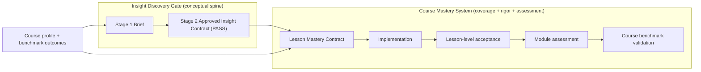
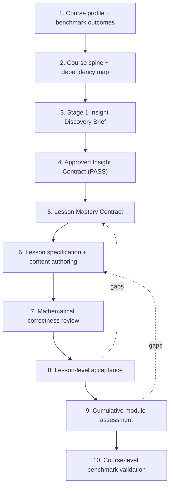

# Course Mastery Standard

The canonical **mastery-assurance** specification for this project. It answers a
question none of the existing documents answer:

> *Has the learner actually acquired all of the definitions, procedures,
> representations, theorems, proofs, misconceptions, transfer abilities, fluency,
> retention, and exam performance a course must produce — not merely watched,
> recognized, or completed it?*

The [Insight Discovery Gate](insight-discovery-gate.md) answers a *different*,
equally essential question — *"what model-changing insight should organize this
lesson?"* This document does **not** replace or weaken it. The two are
complementary halves of one system (see [§2](#2-how-mastery-and-insight-fit-together)):

- the **Insight Contract** supplies the conceptual **spine** of a lesson;
- the **Mastery Standard** supplies **coverage, rigor, practice, transfer,
  assessment, and retention** around that spine;
- neither substitutes for the other, and a lesson needs *both* to ship.

> **Scope of this document.** It defines *what mastery means* at course, module,
> and lesson level, the *course profiles* a course can target, the *dimensions*
> of mastery, the *evidence levels* that count as acquisition, the *assessment
> architecture* that measures them, the *coherence* requirements that keep a
> course from fragmenting, and the *authoring workflow* that ties every gate
> together. The per-lesson gate itself lives in
> [authoring/templates/lesson-mastery-contract.md](templates/lesson-mastery-contract.md); the course-level
> calibration benchmarks live in
> [courses/linear-algebra/benchmark-matrix.md](../courses/linear-algebra/benchmark-matrix.md);
> presentation lives in [product/semantic-page-grammar.md](../product/semantic-page-grammar.md).

Read alongside:

- [product/vision.md](../product/vision.md) — the
  learning theory this standard operationalizes (mental models, compression,
  worked-example fading, misconception staging, the "enough depth" test).
- [authoring/assessment-patterns.md](assessment-patterns.md) — the working *library* of
  assessment patterns; this document tells you *how much* of it a course owes and
  *how* to combine patterns into an assessment architecture.
- [authoring/insight-validation-protocol.md](insight-validation-protocol.md) — the
  post-implementation learner pilot; its 0–4 acquisition rubric is a special case
  of the [evidence levels](#5-evidence-levels) below.

---

## 1. The product goal, stated as a progression

The north-star product claim is:

> *A learner who completes a course such as linear algebra should become capable
> of performing strongly — even in demanding university courses — while acquiring
> durable intuition, precise mathematical understanding, independent
> problem-solving ability, proof maturity, and the foundations needed to begin
> reading or conducting more advanced mathematical work.*

This is **not** a promise that one introductory course makes a mathematical
researcher. It is a promise of a *credible progression* through five capability
stages. Every course states which stages it targets (see
[course profiles, §3](#3-course-profiles)); no course silently claims a stage it
does not assess.

| Stage | Capability | Primarily served by |
| --- | --- | --- |
| **S1 Conceptual understanding** | Sees the object behind the symbol; can explain it in words and pictures. | Insight Gate + Vision §2/§7 |
| **S2 Computational fluency** | Executes the standard procedures correctly, efficiently, and reliably. | Mastery: procedural dimension + drill |
| **S3 Exam-level independent performance** | Selects methods unprompted, combines topics, works under time pressure, catches own errors. | Mastery: assessment architecture (§6) |
| **S4 Proof-based maturity** | Reasons from definitions, proves both directions, builds counterexamples, repairs arguments. | Mastery: proof dimension + Profile B |
| **S5 Research-oriented habits** | Forms conjectures, varies assumptions, reads unfamiliar prose, communicates findings. | Mastery: investigation dimension + Profile C enrichment |

The stages are **cumulative in dependency but not in requirement**: a course may
deliberately stop at S3, or reach S4 for some topics and S3 for others. What is
forbidden is *implying* a stage the course never gives the learner evidence for.

---

## 2. How mastery and insight fit together

The two gates run in sequence and check different things. Keep them distinct.

| Concern | Insight Discovery Gate | Course Mastery System |
| --- | --- | --- |
| Central question | *What one insight reorganizes the model?* | *Did the learner acquire everything the topic requires?* |
| Output artifact | Approved Insight Contract (`docs/courses/<course>/lessons/<lesson>/insight.md`) | Lesson Mastery Contract + assessment set + benchmark row |
| Failure it prevents | A lesson built on a definition, a story, or a routine derivation instead of a real breakthrough. | An elegant, insightful lesson that still leaves definitions, practice, transfer, or retention missing. |
| What it does *not* do | Guarantee coverage, fluency, transfer, retention, or exam readiness. | Choose or validate the organizing insight. |

**Non-negotiable division of labor.** The Insight Contract's *causal chain* is an
input to the Lesson Mastery Contract, not a duplicate of it. The Lesson Mastery
Contract references the contract by link and adds the coverage/practice/
assessment/retention obligations the insight gate deliberately leaves out. A
lesson that has a `PASS` insight contract but fails its mastery contract **does
not ship**; a lesson with strong coverage but no `PASS` insight contract is *out
of process* (Insight Gate rule) and also does not ship.

---

## 3. Course profiles

A course must declare **one primary profile** and may declare **per-module
overrides** (e.g. a computational course whose capstone module reaches for
Profile B on one theorem). The profile sets which mastery dimensions are
*mandatory*, which are *profile-dependent*, and which are *optional enrichment*
(see [§4](#4-mastery-dimensions)), and it sets the assessment styles in
[§6](#6-assessment-architecture).

The three profiles are **calibration targets**, not a claim the app currently
meets any of them. Their linear-algebra instantiation is in
[courses/linear-algebra/benchmark-matrix.md](../courses/linear-algebra/benchmark-matrix.md).

### A. Computational university mastery

The learner can, on unfamiliar variants and under exam conditions:

- recall and use definitions accurately;
- **select an appropriate method without being told which applies**;
- perform standard computations correctly and efficiently;
- interpret computations conceptually and geometrically;
- translate among symbolic, numerical, visual, verbal, and applied
  representations;
- solve unfamiliar variants of familiar problems;
- combine topics in a single problem;
- detect and repair their own errors;
- retain earlier material as the course advances.

*Linear-algebra span:* elimination, solution sets, matrix transformations,
determinants, bases, eigenvalues, projections, least squares, and related
standard first-course material.

*Proof expectation:* short justifications and "why does this work" explanations,
**not** a full two-direction proof program.

### B. Proof-based / honors mastery

Everything in Profile A, plus the learner can:

- reason directly from definitions;
- state theorem hypotheses and conclusions precisely, and say *where each
  hypothesis is used*;
- distinguish necessary from sufficient conditions;
- prove both directions of an equivalence;
- construct examples and counterexamples on demand;
- repair a flawed argument;
- decide whether a converse or generalization holds;
- work with **abstract** vector spaces and linear maps, not only \(\mathbb{R}^2\)
  / \(\mathbb{R}^n\);
- write a coherent multi-step argument independently.

Not every introductory course must reach Profile B. A course that targets B must
say so and must assess proof construction, not just proof *reading*.

### C. Research bridge (research-oriented *preparation*, not readiness)

Profile A or B, plus the learner begins developing (as **enrichment**, clearly
labeled and never part of the core exam bar):

- forming conjectures from examples;
- varying assumptions and identifying which result breaks and *why*;
- searching for a minimal counterexample;
- using computation to explore **without mistaking evidence for proof**;
- reading unfamiliar mathematical prose and reconstructing omitted steps;
- comparing alternative definitions or formulations;
- connecting several results into a longer argument;
- communicating a finding in a short mathematical note or mini-project.

**Honesty constraint (durable).** Profile C is *research-oriented preparation*.
No course document, lesson, or UI string may claim the learner is "research
ready" or a "researcher." The credible claim is: *"has begun developing the
habits advanced study requires."*

---

## 4. Mastery dimensions

A compact, reusable set of dimensions. **Do not turn this into a flat per-lesson
checklist** — the whole point of the level column is that a single lesson owns a
few dimensions deeply, the module integrates more, and only the course as a whole
must exercise all of them.

| # | Dimension | Natural home | Mandatory where |
| --- | --- | --- | --- |
| D1 | Motivation & conceptual model | Lesson | Every lesson (this is the Insight Gate's territory). |
| D2 | Precise vocabulary & definitions | Lesson | Every lesson that introduces an object. |
| D3 | Computational / procedural fluency | Lesson → Module | Every lesson with a procedure (Profile A/B). |
| D4 | Representation translation | Lesson → Module | Every lesson with ≥2 representations of its object. |
| D5 | Theorem use | Lesson → Module | Lessons that state a theorem/proposition/invariant. |
| D6 | Proof & justification | Lesson → Module | **Profile B mandatory; Profile A = short "why" only.** |
| D7 | Examples, nonexamples, boundary & counterexamples | Lesson | Every lesson with a definition or theorem. |
| D8 | Method selection | Module | Any module with ≥2 methods that could apply. |
| D9 | Transfer to unfamiliar problems | Module | Every module (≥1 genuine transfer item). |
| D10 | Cumulative integration | Module → Course | Every module after the first. |
| D11 | Speed & reliability | Module → Course | Where a profile names a speed expectation (usually A/exam). |
| D12 | Delayed retention | Module → Course | Every module (spaced retrieval of prior material). |
| D13 | Metacognitive error diagnosis | Module → Course | Every course (≥1 error-diagnosis item per module). |
| D14 | Research-oriented investigation | Course (enrichment) | **Profile C only; never a core exam requirement.** |

Rules for using the table:

- **Lesson level** owns D1, D2, D3 (if a procedure), D4 (if multiple
  representations), D5/D7 (if a theorem), and a *seed* of D9/D13. A lesson is
  **not** required to exercise every dimension — forcing that is an explicit
  [anti-failure](#8-calibration-cases).
- **Module level** owns D8, D9, D10, D12, D13 and consolidates D3/D6.
- **Course level** owns D10, D11, D12, D14 and the profile claim.
- The per-lesson decision of *which* dimensions apply is recorded in the
  [Lesson Mastery Contract](templates/lesson-mastery-contract.md); the per-module and
  per-course decisions are recorded in the
  [benchmark matrix](../courses/linear-algebra/benchmark-matrix.md) and module assessment
  plans.

---

## 5. Evidence levels

Mastery is claimed only from **observable evidence**, graded on a seven-level
scale. This scale generalizes the two taxonomies already in the repo — the
`check | drill | transfer` [exercise tiers](assessment-patterns.md#tiers--phases)
and the `recall / reconstruction / transfer` levels of the
[Insight Validation Protocol](insight-validation-protocol.md) — rather than
inventing a competing one.

| Level | Name | The learner… | Existing-repo mapping |
| --- | --- | --- | --- |
| **E1** | Recognition | understands an explanation when shown it; picks the right statement among distractors. | `check` tier; validation "recall" (low) |
| **E2** | Reproduction | repeats a demonstrated method on lesson-like inputs. | `drill` tier (near-copy); validation "recall/execution" |
| **E3** | Selection | chooses the right method **unprompted** on a fresh but familiar problem. | `drill` tier (fresh inputs); Vision "enough depth" #3 |
| **E4** | Transfer | applies the idea in an unfamiliar representation or context, technique unnamed. | `transfer` tier; validation "transfer" (level 4) |
| **E5** | Integration | combines the idea with earlier ideas in one problem. | cumulative/mixed sets; validation "reconstruction" |
| **E6** | Justification | explains or proves *why* it works; states where a hypothesis is used. | proof items; Vision "enough depth" #2/#5 |
| **E7** | Investigation | varies assumptions, forms/tests a conjecture, finds a boundary. | Profile C enrichment; research bridge |

Ordering note: E1–E4 form a difficulty ladder; **E5, E6, E7 are largely
orthogonal to that ladder** (a learner can justify (E6) a simple result before
transferring (E4) a harder one). Treat E1→E4 as increasing independence, and
E5/E6/E7 as *additional kinds* of evidence layered on top — not strictly higher
rungs. A claim like "exam ready" needs breadth across E3–E5; "proof-ready" needs
E6; "research-oriented" needs E7.

### The anti-completion rule (the reason this standard exists)

**Success at E1, watching an animation to the end, or marking a lesson
`completed` is not evidence of mastery and must never be treated as such.** The
platform's persisted `LessonProgress.completed` flag
([learnerState.ts](../../src/platform/learnerState.ts)) records *exposure*, not
acquisition. Concretely:

- No mastery claim (§7) may be derived from `visited` / `completed` alone.
- An assessment that merely re-runs the interaction used during instruction
  measures E1–E2 at best and **cannot** support a "ready"/"mastered" claim (this
  is calibration case [#10](#8-calibration-cases)).
- Prediction/reveal Checks (`prediction`, `committed-prediction`) are learning
  events, not mastery evidence, unless the learner **commits before the reveal**
  and the item is a fresh (non-lesson) instance.

### The four states the platform must keep separate

Borrowed from and made explicit against
[courses/multi-domain-architecture.md](../courses/multi-domain-architecture.md)
§3 (`mastery: number` is deliberately deferred there):

1. **Exposure** — visited/watched (`visited`).
2. **Completion** — reached the end of the lesson (`completed`).
3. **Current performance** — recent graded-attempt success (`ExerciseAttempt.correct`).
4. **Durable mastery** — performance that survives a delay and an unfamiliar
   restatement (requires spaced/interleaved re-assessment, §6).

Only (4) licenses a mastery claim. (1)–(3) may inform recommendations but must
be **labeled as what they are** in any UI or report.

---

## 6. Assessment architecture

The mastery system requires a far broader assessment ecology than "a few
end-of-lesson questions." This section defines the *architecture*; the reusable
*patterns* it draws from live in
[authoring/assessment-patterns.md](assessment-patterns.md), and the *per-lesson* exercise
families and progression live in
[authoring/templates/lesson-mastery-contract.md §3](templates/lesson-mastery-contract.md#3-exercise-and-assessment-standard).

### 6.1 The assessment layers

| Layer | Purpose | Scope | Stakes / feedback |
| --- | --- | --- | --- |
| **Diagnostic placement** | Route the learner to the right entry point / profile. | Course entry | Low; informative only. |
| **Prerequisite check** | Confirm the retrievable prior knowledge a lesson assumes. | Lesson entry | Low; gates *readiness*, not access. |
| **Low-stakes lesson practice** | Build fluency; every reveal keeps teaching (Vision §11). | Lesson | Low; immediate rich feedback. |
| **Cumulative problem set** | Integrate the module's lessons (D10). | Module | Medium; feedback after commit. |
| **Spaced retrieval** | Re-surface older material after a delay (D12). | Module → Course | Low; scheduled, interleaved. |
| **Interleaved review** | Mix problem types so the learner must *select* (D8). | Module → Course | Medium. |
| **Module assessment** | Certify module mastery across E3–E6 as the profile requires. | Module | Medium/high. |
| **Timed mock midterm/final** | Rehearse exam-level performance (S3, D11). | Course | High; timed. |
| **Exam mode** | Measure unaided performance: **no hints, no immediate corrective feedback**. | Module/Course | High; feedback deferred to the post-assessment pass. |
| **Post-assessment error classification** | Turn wrong answers into a misconception profile (D13). | After any assessment | Diagnostic. |
| **Targeted remediation** | Send the learner back to the specific beat, not the whole lesson. | After error classification | Low. |
| **Reassessment** | Re-test with **structurally equivalent, non-identical** problems. | After remediation | Medium/high. |

**Exam mode is a first-class requirement, not a toggle.** A course that claims S3
must provide at least one assessment surface that withholds hints and immediate
correctness feedback until submission, drawn from fresh problem instances. Note
the current platform grades and reveals immediately
([capabilities.ts](../../src/lessons/capabilities.ts)); exam mode is therefore
flagged as **new support needed** (deferred-feedback attempt flow), not something
to fake with the existing per-item reveal.

### 6.2 What evidence justifies each readiness claim

Claims are **profile-relative** and must cite the evidence layer + level that
supports them. Do not invent psychometric precision (see [§6.3](#63-honesty-about-measurement)).

| Claim | Minimum evidence |
| --- | --- |
| **"Ready for the next lesson"** | Prerequisite check passed **and** ≥ E3 on this lesson's must-demonstrate outcomes (not just E1–E2). |
| **"Module mastered"** | E3–E5 across the module's must-demonstrate outcomes on a cumulative set, **plus** one delayed retrieval success (D12). |
| **"Exam ready"** | Breadth of E3–E5 under **exam mode** on fresh, mixed, timed problems at the profile's complexity, with method selection (D8) exercised. |
| **"Proof-ready"** | E6 evidence: at least one independent proof (both directions where applicable) and one argument repair or counterexample, per the Profile-B module bar. |
| **"Requires remediation"** | A recurring error class (D13) identified by post-assessment classification, mapped to a specific beat. |

### 6.3 Honesty about measurement

These are **design targets and heuristics, not validated psychometrics.** The
project has one worked calibration instrument — the
[Insight Validation Protocol](insight-validation-protocol.md), whose cohort
bars ("≥ 60% reach rubric ≥ 3") are explicitly *pilot heuristics*. Any mastery
threshold, decay schedule, or `mastery: number` estimate introduced later:

- must state that it requires **empirical calibration** before it is trusted;
- must not present a single number as if it were a measured probability of
  future exam success;
- should prefer **transparent evidence** ("passed 2 fresh transfer items after a
  7-day delay") over an opaque score until calibration exists.

---

## 7. Course & lesson coherence

Mastery collapses if lessons become isolated experiences. This standard requires,
and the [Lesson Mastery Contract](templates/lesson-mastery-contract.md) and
[Course Spine](../courses/linear-algebra/course-spine.md) enforce, that:

- **Backward bridges** — each lesson explicitly retrieves the prerequisite ideas
  it needs (not "assumed known"); the retrieval is an *event*, per the concept
  graph in Vision §14.
- **Forward motivation** — each lesson names what later mathematics it enables
  (a `looking-ahead` layer, an application-thread reference).
- **Notation consistency** — one symbol set across prose, scenes, explorers,
  exercises (authoring/lesson-design.md notation rules; engineering/math-correctness.md).
- **Recurring mathematical objects** — reuse the shared canonical examples
  ([courses/linear-algebra/curriculum-architecture.md §4](../courses/linear-algebra/curriculum-architecture.md)) so an edge is
  *strengthened*, not a new node added (Vision §14).
- **Cumulative exercises** — every module after the first mixes in prior material
  (D10); every module schedules delayed retrieval (D12).
- **Controlled abstraction increase** — abstraction rises deliberately along the
  [abstraction path](../product/semantic-page-grammar.md#4-mathematical-object-and-representation-standard);
  no lesson leaves the learner believing a general concept exists only in its
  easiest visual case.
- **Explicit dependency relationships** — the prerequisite DAG in
  [courses/linear-algebra/curriculum-architecture.md §2](../courses/linear-algebra/curriculum-architecture.md) is the source of
  truth; a lesson's contract cites its edges.
- **Module-level narrative & course-level synthesis** — each module reads as one
  argument; the course ends on a synthesis (the spine's capstone role).

A course must be able to answer, for each lesson: *why is this introduced here,
and what does it unlock?* — not only *what does it mean?*

---

## 8. Calibration cases

The standard is validated by two lists: failures it **must catch**, and opposite
over-reactions it must **not** create. Each is mapped to the gate that fires.
Re-run this validation whenever a standard changes.

### Failures the standard must detect

| # | Failure | Caught by |
| --- | --- | --- |
| 1 | A beautiful solution-sets animation with **no precise definition or parameterization**. | Lesson Mastery Contract rejection: insight strong, D2 definitions absent. |
| 2 | Correct elimination demos with **not enough independent arithmetic practice**. | Contract: D3 procedural fluency under-covered; assessment set lacks fresh drills. |
| 3 | A learner who succeeds **only when the problem resembles the visual lesson**. | Evidence levels: only E1–E2 evidenced; no E3/E4 items. |
| 4 | A lesson that **stays entirely in \(\mathbb{R}^2\)** while teaching a general concept. | Abstraction path (SEMANTIC_PAGE_GRAMMAR §4); contract "return to the general case". |
| 5 | Several exercises testing **recognition but not method selection**. | Assessment architecture: D8 selection required; ASSESSMENT_PATTERNS "cap recall". |
| 6 | A **theorem asserted without proof** in a profile that requires proof. | Profile B + D6; contract rejection condition. |
| 7 | A **proof-focused lesson with no computational fluency**. | D3 mandatory for Profile A/B lessons with a procedure. |
| 8 | Strong content with **no connection to earlier/later lessons**. | Coherence (§7); contract's cumulative-connection field. |
| 9 | A module with **no cumulative or delayed assessment**. | Assessment architecture: D10 + D12 module requirement. |
| 10 | A learner completing every page yet **failing an unfamiliar timed exam**. | Anti-completion rule (§5); exam-mode requirement (§6). |

### Opposite failures the standard must NOT create

| Over-reaction | Guardrail |
| --- | --- |
| Forcing a theorem **proof into every introductory lesson**. | D6 is Profile-B mandatory only; Profile A wants short "why", not proofs. |
| Forcing a **real-world application** where none adds value. | Applications are *threads that recur with value* (spine §4), never a per-lesson tax; Insight Gate's anti-decoration rule. |
| Requiring **every lesson to exercise every dimension**. | Dimensions are scoped to lesson/module/course (§4); the contract records which apply. |
| Making **exploratory/visual lessons unnecessarily formal**. | Representation-appropriate teaching (SEMANTIC_PAGE_GRAMMAR §5); an intro chapter may omit Practice/Summary. |
| Turning authoring into an **impractically large bureaucracy**. | The contract is *one page*; it references, never restates, upstream artifacts (§9). |
| Confusing **research enrichment with core exam requirements**. | D14/Profile C is enrichment, explicitly excluded from the exam bar (§3C, §4). |

---

## 9. Workflow integration

The full authoring sequence, from course intent to validated mastery. Each gate
lists its **purpose, required input, output artifact, rejection conditions, and
relationship to the next stage.** Gates reference upstream artifacts rather than
duplicating them.

> **Entry point.** [authoring/course-authoring-workflow.md](course-authoring-workflow.md)
> is the practical dispatcher over the gates below: it classifies a request into a
> mode (architecture / planning / implementation / validation), tells the agent
> which gates and docs to run in order, and marks the approval boundaries. Start
> any authoring request there; this section is the gates' canonical definition.

| # | Gate | Purpose | Input | Output | Rejection conditions |
| --- | --- | --- | --- | --- | --- |
| 1 | **Course profile + outcomes** | Fix which profile(s) and which stages (S1–S5) the course targets. | Product intent; benchmark matrix. | A profile declaration + target outcomes per module. | Claims a stage with no planned assessment; mixes profiles silently. |
| 2 | **Spine + dependency map** | Order topics as re-interpretations of prior ones; fix prerequisites. | Profile; existing [spine](../courses/linear-algebra/course-spine.md) + [DAG](../courses/linear-algebra/curriculum-architecture.md). | Updated spine row + prerequisite edges + concept ids. | A lesson's prerequisites aren't taught earlier; cycle in the DAG. |
| 3 | **Insight Discovery Brief** | Diagnose the obstacle; generate & rank insight candidates. | Spine insight (as *inherited hypothesis*, not answer). | `docs/courses/<course>/lessons/<lesson>/insight-brief.md`. | See [Insight Gate Stage 1](insight-discovery-gate.md#stage-1--insight-discovery-brief). |
| 4 | **Approved Insight Contract** | Commit to one insight; prove its chain; run audits. | The brief. | `docs/courses/<course>/lessons/<lesson>/insight.md` ending `Gate result: PASS`. | See [Insight Gate Stage 2](insight-discovery-gate.md#stage-2--approved-insight-contract). |
| 5 | **Lesson Mastery Contract** | Guarantee coverage, rigor, practice, transfer, retention around the insight. | The `PASS` contract + profile + spine row. | A completed [Lesson Mastery Contract](templates/lesson-mastery-contract.md). | Any contract [rejection condition](templates/lesson-mastery-contract.md#5-rejection-conditions-the-mastery-gate). |
| 6 | **Lesson spec + authoring** | Build the lesson from the block palette + page grammar. | Mastery contract; [authoring/templates/lesson-plan.md](templates/lesson-plan.md); [authoring/lesson-design.md](lesson-design.md); [product/semantic-page-grammar.md](../product/semantic-page-grammar.md). | Typed `LessonDefinition` + scenes + explorers + exercises. | Missing must-teach content; page leads with a purposeless visual (grammar §3). |
| 7 | **Mathematical correctness review** | Ensure every shown quantity is mathematically correct. | The built lesson. | Completed [quality/lesson-correctness-checklist.md](../quality/lesson-correctness-checklist.md) + [engineering/math-correctness.md](../engineering/math-correctness.md) sign-off. | Any unverified/plausible-but-wrong math; missing regression test. |
| 8 | **Lesson-level acceptance** | Confirm the lesson meets its own mastery contract. | Contract + built lesson + tests. | Acceptance record (contract outcomes ↔ evidence, all met). | An outcome with no evidencing item; only near-copy exercises; assessment repeats instruction. |
| 9 | **Cumulative module assessment** | Certify integration + delayed retention across the module. | All accepted lessons in the module. | A module assessment set (cumulative, interleaved, spaced) + results. | No cumulative/delayed items (case #9); no method-selection items. |
| 10 | **Course benchmark validation** | Check the whole course against the profile benchmark. | All modules; the [benchmark matrix](../courses/linear-algebra/benchmark-matrix.md). | A benchmark validation report (covered / missing / deferred). | Claims a profile the assessments don't support; silent coverage gaps. |

**Relationship rule.** Later gates *consume* earlier artifacts and never restate
them. The Lesson Mastery Contract links the Insight Contract; the module
assessment links the lesson contracts; the benchmark report links the module
assessments. If you find yourself copying content between two gates, replace the
copy with a reference.

---

## 10. Standards hierarchy (where this document sits)

| Layer | Documents | Owns |
| --- | --- | --- |
| **Entry point (how to start)** | [authoring/course-authoring-workflow.md](course-authoring-workflow.md) | Routing a request to a mode + gate sequence; approval boundaries. |
| **Learning theory (why)** | [product/vision.md](../product/vision.md) | Mental models, compression, principles, "enough depth". |
| **Conceptual spine (what insight)** | [authoring/insight-discovery-gate.md](insight-discovery-gate.md) → Approved Insight Contracts | The one model-changing idea per lesson. |
| **Mastery assurance (did they learn it)** | **authoring/mastery-standard.md** (this) → [authoring/templates/lesson-mastery-contract.md](templates/lesson-mastery-contract.md) | Coverage, rigor, evidence, assessment, retention, coherence, workflow. |
| **Presentation (how it reads)** | [authoring/lesson-design.md](lesson-design.md) + [product/semantic-page-grammar.md](../product/semantic-page-grammar.md) | Block palette, page grammar, representation choice, prose. |
| **Content & sequence (what & when)** | [courses/linear-algebra/course-spine.md](../courses/linear-algebra/course-spine.md) + [courses/linear-algebra/curriculum-architecture.md](../courses/linear-algebra/curriculum-architecture.md) + [courses/linear-algebra/benchmark-matrix.md](../courses/linear-algebra/benchmark-matrix.md) | Topics, order, prerequisites, external calibration. |
| **Correctness** | [engineering/math-correctness.md](../engineering/math-correctness.md) + [quality/known-failure-modes.md](../quality/known-failure-modes.md) + [quality/lesson-correctness-checklist.md](../quality/lesson-correctness-checklist.md) | Mathematical + visualization correctness. |
| **Assessment library & pilot** | [authoring/assessment-patterns.md](assessment-patterns.md) + [authoring/insight-validation-protocol.md](insight-validation-protocol.md) | Reusable patterns; post-ship learner validation. |
| **Data model** | [courses/multi-domain-architecture.md](../courses/multi-domain-architecture.md) + `learnerState.ts` + `capabilities.ts` | Curriculum tree/graph; progress envelope; grading. |

These standards are **reusable across mathematics, computer science, and related
technical subjects.** Universal principles live in this document, the lesson
contract, and the page grammar; **linear-algebra-specific calibration is
quarantined** in the benchmark matrix and the spine. A new subject writes its own
benchmark matrix and spine and reuses everything else unchanged.
