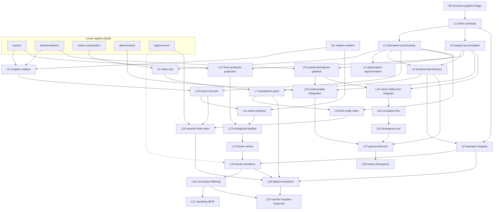

# Applied Mathematics — Curriculum Architecture

The **encoding-facing** companion to the [course spine](course-spine.md). Where
the spine answers *"what is the whole course and why in this order?"*, this
document makes that architecture explicit and schedulable:

1. the **prerequisite DAG** (edge table + Mermaid), including the cross-course
   edges into the built linear-algebra and algorithms courses;
2. a **concept-ID catalog** — stable slugs for the first-class concepts, each
   with its introducing lesson and its reusers;
3. the **recurring canonical examples**;
4. the **reusable visualization families** and which lessons draw on each;
5. the **implementation packages** — the batch plan, in dependency order, with
   flagship-versus-supporting visual budgets;
6. **what is reused** from existing courses and infrastructure;
7. the **platform gaps** this course would hit, recorded and *not* scheduled.

> **Scope note (durable).** This is architecture, not an authoring reopening.
> Every lesson is a `future` node. Listing packages here does not authorize
> building them; each package needs its own approval at the planning-to-
> implementation boundary.

---

## 1. Sequence, reconciled

Course id `applied-mathematics`, under the existing `mathematics` subject in
`src/lessons/courseModel.ts`, as a sibling of `linear-algebra`.

| Spine | Lesson | Curriculum id | Unit | Status |
| --- | --- | --- | --- | --- |
| B0 | Functions, graphs, and the shapes you keep meeting | `functions-graphs-bridge` | `entry-bridges` | future *(conditional)* |
| B1 | Radians and the rotating point | `radians-rotation` | `entry-bridges` | future |
| L1 | What "approaches" means | `limits-continuity` | `change` | future |
| L2 | The derivative as local linearity | `derivative-local-linearity` | `change` | future |
| L3 | The chain rule: rates compose | `chain-rule` | `change` | future |
| L4 | Deciding with the derivative | `optimization-approximation` | `change` | future |
| L5 | The integral as accumulation | `integral-accumulation` | `accumulation` | future |
| L6 | The Fundamental Theorem of Calculus | `fundamental-theorem` | `accumulation` | future |
| L7 | Two techniques, both derived | `substitution-parts` | `accumulation` | future |
| L8 | Accumulating forever | `improper-integrals` | `accumulation` | future |
| L9 | Complex numbers as rotation and scaling | `complex-rotation` | `complex-oscillation` | future |
| L10 | Euler's formula | `eulers-formula` | `complex-oscillation` | future |
| L11 | Waves: frequency, phase, complex sinusoids | `waves-phasors` | `complex-oscillation` | future |
| L12 | Inner products and projection | `inner-products-projection` | `projection-spectra` | future |
| L13 | Orthogonal families | `orthogonal-families` | `projection-spectra` | future |
| L14 | Fourier series | `fourier-series` | `projection-spectra` | future |
| L15 | The Fourier transform | `fourier-transform` | `projection-spectra` | future |
| L16 | Convolution and filtering | `convolution-filtering` | `signals` | future |
| L17 | Sampling, aliasing, DFT, FFT | `sampling-dft-fft` | `signals` | future |
| L18 | First-order equations | `first-order-odes` | `dynamics-transforms` | future |
| L19 | Second-order equations | `second-order-odes` | `dynamics-transforms` | future |
| L20 | The Laplace transform | `laplace-transform` | `dynamics-transforms` | future |
| L21 | Transfer functions and impulse response | `transfer-impulse-response` | `dynamics-transforms` | future |
| L22 | Partial derivatives and the gradient | `partial-derivatives-gradient` | `fields-circulation` | future |
| L23 | Accumulating over a region | `multivariable-integration` | `fields-circulation` | future |
| L24 | Vector fields, paths, line integrals | `vector-fields-line-integrals` | `fields-circulation` | future |
| L25 | Circulation and flux | `circulation-flux` | `fields-circulation` | future |
| L26 | Divergence and curl | `divergence-curl` | `fields-circulation` | future |
| L27 | Green's theorem | `greens-theorem` | `fields-circulation` | future |
| L28 | Stokes and the divergence theorem | `stokes-divergence` | `fields-circulation` | future |

No id collides with a built lesson or with a linear-algebra `future` node
(`orthogonality`, `least-squares`, `svd` remain the LA course's). Ids satisfy
`ID_SYNTAX` in `src/platform/identity.ts`.

---

## 2. Prerequisite DAG

An edge `A → B` means **B genuinely needs an idea introduced in A**. Hard,
directed, acyclic.

### 2.1 Cross-course edges (into built courses)

| From (course) | To | Why |
| --- | --- | --- |
| `vectors` (LA, built) | `inner-products-projection` | The dot product, span, and coordinates are generalized, not introduced. |
| `vectors` (LA, built) | `complex-rotation` | The complex plane is \(\mathbb{R}^2\) with a multiplication. |
| `transformations` (LA, built) | `complex-rotation` | Multiplication by \(a+bi\) **is** a 2×2 map fixed by where the basis lands. |
| `transformations` (LA, built) | `partial-derivatives-gradient` | The Jacobian is a matrix of a linear map, read by the columns rule. |
| `matrix-composition` (LA, built) | `chain-rule` | Composing local linear models is composing matrices. |
| `determinants` (LA, built) | `multivariable-integration` | The Jacobian determinant is the same area/volume scale factor. |
| `eigenvectors` (LA, built) | `second-order-odes` | \(e^{st}\) is an eigenfunction of \(d/dt\); the characteristic polynomial is the same object. |
| `eigenvectors` (LA, built) | `fourier-transform` | Complex sinusoids are the eigenfunctions of shift-invariant systems. |
| `karatsuba` (Algorithms, built) | `sampling-dft-fft` | The FFT is the same "do the shared sub-work once" move. **Soft/connection edge** — enriching, not blocking. |

> The `eigenvectors → fourier-transform` and `karatsuba → sampling-dft-fft`
> edges are **connection** edges in the sense of `product/vision.md` §14: they
> deepen understanding but do not gate. Every other cross-course edge is hard.

### 2.2 Within-course edges

| From | To | Why |
| --- | --- | --- |
| `functions-graphs-bridge` | `limits-continuity` | *(conditional)* A limit is about a function's values near a point. |
| `radians-rotation` | `complex-rotation` | Rotation is measured in radians. |
| `radians-rotation` | `waves-phasors` | A phasor's angle is an arc length. |
| `limits-continuity` | `derivative-local-linearity` | The derivative is a limit. |
| `limits-continuity` | `integral-accumulation` | The integral is a limit of sums. |
| `derivative-local-linearity` | `chain-rule` | Composing the local linear models. |
| `derivative-local-linearity` | `optimization-approximation` | "Flat local model" is the criterion. |
| `derivative-local-linearity` | `fundamental-theorem` | The theorem is *about* the derivative. |
| `integral-accumulation` | `fundamental-theorem` | The theorem is *about* the accumulation. |
| `chain-rule` | `substitution-parts` | Substitution is the chain rule backwards. |
| `fundamental-theorem` | `substitution-parts` | Techniques evaluate definite integrals via antiderivatives. |
| `limits-continuity` | `improper-integrals` | An improper integral is a limit of proper ones. |
| `fundamental-theorem` | `improper-integrals` | Each finite piece is evaluated by the FTC. |
| `complex-rotation` | `eulers-formula` | \(i\) as a quarter turn is the premise of the derivation. |
| `derivative-local-linearity` | `eulers-formula` | The derivation asks what function's derivative is \(i\) times itself. |
| `eulers-formula` | `waves-phasors` | The phasor is \(Ae^{i\phi}e^{i\omega t}\). |
| `vectors` (LA) + `integral-accumulation` | `inner-products-projection` | The function inner product is an integral of a product. |
| `inner-products-projection` | `orthogonal-families` | Orthogonality is defined by the inner product. |
| `waves-phasors` | `orthogonal-families` | The family in question is the sinusoids. |
| `orthogonal-families` | `fourier-series` | Coefficients are separable because the family is orthogonal. |
| `improper-integrals` | `fourier-transform` | The transform integral is improper. |
| `fourier-series` | `fourier-transform` | The transform is the period-to-infinity limit. |
| `fourier-transform` | `convolution-filtering` | The convolution theorem is a statement about transforms. |
| `convolution-filtering` | `sampling-dft-fft` | Sampling is multiplication by a comb, i.e. convolution of spectra. |
| `derivative-local-linearity` | `first-order-odes` | An ODE is a statement about a derivative. |
| `substitution-parts` | `first-order-odes` | Separation of variables integrates both sides. |
| `eulers-formula` | `second-order-odes` | Complex roots give oscillation. |
| `first-order-odes` | `second-order-odes` | Same "guess an exponential" move, one order up. |
| `improper-integrals` | `laplace-transform` | The Laplace integral is improper. |
| `substitution-parts` | `laplace-transform` | The derivative rule is integration by parts. |
| `second-order-odes` | `laplace-transform` | The problems Laplace is *for*. |
| `fourier-transform` | `laplace-transform` | Laplace is the same move with a growth-taming kernel. |
| `laplace-transform` | `transfer-impulse-response` | The transfer function is a Laplace-domain object. |
| `convolution-filtering` | `transfer-impulse-response` | Impulse response + convolution is the time-domain half. |
| `derivative-local-linearity` | `partial-derivatives-gradient` | A partial derivative is a derivative. |
| `integral-accumulation` | `multivariable-integration` | Same accumulation, iterated. |
| `partial-derivatives-gradient` | `multivariable-integration` | The change-of-variables factor is built from partials. |
| `partial-derivatives-gradient` | `vector-fields-line-integrals` | The gradient is the first vector field the learner meets. |
| `integral-accumulation` | `vector-fields-line-integrals` | A line integral totals along a path. |
| `vector-fields-line-integrals` | `circulation-flux` | Both are line integrals with different integrands. |
| `circulation-flux` | `divergence-curl` | Local versions of the global quantities. |
| `divergence-curl` | `greens-theorem` | The theorem relates the local density to the boundary total. |
| `multivariable-integration` | `greens-theorem` | The left side is a double integral. |
| `fundamental-theorem` | `greens-theorem` | The telescoping argument is the same one, re-run. |
| `greens-theorem` | `stokes-divergence` | The generalizations. |

### 2.3 The DAG

*(Dashed node = conditional on the entry diagnostic. Dotted edge = connection,
not a gate.)*

### 2.4 Critical-path length

| Destination | Path length (new lessons) | Trunk share |
| --- | --- | --- |
| **Fourier transform** | 13 (12 if diagnosed out of B1) | 4 of 13 are Package A |
| Green's theorem | 11 | 4 of 11 are Package A |
| Laplace transform | 17 | 4 of 17 are Package A |

Package A (`limits-continuity`, `derivative-local-linearity`,
`integral-accumulation`, `fundamental-theorem`) is on **every** path. That is the
leverage argument for building it first.

---

## 3. Concept-ID catalog

Stable `ConceptId`-shaped slugs for the first-class concepts. **Introduced by**
is the one lesson that owns the definition; **reused by** lessons must not
redefine it.

| Concept id | Definition (one line) | Introduced by | Reused by |
| --- | --- | --- | --- |
| `limit` | The value a function's outputs can be forced arbitrarily close to. | `limits-continuity` | L2, L5, L8 |
| `continuity` | No gap hides between samples: the limit equals the value. | `limits-continuity` | L2, L5, L6 |
| `local-linearity` | Zoomed far enough, a smooth curve is indistinguishable from a line. | `derivative-local-linearity` | L3, L4, L22 |
| `derivative` | The slope of that line; equivalently the instantaneous rate. | `derivative-local-linearity` | L3, L4, L6, L18, L22 |
| `linearization` | The local line used as a stand-in for the function. | `optimization-approximation` | L22, L19 |
| `riemann-sum` | A finite total of rate × width, refined without bound. | `integral-accumulation` | L6, L8, L23, L24 |
| `definite-integral` | The limit of Riemann sums; the total of a rate. | `integral-accumulation` | L6–L8, L12, L14, L15, L20, L23, L24 |
| `antiderivative` | A function whose derivative is the integrand. | `fundamental-theorem` | L7, L8, L18 |
| `ftc` | Differentiation and accumulation are inverse; interiors telescope. | `fundamental-theorem` | L7, L8, L20, L27 |
| `improper-integral` | A limit of finite accumulations over a growing interval. | `improper-integrals` | L15, L20 |
| `complex-multiplication` | Rotate by the argument, scale by the modulus. | `complex-rotation` | L10, L11, L15, L20 |
| `complex-exponential` | \(e^{i\theta}\): the exponential whose rate is a quarter turn from its position. | `eulers-formula` | L11, L13–L17, L19–L21 |
| `phasor` | A complex amplitude carrying magnitude and phase together. | `waves-phasors` | L13–L17, L21 |
| `inner-product` | A bilinear, symmetric, positive pairing measuring alignment. | `inner-products-projection` | L13–L15 |
| `orthogonal-projection` | The closest point in a subspace; the error is orthogonal. | `inner-products-projection` | L13, L14, L15 |
| `orthogonal-family` | A set whose members are mutually orthogonal, so coordinates separate. | `orthogonal-families` | L14, L15, L17 |
| `fourier-coefficient` | The projection of a periodic function onto one basis sinusoid. | `fourier-series` | L15, L17 |
| `spectrum` | The map from frequency to complex amplitude. | `fourier-transform` | L16, L17, L20, L21 |
| `convolution` | The operation whose transform is a product; smearing by an impulse response. | `convolution-filtering` | L17, L21 |
| `lti-system` | Linear and time-invariant; fully described by its impulse response. | `convolution-filtering` | L21 |
| `sampling` | Replacing a function by its values on a grid; replicates the spectrum. | `sampling-dft-fft` | — |
| `aliasing` | Spectral copies overlapping, so frequencies become indistinguishable. | `sampling-dft-fft` | — |
| `differential-equation` | A statement relating a function to its own derivatives. | `first-order-odes` | L19–L21 |
| `characteristic-equation` | The polynomial obtained by trying \(e^{st}\). | `second-order-odes` | L20, L21 |
| `laplace-transform` | Projection onto \(e^{-st}\); turns \(d/dt\) into multiplication by \(s\). | `laplace-transform` | L21 |
| `transfer-function` | The transform-domain multiplier of an LTI system. | `transfer-impulse-response` | — |
| `impulse-response` | What an LTI system does to a single impulse. | `transfer-impulse-response` | — |
| `partial-derivative` | A derivative with the other inputs held fixed. | `partial-derivatives-gradient` | L23–L26 |
| `gradient` | The vector of partials; the uphill direction. | `partial-derivatives-gradient` | L24, L26 |
| `vector-field` | A vector assigned to every point. | `vector-fields-line-integrals` | L25–L28 |
| `line-integral` | Accumulation of a field along a path. | `vector-fields-line-integrals` | L25, L27 |
| `circulation` | The line integral of the tangential component around a loop. | `circulation-flux` | L26, L27 |
| `flux` | The line/surface integral of the normal component. | `circulation-flux` | L26, L28 |
| `curl` | Circulation per unit area, in the limit. | `divergence-curl` | L27, L28 |
| `divergence` | Flux per unit area/volume, in the limit. | `divergence-curl` | L28 |

---

## 4. Recurring canonical examples

Shared constants belong in `src/math/` (a new `src/math/calculus.ts`,
`src/math/signals.ts`, `src/math/fields.ts`) and are referenced by id — never
duplicated in a lesson definition, per `.cursor/rules/project-core.mdc`.

| Example id | What it is | Recurs in | Why this one |
| --- | --- | --- | --- |
| `ex-drive` | A velocity trace with a matching position trace (a short car journey). | L1, L2, L5, L6 | The one example where the learner *already believes* the FTC before it is stated: the odometer and the speedometer never disagree. |
| `ex-parabola` | \(f(x)=x^2\) on \([0,2]\). | L1, L2, L5, L6, L7 | The smallest function with a non-constant derivative and an exactly computable accumulation. Lets a learner check the FTC by hand. |
| `ex-decay` | \(e^{-t/\tau}\), an RC discharge. | L4, L8, L10, L18, L20 | Carries growth/decay, improper convergence, the exponential's defining property, and the canonical first-order ODE — one object, four lessons. |
| `ex-square-wave` | The odd square wave of period \(2\pi\). | L13, L14, L16, L17 | The classic: its coefficients are computable by hand, its Gibbs overshoot is honest about convergence, and its spectrum is instantly audible. |
| `ex-two-tone` | \(\cos(2\pi f_1 t) + \tfrac12\cos(2\pi f_2 t + \phi)\). | L11, L14, L15, L17 | Two spikes in the spectrum, a visible phase, and an aliasing demonstration that needs no new setup. |
| `ex-rc-circuit` | Series RC with a step input. | L11, L18, L20, L21 | The thread that ties phasors, ODEs, Laplace, and the transfer function to one physical object. |
| `ex-spring` | Mass–spring–damper. | L19, L21 | Under-, critically-, and over-damped from one parameter — the cleanest place to see the characteristic roots move. |
| `ex-rotation-field` | \(\mathbf{F}(x,y)=(-y,x)\). | L24, L25, L26, L27 | Nonzero circulation, zero divergence; the field whose curl the learner can *see*. |
| `ex-source-field` | \(\mathbf{F}(x,y)=(x,y)\). | L25, L26, L28 | Zero circulation, nonzero divergence — the exact complement of `ex-rotation-field`, so the two questions are told apart by contrast. |

---

## 5. Reusable visualization families

The single biggest lever on production speed. A **family** is a parameterized
visual treatment built once and re-instantiated; a lesson that reuses a family
needs new *data and captions*, not a new scene architecture.

| Family | What it renders | Built for | Reused by |
| --- | --- | --- | --- |
| `function-plot` | \(y=f(x)\) with a draggable point, value band and input window, punctured points, secant and tangent overlay; optional second panel for \(f'\). | **L1** *(first lesson to ship it)* | L2, L3, L4, L7, L18 |
| `local-linearity-zoom` | Recursive zoom toward a point until the curve is a line; honest about the zoom factor. | L2 | L3 (two linked panels), L22 |
| `accumulation-strip` | Riemann rectangles refining, with a running total and a signed-area readout. | L5 | L6, L7, L8, L12, L23 |
| `telescoping-cancellation` | Adjacent contributions drawn with opposite signs, annihilating so only the ends survive. | L6 | **L27** — the same animation, one dimension up. The highest-value reuse in the course. |
| `unit-circle-phasor` | A point circling at constant angular speed, projecting onto both axes, with an arc-length angle readout. | B1 | L9, L10, L11, L13, L14, L15 |
| `complex-plane-map` | The complex plane deformed by multiplication — **the linear-algebra transformation grid, re-skinned**. | L9 | L10, L20 (s-plane) |
| `vector-field-grid` | Arrows on a lattice, with a test particle and a traced path. | L24 | L22 (gradient field), L25, L26, L27, L28 |
| `loop-and-flux` | A deformable closed curve on a field, with live circulation and flux readouts. | L25 | L26, L27, L28 |
| `convolution-slider` | One function slid across another with the overlap integral traced out beneath. | L16 | L17, L21 |
| `spectrum-bars` | Magnitude (and optional phase) against frequency; discrete comb or continuous. | L14 | L15, L16, L17, L20 |
| `transform-pair` | Time domain and frequency domain side by side, linked so an edit to either updates the other. | L15 | L16, L17, L20, L21 |
| `sampling-comb` | Samples on a continuous signal, the replicated spectrum, and alias copies overlapping. | L17 | — |
| `slope-field` | Direction field with solution curves through draggable initial conditions. | L18 | L19 |

**Thirteen families cover thirty lessons.** Six of them (`function-plot`,
`accumulation-strip`, `unit-circle-phasor`, `vector-field-grid`,
`spectrum-bars`, `transform-pair`) each serve five or more lessons and should be
built as genuinely parameterized components with their own tests, not as
copy-paste.

### 5.1 Visual budget: flagship vs supporting

Neither "one animation per lesson" nor "every lesson needs a custom animation."
The budget follows the **learning obstacle**, and a lesson gets as many
treatments as its obstacles require.

| Tier | Meaning | Lessons |
| --- | --- | --- |
| **Flagship** | A bespoke guided animation **and** an explorer, because the insight is a motion nothing static conveys. Some get two clips. | L2 *(two clips: the zoom, and rate-vs-slope-vs-approximation as one object)*, L5, **L6** *(two clips: accumulate-then-differentiate, and the telescoping)*, L10, L14, L15, L16, L17, **L27** *(two clips: interior cancellation, and the boundary survivor)* |
| **Supporting** | Reuses an existing family with new data; explorer only where interaction adds something. **L1 is here because its cost is family construction, not a bespoke scene** — its clip is `function-plot`'s first instantiation. | B1, L1, L3, L4, L7, L8, L9, L11, L12, L13, L18, L19, L20, L21, L22, L23, L24, L25, L26 |
| **Static-first** | Prose, worked examples, and a figure; no guided clip. | B0, L28 |

That is **9 flagship lessons out of 30**, carrying **12 bespoke clips** — the
rest is reuse. The two-clip lessons are exactly the ones whose insight has a
"before" and an "after" that a single timeline would blur.

---

## 6. Implementation packages

Ordered batches of 3–5 lessons, each buildable without reopening curriculum
decisions. **Ship** order is the row order; the *Unlocks* column is what becomes
available on completion.

| Pkg | Title | Lessons | New families | Flagships | Unlocks |
| --- | --- | --- | --- | --- | --- |
| **A** | **Change and accumulation** | `limits-continuity`, `derivative-local-linearity`, `integral-accumulation`, `fundamental-theorem` | `function-plot`, `local-linearity-zoom`, `accumulation-strip`, `telescoping-cancellation` | L2, L5, L6 | **Every branch.** A genuinely complete learner arc on its own. |
| **B** | Complex numbers and oscillation | `radians-rotation`, `complex-rotation`, `eulers-formula`, `waves-phasors` | `unit-circle-phasor`, `complex-plane-map` | L10 | The transform branch's language. |
| **C** | Technique and the infinite | `chain-rule`, `substitution-parts`, `improper-integrals`, `optimization-approximation` | — *(all reuse)* | — | Transform integrals; the dynamics branch. |
| **D** | Projection to spectrum | `inner-products-projection`, `orthogonal-families`, `fourier-series`, `fourier-transform` | `spectrum-bars`, `transform-pair` | L14, L15 | **The Fourier destination.** |
| **E** | Signals | `convolution-filtering`, `sampling-dft-fft` | `convolution-slider`, `sampling-comb` | L16, L17 | The applied payoff; the algorithms cross-edge. |
| **F** | Dynamics | `first-order-odes`, `second-order-odes`, `laplace-transform`, `transfer-impulse-response` | `slope-field` | — | Control and circuits. |
| **G** | Many variables | `partial-derivatives-gradient`, `multivariable-integration` | — *(reuses `local-linearity-zoom`, `accumulation-strip`)* | — | The fields branch. |
| **H** | Fields | `vector-fields-line-integrals`, `circulation-flux`, `divergence-curl` | `vector-field-grid`, `loop-and-flux` | — | Green's theorem. |
| **I** | The theorem, generalized | `greens-theorem`, `stokes-divergence` | — *(reuses `telescoping-cancellation`, `loop-and-flux`)* | L27 | The capstone. |
| **B0** | *(conditional)* Functions bridge | `functions-graphs-bridge` | — | — | Only if the diagnostic shows it is needed. |

**Package A → B → D is the fastest useful route** (10 lessons) and lands the
learner at the Fourier transform. Package C is required before D only for
`improper-integrals`; the other three C lessons may be deferred past D if
schedule pressure demands, at the cost of an honest note in `fourier-transform`
that the derivative property is stated rather than derived.

### 6.1 Package status ledger

Maintained here as the first thing an implementing agent checks (see
`AGENTS.md`, "Claim a package before implementing it").

| Pkg | Status | Branch/worktree | Notes |
| --- | --- | --- | --- |
| A | **PLANNED — awaiting approval** | — | Mode B artifacts complete; see [modules/change-accumulation/implementation-package.md](modules/change-accumulation/implementation-package.md). |
| B–I | NOT STARTED | — | Mode A only. No Mode B artifacts exist. |

---

## 7. Platform gaps (recorded, not scheduled)

Each is a real obstacle this course would hit. **None is authorized here**, and
none is a reason to redesign the authoring system.

| # | Gap | First blocked by | Smallest honest response |
| --- | --- | --- | --- |
| G1 | No calculus math layer. `src/math/` has vectors, matrices, eigen, elimination — nothing for sampling a function, Riemann sums, or numeric derivatives. | Package A | Add `src/math/calculus.ts` with pure, tested helpers. Normal lesson work, not platform work. |
| G2 | No shared function-plot component. Mafs is available (`MafsSceneShell`) but every explorer so far is vector/matrix-shaped. | Package A | Build `function-plot` as a real parameterized explorer component with its own tests — it serves six lessons. |
| G3 | No conditional/diagnostic-gated lesson. `courseModel.ts` has `lesson` and `future` refs; nothing expresses "show this only if the diagnostic flags it". | B0 bridge | Ship B0 as an ordinary lesson and let the diagnostic *recommend* it in prose. Defer any routing mechanism. |
| G4 | No cross-course prerequisite edges in the model. §2.1's edges have nowhere to live in `courseModel.ts`. | Package A (soft) | Document-only for now; the multi-domain architecture already defers typed edges. |
| G5 | No 3-D surface/field rendering. `Eigen3DExtension` exists but is eigen-specific. | Package H, and `stokes-divergence` | Keep the fields branch in 2-D; Green's theorem is a plane theorem. `stokes-divergence` is the course's declared first cut if 3-D never arrives. |
| G6 | No audio output. The audio thread is the course's most vivid anchor and is currently visual-only. | Package D (weakly), E | Ship silent. Record as the highest-value enrichment; a spectrum you can *hear* is worth more than any additional lesson. |
| G7 | Per-strand diagnostic reporting. The module-assessment machinery reports a set outcome, not independent strand verdicts. | M0 diagnostic | Model the diagnostic as three separate small sets rather than changing the runner. |

---

## 8. Next-package recommendation

**Package A — Change and accumulation.** It is on every path in §2.3, it is the
only package no other package can precede, it ends on a theorem worth arriving
at, and its four lessons stand alone as a coherent learner experience even if
nothing else is ever built. Mode B artifacts are complete and it awaits a single
approval.
