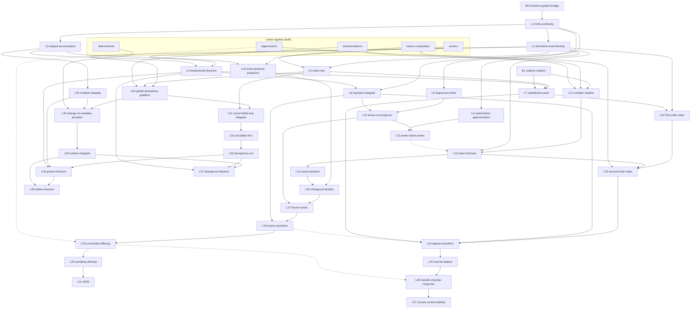

# Applied Mathematics — Curriculum Architecture

The **encoding-facing** companion to the [course spine](course-spine.md):

1. the **prerequisite DAG** (edge table + Mermaid), including cross-course edges;
2. a **concept-ID catalog**;
3. the **recurring canonical examples**;
4. the **reusable visualization families**;
5. the **implementation packages** — the complete roadmap, in dependency order;
6. the **platform gaps**, recorded and *not* scheduled.

> **Scope note (durable).** Architecture, not an authoring reopening. Every
> lesson is a `future` node **except `limits-continuity`,
> `derivative-local-linearity`, `integral-accumulation`, and
> `fundamental-theorem`, which are built** (Package A, slices A1–A4 — the
> complete package). Listing the rest does not authorize building them.

---

## 1. Sequence, reconciled

Course id `applied-mathematics`, under the existing `mathematics` subject in
`src/lessons/courseModel.ts`, as a sibling of `linear-algebra`.

**One unit = one module directory = one implementation package.** Unit ids below
are exactly the `courseModel.ts` unit ids and exactly the directory names under
`docs/courses/applied-mathematics/modules/`.

| Spine | Lesson | Curriculum id | Unit | Pkg |
| --- | --- | --- | --- | --- |
| B0 | Functions, graphs, and the shapes you keep meeting | `functions-graphs-bridge` | `entry-bridges` | B0 *(conditional)* |
| B1 | Radians and the rotating point | `radians-rotation` | `entry-bridges` | B0 |
| L1 | What "approaches" means | `limits-continuity` | `calculus-foundations` | **A** ✅ |
| L2 | The derivative as local linearity | `derivative-local-linearity` | `calculus-foundations` | **A** ✅ |
| L3 | The integral as accumulation | `integral-accumulation` | `calculus-foundations` | **A** ✅ |
| L4 | The Fundamental Theorem of Calculus | `fundamental-theorem` | `calculus-foundations` | **A** ✅ |
| L5 | The chain rule | `chain-rule` | `calculus-technique` | B |
| L6 | Deciding with the derivative | `optimization-approximation` | `calculus-technique` | B |
| L7 | Two techniques, both derived | `substitution-parts` | `calculus-technique` | B |
| L8 | Accumulating forever | `improper-integrals` | `calculus-technique` | B |
| L9 | Sequences and their limits | `sequences-limits` | `series` | C |
| L10 | Series: adding forever | `series-convergence` | `series` | C |
| L11 | Power series and Taylor series | `power-taylor-series` | `series` | C |
| L12 | Complex numbers as rotation and scaling | `complex-rotation` | `complex-oscillation` | D |
| L13 | Euler's formula | `eulers-formula` | `complex-oscillation` | D |
| L14 | Waves: frequency, phase, complex sinusoids | `waves-phasors` | `complex-oscillation` | D |
| L15 | Inner products and projection | `inner-products-projection` | `projection-spectra` | E |
| L16 | Orthogonal families | `orthogonal-families` | `projection-spectra` | E |
| L17 | Fourier series | `fourier-series` | `projection-spectra` | E |
| L18 | The Fourier transform | `fourier-transform` | `projection-spectra` | E |
| L19 | Convolution and filtering | `convolution-filtering` | `signals` | F |
| L20 | Sampling and aliasing | `sampling-aliasing` | `signals` | F |
| L21 | The DFT and the FFT | `dft-fft` | `signals` | F |
| L22 | First-order equations | `first-order-odes` | `differential-equations` | G |
| L23 | Second-order equations | `second-order-odes` | `differential-equations` | G |
| L24 | The Laplace transform | `laplace-transform` | `differential-equations` | G |
| L25 | Coming back: inverse transforms | `inverse-laplace` | `response-control` | H |
| L26 | Transfer functions and impulse response | `transfer-impulse-response` | `response-control` | H |
| L27 | Circuits, feedback, and stability | `circuits-control-stability` | `response-control` | H |
| L28 | Partial derivatives and the gradient | `partial-derivatives-gradient` | `many-variables` | I |
| L29 | Accumulating over a region | `multiple-integrals` | `many-variables` | I |
| L30 | Changing coordinates | `change-of-variables-jacobian` | `many-variables` | I |
| L31 | Vector fields, paths, line integrals | `vector-fields-line-integrals` | `fields` | J |
| L32 | Circulation and flux | `circulation-flux` | `fields` | J |
| L33 | Divergence and curl | `divergence-curl` | `fields` | J |
| L34 | Green's theorem | `greens-theorem` | `boundary-theorems` | K |
| L35 | Surface integrals | `surface-integrals` | `boundary-theorems` | K |
| L36 | Stokes' theorem | `stokes-theorem` | `boundary-theorems` | K |
| L37 | The divergence theorem and conservation | `divergence-theorem` | `boundary-theorems` | K |

**39 lessons; 38 indispensable. Two built** (`limits-continuity`,
`derivative-local-linearity`). No id collides with a built lesson or with a
linear-algebra `future` node (`orthogonality`, `least-squares`, `svd`). All ids
satisfy `ID_SYNTAX` in `src/platform/identity.ts`.

---

## 2. Prerequisite DAG

An edge `A → B` means **B genuinely needs an idea introduced in A**. Hard,
directed, acyclic. **Connection** edges (marked) deepen understanding without
gating.

### 2.1 Cross-course edges

| From (course) | To | Kind | Why |
| --- | --- | --- | --- |
| `vectors` (LA, built) | `inner-products-projection` | hard | Dot product, span, coordinates generalized, not introduced. |
| `vectors` (LA, built) | `complex-rotation` | hard | The complex plane is \(\mathbb{R}^2\) with a multiplication. |
| `transformations` (LA, built) | `complex-rotation` | hard | Multiplication by \(a+bi\) **is** a 2×2 map fixed by where the basis lands. |
| `transformations` (LA, built) | `partial-derivatives-gradient` | hard | The Jacobian is the matrix of a linear map, read by the columns rule. |
| `matrix-composition` (LA, built) | `chain-rule` | hard | Composing local linear models is composing matrices. |
| `determinants` (LA, built) | `change-of-variables-jacobian` | hard | The Jacobian determinant is the same area/volume scale factor. |
| `eigenvectors` (LA, built) | `second-order-odes` | hard | \(e^{st}\) is an eigenfunction of \(d/dt\); the characteristic polynomial is the same object. |
| `eigenvectors` (LA, built) | `convolution-filtering` | connection | Complex sinusoids are the eigenfunctions of LTI systems. |
| `karatsuba` (Algorithms, built) | `dft-fft` | connection | The FFT is the same "do the shared sub-work once" move. |

### 2.2 Within-course edges

| From | To | Kind | Why |
| --- | --- | --- | --- |
| `functions-graphs-bridge` | `limits-continuity` | conditional | A limit is about a function's values near a point. |
| `limits-continuity` | `derivative-local-linearity` | hard | The derivative is a limit. |
| `limits-continuity` | `integral-accumulation` | hard | The integral is a limit of sums. |
| `derivative-local-linearity` | `fundamental-theorem` | hard | The theorem is *about* the derivative; its proof uses the local model. |
| `integral-accumulation` | `fundamental-theorem` | hard | The theorem is *about* the accumulation. |
| `derivative-local-linearity` | `chain-rule` | hard | Composing the local linear models. |
| `derivative-local-linearity` | `optimization-approximation` | hard | "Flat local model" is the criterion. |
| `chain-rule` | `substitution-parts` | hard | Substitution is the chain rule backwards. |
| `fundamental-theorem` | `substitution-parts` | hard | Techniques evaluate definite integrals via antiderivatives. |
| `limits-continuity` | `improper-integrals` | hard | An improper integral is a limit of proper ones. |
| `fundamental-theorem` | `improper-integrals` | hard | Each finite piece is evaluated by the FTC. |
| `radians-rotation` | `substitution-parts` | hard | Trigonometric antiderivatives and substitutions. |
| `limits-continuity` | `sequences-limits` | hard | The same tolerance guarantee, with "far enough along" for the window. |
| `sequences-limits` | `series-convergence` | hard | A series is the limit of its sequence of partial sums. |
| `improper-integrals` | `series-convergence` | hard | The integral test, and the \(p\)-series comparison. |
| `series-convergence` | `power-taylor-series` | hard | A power series converges or does not, on a radius. |
| `optimization-approximation` | `power-taylor-series` | hard | Linearization is the first two terms. |
| `radians-rotation` | `complex-rotation` | hard | Rotation is measured in radians. |
| `complex-rotation` | `eulers-formula` | hard | \(i\) as a quarter turn is the premise. |
| `derivative-local-linearity` | `eulers-formula` | hard | The derivation asks what function's derivative is \(i\) times itself. |
| `power-taylor-series` | `eulers-formula` | connection | The alternative series derivation, given once the series exist. |
| `eulers-formula` | `waves-phasors` | hard | The phasor is \(Ae^{i\phi}e^{i\omega t}\). |
| `integral-accumulation` | `inner-products-projection` | hard | The function inner product is an integral of a product. |
| `inner-products-projection` | `orthogonal-families` | hard | Orthogonality is defined by the inner product. |
| `waves-phasors` | `orthogonal-families` | hard | The family in question is the sinusoids. |
| `orthogonal-families` | `fourier-series` | hard | Coefficients separate because the family is orthogonal. |
| `series-convergence` | `fourier-series` | hard | "An infinite sum of sinusoids" needs a meaning. |
| `fourier-series` | `fourier-transform` | hard | The transform is the period-to-infinity limit. |
| `improper-integrals` | `fourier-transform` | hard | The transform integral is improper. |
| `fourier-transform` | `convolution-filtering` | hard | The convolution theorem is a statement about transforms. |
| `convolution-filtering` | `sampling-aliasing` | hard | Sampling is multiplication by a comb; spectra convolve. |
| `sampling-aliasing` | `dft-fft` | hard | The DFT is the transform of a sampled, finite record. |
| `derivative-local-linearity` | `first-order-odes` | hard | An ODE is a statement about a derivative. |
| `substitution-parts` | `first-order-odes` | hard | Separation of variables integrates both sides. |
| `first-order-odes` | `second-order-odes` | hard | The same "guess an exponential" move, one order up. |
| `eulers-formula` | `second-order-odes` | hard | Complex roots give oscillation. |
| `improper-integrals` | `laplace-transform` | hard | The Laplace integral is improper. |
| `substitution-parts` | `laplace-transform` | hard | The derivative rule **is** integration by parts, and its boundary term carries the initial conditions. |
| `second-order-odes` | `laplace-transform` | hard | The problems Laplace is *for*. |
| `series-convergence` | `laplace-transform` | connection | The region of convergence is the same kind of object as a radius of convergence. |
| `fourier-transform` | `laplace-transform` | **connection** | Both are Theme-2 operator simplifications — but Laplace is **not** an orthogonal projection, so this is a comparison, not a dependency. |
| `laplace-transform` | `inverse-laplace` | hard | You must transform before you invert. |
| `inverse-laplace` | `transfer-impulse-response` | hard | The impulse response is an inverse transform. |
| `convolution-filtering` | `transfer-impulse-response` | connection | The time-domain half; available if the Fourier branch was taken first. |
| `transfer-impulse-response` | `circuits-control-stability` | hard | Poles live in the transfer function. |
| `derivative-local-linearity` | `partial-derivatives-gradient` | hard | A partial derivative is a derivative. |
| `chain-rule` | `partial-derivatives-gradient` | hard | The multivariable chain rule composes the local models. |
| `integral-accumulation` | `multiple-integrals` | hard | Same accumulation, iterated. |
| `partial-derivatives-gradient` | `change-of-variables-jacobian` | hard | The Jacobian is built from partials. |
| `multiple-integrals` | `change-of-variables-jacobian` | hard | The factor multiplies an iterated integral. |
| `partial-derivatives-gradient` | `vector-fields-line-integrals` | hard | The gradient is the first vector field met. |
| `chain-rule` | `vector-fields-line-integrals` | hard | Parameterize the path and differentiate the composition. |
| `vector-fields-line-integrals` | `circulation-flux` | hard | Both are line integrals with different integrands. |
| `circulation-flux` | `divergence-curl` | hard | Local versions of the global quantities. |
| `divergence-curl` | `greens-theorem` | hard | The theorem relates the local density to the boundary total. |
| `multiple-integrals` | `greens-theorem` | hard | The left side is a double integral. |
| `fundamental-theorem` | `greens-theorem` | hard | **Theme 1**: the same cancellation argument, re-run. |
| `change-of-variables-jacobian` | `surface-integrals` | hard | The area element is the coordinate-change factor on a surface. |
| `greens-theorem` | `stokes-theorem` | hard | Stokes is Green lifted off the plane. |
| `surface-integrals` | `stokes-theorem` | hard | The curl is integrated over a surface. |
| `surface-integrals` | `divergence-theorem` | hard | The flux is a surface integral. |
| `divergence-curl` | `divergence-theorem` | hard | The local density is the divergence. |
| `fundamental-theorem` | `divergence-theorem` | hard | **Theme 1**: the same cancellation argument again, now with shared interior faces. |
| `stokes-theorem` | `divergence-theorem` | connection | The third costume of one statement. |

### 2.3 The DAG



*(Dashed node = diagnostic-conditional. Dotted edge = connection, not a gate.)*

### 2.4 Critical-path lengths

| Destination | New lessons required | Package-A share |
| --- | --- | --- |
| **Fourier transform** | **15** (14 if diagnosed out of B1) | 4 of 15 |
| **Green's theorem** | **11** | 4 of 11 |
| **Laplace transform** | **13** | 4 of 13 |
| Divergence theorem (course end of Theme 1) | 13 | 4 of 13 |
| DFT / FFT (course end of the transform branch) | 18 | 4 of 18 |

Package A (`limits-continuity`, `derivative-local-linearity`,
`integral-accumulation`, `fundamental-theorem`) is on **every** path.

---

## 3. Concept-ID catalog

**Introduced by** owns the definition; **reused by** must not redefine it.

| Concept id | Definition (one line) | Introduced by | Reused by |
| --- | --- | --- | --- |
| `limit` | The value a function's outputs can be forced arbitrarily close to, near a point. | `limits-continuity` | L2, L3, L8, L9 |
| `continuity` | The tolerance guarantee holding with \(f(a)\) as the target — a **local** claim. | `limits-continuity` | L2, L3, L4 |
| `modulus-of-continuity` | A function \(\omega(\delta)\) bounding how much \(f\) can vary over any step of size \(\delta\) — the **quantitative** control a local guarantee does not supply. | `limits-continuity` | L3, L4 (the uniformity step), L29 |
| `local-linearity` | Zoomed far enough, a smooth curve is indistinguishable from a line. | `derivative-local-linearity` | L4, L5, L6, L11, L28 |
| `derivative` | The slope of that line; equivalently the instantaneous rate. | `derivative-local-linearity` | L4–L6, L22, L28 |
| `riemann-sum` | A finite total of rate × width, refined without bound. | `integral-accumulation` | L4, L8, L29, L31 |
| `definite-integral` | The limit of Riemann sums; the total of a rate. | `integral-accumulation` | L4, L7, L8, L15, L17, L18, L24, L29, L31, L35 |
| `antiderivative` | A function whose derivative is the integrand. | `fundamental-theorem` | L7, L8, L22 |
| `ftc` | Measuring and accumulating are inverse; interiors telescope. **Theme 1, 1-D.** | `fundamental-theorem` | L7, L8, L24, L34, L36, L37 |
| `improper-integral` | A limit of finite accumulations over a growing interval. | `improper-integrals` | L10, L18, L24 |
| `sequence-limit` | Eventual entrapment of the tail in any tolerance. | `sequences-limits` | L10, L17 |
| `series-convergence` | The limit of the partial sums, when it exists. | `series-convergence` | L11, L17, L24 |
| `radius-of-convergence` | The disc on which a power series converges. | `power-taylor-series` | L13, L24 (compared with the region of convergence) |
| `complex-multiplication` | Rotate by the argument, scale by the modulus. | `complex-rotation` | L13, L14, L18, L24 |
| `complex-exponential` | \(e^{i\theta}\): the exponential whose rate is a quarter turn from its position. | `eulers-formula` | L14, L16–L21, L23, L24, L26 |
| `phasor` | A complex amplitude carrying magnitude and phase together. | `waves-phasors` | L16–L21, L26, L27 |
| `inner-product` | A bilinear, symmetric, positive pairing measuring alignment. | `inner-products-projection` | L16, L17, L18 |
| `orthogonal-projection` | The closest point in a subspace; the error is orthogonal. | `inner-products-projection` | L16, L17 |
| `orthogonal-family` | A mutually orthogonal set, so coordinates separate. | `orthogonal-families` | L17, L18, L21 |
| `fourier-coefficient` | The projection of a periodic function onto one basis sinusoid. | `fourier-series` | L18, L21 |
| `mean-square-convergence` | Convergence in energy — **not** pointwise convergence, as Gibbs shows. | `fourier-series` | L18, L20 |
| `spectrum` | The map from frequency to complex amplitude. | `fourier-transform` | L19–L21, L24, L26 |
| `convolution` | The operation whose transform is a product; smearing by an impulse response. | `convolution-filtering` | L20, L21, L26 |
| `lti-system` | Linear and time-invariant; described entirely by its impulse response. | `convolution-filtering` | L26, L27 |
| `sampling` | Replacing a function by its values on a grid; replicates the spectrum. | `sampling-aliasing` | L21 |
| `aliasing` | Spectral copies overlapping, so frequencies become indistinguishable. | `sampling-aliasing` | L21 |
| `differential-equation` | A statement relating a function to its own derivatives. | `first-order-odes` | L23–L27 |
| `characteristic-equation` | The polynomial obtained by trying \(e^{st}\). | `second-order-odes` | L24, L27 |
| `laplace-transform` | A one-sided integral against \(e^{-st}\) turning \(d/dt\) into multiplication by \(s\), with a **region of convergence**. Not a projection. | `laplace-transform` | L25–L27 |
| `region-of-convergence` | The half-plane of \(s\) where the Laplace integral converges. | `laplace-transform` | L25, L27 |
| `transfer-function` | The transform-domain multiplier of an LTI system. | `transfer-impulse-response` | L27 |
| `impulse-response` | What an LTI system does to a single impulse. | `transfer-impulse-response` | L27 |
| `pole` | A root of the transfer function's denominator — one of the system's own exponentials. | `circuits-control-stability` | — |
| `partial-derivative` | A derivative with the other inputs held fixed. | `partial-derivatives-gradient` | L29–L33 |
| `gradient` | The vector of partials; the uphill direction. | `partial-derivatives-gradient` | L31, L33 |
| `jacobian` | The matrix of partials of a coordinate change; its **determinant** is the local area/volume scale. | `change-of-variables-jacobian` | L35 |
| `vector-field` | A vector assigned to every point. | `vector-fields-line-integrals` | L32–L37 |
| `line-integral` | Accumulation of a field along a path. | `vector-fields-line-integrals` | L32, L34, L36 |
| `circulation` | The line integral of the tangential component around a loop. | `circulation-flux` | L33, L34, L36 |
| `flux` | The integral of the normal component through a boundary. | `circulation-flux` | L33, L37 |
| `curl` | Circulation per unit area, in the limit. | `divergence-curl` | L34, L36 |
| `divergence` | Flux per unit area or volume, in the limit. | `divergence-curl` | L37 |
| `surface-integral` | Accumulation over a parameterized surface. | `surface-integrals` | L36, L37 |

---

## 4. Recurring canonical examples

Shared constants live in `src/math/` (new: `calculus.ts`, `series.ts`,
`signals.ts`, `fields.ts`) and are referenced by id — never duplicated in a
lesson definition.

| Example id | What it is | Recurs in | Why this one |
| --- | --- | --- | --- |
| `ex-drive` | A velocity trace with its matching position trace. | L1, L2, L3, L4 | The one example where the learner already believes the FTC: the odometer and the speedometer never disagree. |
| `ex-parabola` | \(f(x)=x^2\) on \([0,2]\). | L1–L4, L7 | The smallest function with a non-constant derivative and an exactly computable accumulation. |
| `ex-decay` | \(e^{-t/\tau}\), an RC discharge. | L6, L8, L13, L22, L24 | Growth/decay, improper convergence, the exponential's defining property, and the canonical first-order ODE in one object. |
| `ex-geometric` | \(\sum r^n\). | L9, L10, L11 | The one series whose sum, radius, and failure are all visible at once. |
| `ex-square-wave` | The odd square wave of period \(2\pi\). | L16, L17, L19, L20 | Hand-computable coefficients, an honest Gibbs overshoot, an instantly audible spectrum. |
| `ex-two-tone` | \(\cos(2\pi f_1 t)+\tfrac12\cos(2\pi f_2 t+\phi)\). | L14, L17, L18, L20 | Two spectral spikes, a visible phase, and an aliasing demonstration needing no new setup. |
| `ex-rc-circuit` | Series RC with a step input. | L14, L22, L24, L26, L27 | Ties phasors, ODEs, Laplace, the transfer function, and stability to one physical object. |
| `ex-spring` | Mass–spring–damper. | L23, L26, L27 | Under-, critically-, and over-damped from one parameter; the cleanest place to watch the characteristic roots move. |
| `ex-polar-disc` | The unit disc in polar coordinates. | L29, L30, L35 | The smallest genuine coordinate change, where the Jacobian factor \(r\) is unmissable. |
| `ex-rotation-field` | \(\mathbf{F}(x,y)=(-y,x)\). | L31–L34, L36 | Nonzero circulation, zero divergence: the field whose curl is visible. |
| `ex-source-field` | \(\mathbf{F}(x,y)=(x,y)\). | L32, L33, L37 | Zero circulation, nonzero divergence — the exact complement, so the two questions are told apart by contrast. |

---

## 5. Reusable visualization families

A **family** is a parameterized visual treatment built once and re-instantiated.

| Family | What it renders | Built by | Reused by |
| --- | --- | --- | --- |
| `function-plot` | \(y=f(x)\) with a movable point, tolerance band, input window, punctured points, secant/tangent overlay, optional \(f'\) panel. | **L1** | L2, L5, L6, L7, L9, L11, L22 |
| `local-linearity-zoom` | Recursive zoom toward a point until the curve is a line; honest about the magnification and the residual. | **L2** ✅ | L5 (two linked panels), L11, L28 |
| `accumulation-strip` | Riemann rectangles refining, with a running total and units readout. Positive contributions above the axis and negative below, never mirrored; per-rectangle products composed from the fixture's **own declared axis units**, or omitted when it declares none; left/right bracket bars drawn only where the rate is monotone; and the total on its **own panel and scale**, because it is a different quantity in different units. | **L3** ✅ | L4, L7, L8, L15, L29 |
| `telescoping-cancellation` | Adjacent contributions with opposite orientation annihilating so only the boundary survives. **Theme 1's family.** | L4 | **L34, L36, L37** — the same argument in 2-D and 3-D. The highest-value reuse in the course. |
| `partial-sum-ladder` | Partial sums plotted against \(n\), with a tolerance band and the tail highlighted. | L9 | L10, L11, L17 |
| `unit-circle-phasor` | A point circling at constant angular speed, projecting onto both axes, arc-length angle readout. | B1 | L12–L14, L16–L18, L20 |
| `complex-plane-map` | The complex plane deformed by multiplication — the linear-algebra transformation grid, re-skinned. | L12 | L13, L24, L27 (the \(s\)-plane) |
| `spectrum-bars` | Magnitude and phase against frequency; discrete comb or continuous. | L17 | L18–L21, L24 |
| `transform-pair` | Time domain and frequency domain side by side, linked. | L18 | L19–L21, L24, L26 |
| `convolution-slider` | One function slid across another with the overlap integral traced beneath. | L19 | L20, L21, L26 |
| `sampling-comb` | Samples on a continuous signal, the replicated spectrum, alias copies overlapping. | L20 | L21 |
| `slope-field` | Direction field with solution curves through draggable initial conditions. | L22 | L23 |
| `pole-plane` | Poles in the \(s\)-plane linked to the time response they produce. | L27 | — |
| `region-and-jacobian` | A region drawn in two coordinate systems with the local area factor shown as a deforming cell. | L30 | L29, L35 |
| `vector-field-grid` | Arrows on a lattice, with a test particle and a traced path. | L31 | L28 (gradient field), L32–L34, L36, L37 |
| `loop-and-flux` | A deformable closed curve on a field with live circulation and flux readouts. | L32 | L33, L34, L36, L37 |
| `iso-surface-shell` | An isometric surface with its parameterization grid and outward normals, on the existing `sceneKit` isometric helpers. | L35 | L36, L37 |

**Seventeen families cover thirty-nine lessons.** Seven of them
(`function-plot`, `accumulation-strip`, `telescoping-cancellation`,
`unit-circle-phasor`, `spectrum-bars`, `transform-pair`, `vector-field-grid`)
each serve five or more lessons and must be genuinely parameterized components
with their own tests.

### 5.1 Visual budget: flagship vs supporting

Neither "one animation per lesson" nor "every lesson needs a custom animation."
The budget follows the **learning obstacle**.

| Tier | Meaning | Lessons |
| --- | --- | --- |
| **Flagship** | A bespoke guided animation **and** an explorer. Some carry two clips, where the insight has a distinct before and after. | L2 *(2 clips)*, L3, **L4** *(2 clips)*, L13, L17, L18, L19, L20, L26, **L34** *(2 clips)*, L37 |
| **Supporting** | Reuses a family with new data; explorer where interaction adds something. **L1 is here because its cost is family construction, not a bespoke scene.** | B1, L1, L5, L6, L7, L8, L9, L10, L11, L12, L14, L15, L16, L21, L22, L23, L24, L25, L27, L28, L29, L30, L31, L32, L33, L35, L36 |
| **Static-first** | Prose, worked examples, a figure; no guided clip. | B0 |

**11 flagship lessons out of 39, carrying 14 bespoke clips.** Everything else is
reuse.

---

## 6. Implementation packages — the complete roadmap

Twelve packages. **One package = one unit = one module directory.** Ship order is
row order; a package may be re-ordered only if its edges in §2 permit.

| Pkg | Unit | Lessons | New families | Flagships | What it completes |
| --- | --- | --- | --- | --- | --- |
| **B0** | `entry-bridges` | `functions-graphs-bridge` *(conditional)*, `radians-rotation` | `unit-circle-phasor` | — | Entry. Diagnostic-gated; must precede Package B and D. |
| **A** | `calculus-foundations` | `limits-continuity`, `derivative-local-linearity`, `integral-accumulation`, `fundamental-theorem` | `function-plot`, `local-linearity-zoom`, `accumulation-strip`, `telescoping-cancellation` | L2, L3, L4 | The trunk, and **Theme 1 in one dimension**. A complete learner arc on its own. |
| **B** | `calculus-technique` | `chain-rule`, `optimization-approximation`, `substitution-parts`, `improper-integrals` | — | — | Computability, and the improper integrals every transform needs. |
| **C** | `series` | `sequences-limits`, `series-convergence`, `power-taylor-series` | `partial-sum-ladder` | — | What an infinite sum means — required before Fourier series. |
| **D** | `complex-oscillation` | `complex-rotation`, `eulers-formula`, `waves-phasors` | `complex-plane-map` | L13 | The language both transforms are written in. |
| **E** | `projection-spectra` | `inner-products-projection`, `orthogonal-families`, `fourier-series`, `fourier-transform` | `spectrum-bars`, `transform-pair` | L17, L18 | **Theme 2's cleanest case**, and the Fourier milestone. |
| **F** | `signals` | `convolution-filtering`, `sampling-aliasing`, `dft-fft` | `convolution-slider`, `sampling-comb` | L19, L20 | What the spectrum is for; the algorithms cross-connection. |
| **G** | `differential-equations` | `first-order-odes`, `second-order-odes`, `laplace-transform` | `slope-field` | — | The dynamics branch and the Laplace milestone. **Independent of E/F.** |
| **H** | `response-control` | `inverse-laplace`, `transfer-impulse-response`, `circuits-control-stability` | `pole-plane` | L26 | Circuits and control — the engineering payoff. |
| **I** | `many-variables` | `partial-derivatives-gradient`, `multiple-integrals`, `change-of-variables-jacobian` | `region-and-jacobian` | — | Calculus in more variables. |
| **J** | `fields` | `vector-fields-line-integrals`, `circulation-flux`, `divergence-curl` | `vector-field-grid`, `loop-and-flux` | — | The vocabulary of fields. |
| **K** | `boundary-theorems` | `greens-theorem`, `surface-integrals`, `stokes-theorem`, `divergence-theorem` | `iso-surface-shell` | L34, L37 | **Theme 1 completed.** The course's capstone. |

**The roadmap does not stop at Fourier or Laplace.** E and G are milestones; F,
H, I, J, and K follow, and K is where the course's first structural theme reaches
full generality.

### 6.1 Package status ledger

The first thing an implementing agent checks (`AGENTS.md`, "Claim a package
before implementing it").

| Pkg | Status | Branch / worktree | Mode B artifacts |
| --- | --- | --- | --- |
| **A** | **BUILT — A0–A4 complete, pending package-level semantic review** | `master` | Complete: [ledger](modules/calculus-foundations/implementation-package.md) + 4 lesson artifact sets |
| B0, B–K | NOT STARTED | — | None. Mode A only; each enters Mode B when scheduled. |

> **Approval state.** Package A was explicitly approved for implementation on
> 2026-07-28. A0–A4 are all built: `limits-continuity`, `derivative-local-linearity`,
> `integral-accumulation`, and `fundamental-theorem` are complete lessons, each
> passing Gate 8 on its lesson-owned outcomes. The package's single Opus
> semantic review (`AGENTS.md` model routing) and the Gate 9 module assessment
> for `calculus-foundations` are the two remaining, separate steps — neither is
> in scope here. **B** is the next package recommended to enter Mode B.

### 6.2 Suggested Mode B order

Packages enter Mode B **sequentially**, one at a time, each after the previous
package's implementation is accepted. Recommended order — dependency-legal, and
front-loading the two branches that reach a milestone soonest:

```
B0 → A → B → C → D → E → F → G → H → I → J → K
```

G–H may be pulled ahead of E–F if the dynamics branch is wanted first; the DAG
permits it because `fourier-transform → laplace-transform` is only a connection.

---

## 7. Platform gaps (recorded, not scheduled)

| # | Gap | First blocked by | Smallest honest response |
| --- | --- | --- | --- |
| G1 | No calculus math layer in `src/math/`. | Package A | Add `src/math/calculus.ts` (later `series.ts`, `signals.ts`, `fields.ts`) with pure, tested helpers. Ordinary lesson work. |
| G2 | No shared function-plot component; Mafs is present (`MafsSceneShell`) but every explorer so far is vector/matrix-shaped. | Package A | Build `function-plot` as a real parameterized explorer with tests — it serves seven lessons. |
| G3 | No conditional/diagnostic-gated lesson in `courseModel.ts`. | B0 | Ship B0 as an ordinary lesson and let the diagnostic *recommend* it in prose. Defer any routing mechanism. |
| G4 | No cross-course prerequisite edges in the model. | Package A (soft) | Document-only; the multi-domain architecture already defers typed edges. |
| G5 | **Downgraded.** 3-D rendering exists: `sceneKit` ships `toIsometric`, `makeIsometricAxes`, `CUBE_EDGES`, and `ISO_CUBE_CORNERS`, and `subspaces-rank` already draws \(\mathbb{R}^3\) isometrically. | Package K | Build `iso-surface-shell` on those helpers. **Not a blocker**, and the earlier note that `stokes-divergence` might have to be cut is withdrawn. |
| G6 | No audio output. | Packages E–F | Ship silent. Highest-value enrichment on the register: a spectrum you can *hear* is worth more than an extra lesson. |
| G7 | Per-strand diagnostic reporting; the module-assessment runner reports a set outcome, not independent strand verdicts. | M0 diagnostic | Model the diagnostic as three small separate sets rather than changing the runner. |

---

## 8. Next-package recommendation

**Package A is complete.** A0 (the calculus layer, the course registration, and
the `function-plot` family), A1 (`limits-continuity`), A2
(`derivative-local-linearity`, with the `local-linearity-zoom` family), A3
(`integral-accumulation`, with the `accumulation-strip` family), and A4
(`fundamental-theorem`, with the `telescoping-cancellation` family) are all built.
Package A's single Opus semantic review is the remaining step before the
package is accepted; the Gate 9 module assessment for `calculus-foundations`
is a separate, later Mode D pass, open by design.

A4 created `telescoping-cancellation` parameterized over the cancelling pairs
rather than hard-coded to interval endpoints (ledger check **P2**) — Packages
I–K re-run that family with shared interior edges and faces. The underlying
`cancelContributions`/`intervalContributions` primitives (and the pre-existing
`telescopingTerms`/`cancellationReport`) take an arbitrary pairing for that
reason, proven by a regression that feeds the family a non-interval pairing.

**B (`calculus-technique`)** is the next package recommended to enter Mode B.
