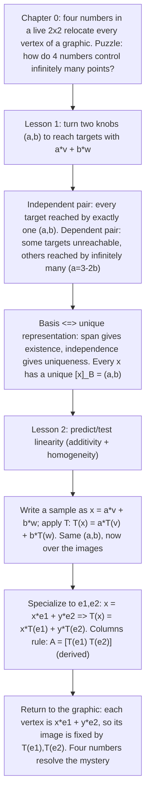

# Insight Discovery Brief — Linear-Algebra Opening Slice (Chapter 0 + Lessons 1–2)

Stage 1 artifact of the [Insight Discovery Gate](../../../../authoring/insight-discovery-gate.md).
Goal: find and rank the "now it clicks" insights that materially change a
learner's mental model of the opening linear-algebra slice — not the definitions
(vector, matrix) or the routine mechanics (how to multiply a matrix by a vector).
This is a **joint** gate: Chapter 0 supplies the mystery, Lesson 1 establishes
unique coordinates, and Lesson 2 completes the causal chain, so a single primary
insight spans both lessons. The approved Stage 2 contract is
[courses/linear-algebra/lessons/00-opening-slice/insight.md](insight.md); the
design brief this gate governs is
[archive/milestones/linear-algebra-opening-vertical-slice.md](../../../../archive/milestones/linear-algebra-opening-vertical-slice.md).

> Primary insight (after audit): **C1** — unique basis coordinates describe every
> vector by coefficients, and linearity preserves those coefficients; therefore
> the images of the basis vectors determine the transformation of every vector.
> C1 is **joint**: it depends on the Lesson 1 basis theorem (**C2**) and pays off
> in the columns rule (**C3**). Necessity (why *four* numbers, not fewer) is the
> dimension-count companion (**C8**); the origin-fixing boundary (**C5**) is what
> makes the claim precise about *which* maps it covers.

Setup and notation used throughout. Work concretely in $\mathbb{R}^2$ (column
vectors, $y$ up). The standard basis is $\mathbf{e}_1=\begin{bmatrix}1\\0\end{bmatrix}$,
$\mathbf{e}_2=\begin{bmatrix}0\\1\end{bmatrix}$. An ordered pair
$B=(\mathbf{v},\mathbf{w})$ is a **basis** iff it is linearly independent and
spans $\mathbb{R}^2$. Given $\mathbf{x}=a\mathbf{v}+b\mathbf{w}$, the pair
$(a,b)$ is $\mathbf{x}$'s **coordinates in $B$**, written
$[\mathbf{x}]_B=\begin{bmatrix}a\\b\end{bmatrix}$. A map
$T:\mathbb{R}^2\to\mathbb{R}^2$ is **linear** iff it is additive
($T(\mathbf{u}+\mathbf{v})=T(\mathbf{u})+T(\mathbf{v})$) and homogeneous
($T(c\mathbf{u})=c\,T(\mathbf{u})$). The recurring worked directions are
$\mathbf{v}=\begin{bmatrix}1\\2\end{bmatrix}$,
$\mathbf{w}=\begin{bmatrix}3\\-1\end{bmatrix}$ (independent, since
$1\cdot(-1)-2\cdot3=-7\neq0$), with the dependent alternative
$\mathbf{w}_d=\begin{bmatrix}2\\4\end{bmatrix}=2\mathbf{v}$.

The recurring puzzle. In Chapter 0 a single $2\times2$ matrix — **four numbers** —
visibly relocates every vertex of a whole graphic. The naive model ("to move a
shape you must say where each of its infinitely many points goes") cannot explain
how four numbers control infinitely many points. The slice resolves the puzzle by
showing that (i) a basis assigns every vector a *unique* coordinate pair
(Lesson 1) and (ii) a linear map carries those coordinates forward onto the images
of the basis vectors (Lesson 2), so two basis images — four numbers — fix every
image.

---

## Candidate insights

### C1. Unique coordinates + linearity ⇒ two basis images determine the whole map (primary, joint)

- Initial model: "A transformation of the plane is defined point-by-point; to know
  it you must know where every one of infinitely many points goes."
- Tension: in Chapter 0 four numbers move an entire graphic. How can four scalars
  determine the fate of infinitely many points?
- Structural reveal: every $\mathbf{x}$ has a *unique* coordinate pair
  $\mathbf{x}=a\mathbf{v}+b\mathbf{w}$ (Lesson 1), and a linear $T$ satisfies
  $T(a\mathbf{v}+b\mathbf{w})=aT(\mathbf{v})+bT(\mathbf{w})$. The *same*
  coefficients $(a,b)$ now sit over the images $T(\mathbf{v}),T(\mathbf{w})$, so
  knowing those two images fixes every image.
- Minimal derivation: with $\mathbf{x}=x\mathbf{e}_1+y\mathbf{e}_2$, linearity
  gives $T(\mathbf{x})=xT(\mathbf{e}_1)+yT(\mathbf{e}_2)
  =\begin{bmatrix}T(\mathbf{e}_1)&T(\mathbf{e}_2)\end{bmatrix}\begin{bmatrix}x\\y\end{bmatrix}$
  — four numbers (the two columns) reproduce $T$ on all of $\mathbb{R}^2$.
- Visual/interactive: Chapter 0 graphic morphing under a live $2\times2$ (mystery);
  Lesson 2 reconstructs the graphic vertex-by-vertex from only
  $T(\mathbf{e}_1),T(\mathbf{e}_2)$, each vertex $x\mathbf{e}_1+y\mathbf{e}_2$
  mapping to $xT(\mathbf{e}_1)+yT(\mathbf{e}_2)$.
- New prediction: to achieve a target transformation, set only the two basis
  images; the image of any other vector is then forced (and computable) from them.
- Transfers to: change of basis (same object, new coordinate name); and — exactly,
  not by analogy — "a linear map is determined by its action on a basis" in every
  finite-dimensional and abstract vector space (Axler-style).

### C2. Basis ⇔ unique representation (span ⇒ existence, independence ⇒ uniqueness)

- Initial model: "Any two different arrows can name every point of the plane."
- Tension: some pairs (e.g. $\mathbf{v},\mathbf{w}_d=2\mathbf{v}$) leave targets
  unreachable, and *reachable* targets on the shared line have *many* names. What
  distinguishes the good pairs?
- Structural reveal: $B=(\mathbf{v},\mathbf{w})$ is a basis of $\mathbb{R}^2$ iff
  every $\mathbf{x}$ has **exactly one** $(a,b)$ with $\mathbf{x}=a\mathbf{v}+b\mathbf{w}$.
  Spanning supplies *existence* (at least one name); independence supplies
  *uniqueness* (at most one).
- Minimal derivation: uniqueness — if $a\mathbf{v}+b\mathbf{w}=a'\mathbf{v}+b'\mathbf{w}$
  then $(a-a')\mathbf{v}+(b-b')\mathbf{w}=\mathbf{0}$; independence forces
  $a=a',\ b=b'$. Existence is the definition of spanning.
- Visual/interactive: a two-knob $(a,b)$ machine over an independent pair (exactly
  one setting hits each target) vs a dependent pair (targets off the line
  unreachable; targets on the line hit by a whole family $a=3-2b$ for
  $\mathbf{r}=(3,6)$).
- New prediction: an independent pair gives *one* coordinate answer for any target;
  a dependent pair gives *none or infinitely many* — never exactly one for every
  target.
- Transfers to: dimension and coordinate systems generally; the uniqueness that
  makes C1's "carry the coefficients forward" well-defined.

### C3. The columns of a matrix are literally the images of $\mathbf{e}_1,\mathbf{e}_2$ (a consequence, not a convention)

- Initial model: "A matrix is a box of four numbers, and the columns-rule
  $A=\begin{bmatrix}T(\mathbf{e}_1)&T(\mathbf{e}_2)\end{bmatrix}$ is a memorized
  packing convention."
- Tension: why *columns*? Why do those particular four numbers act like the whole
  transformation?
- Structural reveal: specialize C1 to the standard basis. Since
  $\mathbf{x}=x\mathbf{e}_1+y\mathbf{e}_2$, linearity gives
  $T(\mathbf{x})=xT(\mathbf{e}_1)+yT(\mathbf{e}_2)$; the matrix whose columns are
  $T(\mathbf{e}_1),T(\mathbf{e}_2)$ *reproduces* $T$. The rule is derived.
- Minimal derivation: read $A\begin{bmatrix}x\\y\end{bmatrix}
  =x\,(\text{col}_1)+y\,(\text{col}_2)$ off the linear-combination form above; set
  $\mathbf{x}=\mathbf{e}_1$ to see $\text{col}_1=T(\mathbf{e}_1)$, likewise
  $\text{col}_2=T(\mathbf{e}_2)$.
- Visual/interactive: hovering column 1 brightens $T(\mathbf{e}_1)$'s image arrow
  and its tip coordinates; column 2 ↔ $T(\mathbf{e}_2)$ — the "four numbers" of
  Chapter 0 named.
- New prediction: read a transformation's effect straight off the columns; build a
  desired transformation by placing the two basis images.
- Transfers to: matrix–vector product as a column combination (C4); every "the
  matrix of a linear map" statement in later linear algebra.

### C4. Every output $A\mathbf{x}$ is a linear combination of $A$'s columns (so the reachable set is the column span)

- Initial model: "$A\mathbf{x}$ is a grid of dot products of rows with $\mathbf{x}$."
- Tension: the row view computes the answer but hides *what set of outputs is
  possible*.
- Structural reveal: $A\mathbf{x}=x\,(\text{col}_1)+y\,(\text{col}_2)$, so every
  output is a combination of the columns; the set of all outputs is exactly
  $\operatorname{span}(\text{col}_1,\text{col}_2)$ — the **column span**.
- Minimal derivation: expand $A\begin{bmatrix}x\\y\end{bmatrix}$ column-wise (C3);
  ranging over $(x,y)$ ranges over all combinations of the columns.
- Visual/interactive: with dependent columns (e.g. projection
  $\begin{bmatrix}1&0\\0&0\end{bmatrix}$) the graphic *flattens* onto a line —
  distinct vertices land on the same point (visible information loss).
- New prediction: dependent columns collapse the plane to a line or point;
  independent columns cover the whole plane (and keep $T$ reversible — named only).
- Transfers to: column space, rank, invertibility (named as consequences); Lesson 3
  determinant/collapse preview.

### C5. Every linear map fixes the origin, so translation is affine (a productive boundary)

- Initial model: "Sliding a shape over is obviously a linear transformation."
- Tension: translation moves the graphic convincingly, yet no $2\times2$ matrix
  reproduces it — why does the "four numbers" story suddenly fail?
- Structural reveal: homogeneity forces $T(\mathbf{0})=T(0\cdot\mathbf{u})=0\cdot
  T(\mathbf{u})=\mathbf{0}$; a translation $\mathbf{x}\mapsto\mathbf{x}+\mathbf{t}$
  with $\mathbf{t}\neq\mathbf{0}$ sends $\mathbf{0}$ to $\mathbf{t}$, so it is
  **affine**, not linear. This is exactly the class C1 covers and the class it does
  not.
- Minimal derivation: additivity also fails —
  $T(\mathbf{u}+\mathbf{v})=\mathbf{u}+\mathbf{v}+\mathbf{t}\neq
  T(\mathbf{u})+T(\mathbf{v})=\mathbf{u}+\mathbf{v}+2\mathbf{t}$.
- Visual/interactive: a translation toggle slides the graphic while the origin
  refuses to stay fixed; the readout flags "not a $2\times2$ linear map: origin
  moved."
- New prediction: any map that moves the origin cannot be a $2\times2$ matrix; the
  fix — **affine / homogeneous coordinates** (a $3\times3$ embedding) — is named
  only, deferred.
- Transfers to: affine geometry, homogeneous coordinates, computer-graphics
  transforms; sharpening "linear" vs "affine."

### C6. Coordinates and matrices are basis-relative (same vector, different coordinates; same map, different matrix)

- Initial model: "A vector's coordinates and a map's matrix are absolute facts."
- Tension: reflection across $y=x$ has matrix
  $\begin{bmatrix}0&1\\1&0\end{bmatrix}$ in standard coordinates, but the *same*
  reflection looks like $\operatorname{diag}(1,-1)$ in another basis. Which is "the"
  matrix?
- Structural reveal: coordinates are names *in a chosen basis*, and a matrix
  represents $T$ *relative to* chosen bases. Both are basis-relative; neither is
  absolute.
- Minimal derivation: in $B=\big((1,1),(1,-1)\big)$, reflection across $y=x$ fixes
  $(1,1)$ and sends $(1,-1)\mapsto(-1,1)=-(1,-1)$, so
  $[T]_{B\leftarrow B}=\operatorname{diag}(1,-1)$; in the standard basis the same
  map is $\begin{bmatrix}0&1\\1&0\end{bmatrix}$.
- Visual/interactive: a "same map, two matrices" toggle switching the readout
  between the two representations of one geometric reflection.
- New prediction: choosing a smarter basis can diagonalize a map (seeds
  eigenbases); the same map has different matrices in different bases.
- Transfers to: change of basis, similarity, diagonalization (formula deferred);
  the eigenvector lessons.

### C7. Linearity = respecting addition and scaling, and it is exactly what globalizes local data

- Initial model: "'Linear' just means 'straight-line-ish' or 'no squares.'"
- Tension: what precise property lets *two* sampled images (local data) determine
  the map *everywhere* (global behavior)?
- Structural reveal: linearity is two testable equations — additivity and
  homogeneity — and they are *exactly* the properties that let
  $T(a\mathbf{v}+b\mathbf{w})=aT(\mathbf{v})+bT(\mathbf{w})$, i.e. that carry basis
  data to all combinations.
- Minimal derivation: apply additivity then homogeneity to $a\mathbf{v}+b\mathbf{w}$;
  the two axioms are used once each and nothing else is needed.
- Visual/interactive: a predict-then-test panel — pick $\mathbf{u},\mathbf{v}$ and
  compare $T(\mathbf{u}+\mathbf{v})$ against $T(\mathbf{u})+T(\mathbf{v})$ for a
  shear (passes) vs a translation/warp (fails).
- New prediction: a map passing both tests is determined by its basis images; a map
  failing either is not (and cannot be a matrix).
- Transfers to: linear operators, function spaces, the definition-of-linearity
  reflex used throughout mathematics.

### C8. Dimension count — four numbers are both sufficient and necessary (necessity companion to C1)

- Initial model: "Four numbers happen to be enough; maybe fewer, or more, would do."
- Tension: C1 shows four *suffice*; are they also *required*, or is four incidental?
- Structural reveal: the linear maps $\mathbb{R}^2\to\mathbb{R}^2$ form a
  **4-dimensional** space — a general such map is fixed by the two images
  $T(\mathbf{e}_1),T(\mathbf{e}_2)$, each with two coordinates, freely chosen — so
  four numbers are also *necessary* in general.
- Minimal derivation: the map $T\mapsto\big(T(\mathbf{e}_1),T(\mathbf{e}_2)\big)\in
  \mathbb{R}^2\times\mathbb{R}^2$ is a bijection between linear maps and pairs of
  images; $\dim(\mathbb{R}^2\times\mathbb{R}^2)=4$.
- Visual/interactive: four independent sliders (the two columns) sweep the entire
  space of linear maps; removing one loses reachable transformations.
- New prediction: no three-number scheme can name every linear map of the plane;
  the parameter count is exactly the picture's four columns entries.
- Transfers to: dimension of $\operatorname{Hom}(\mathbb{R}^m,\mathbb{R}^n)=mn$;
  degrees-of-freedom counting.
- Audit note: this is an **elementary parameter count** (a bijection to
  $\mathbb{R}^4$), **not** a hard bilinear-rank / complexity lower bound like
  Karatsuba's "three is optimal." Keep the two kinds of "necessity" distinct.

### C9. A basis is ordered — coordinate order follows basis order

- Initial model: "A basis is just a *set* of two independent vectors."
- Tension: writing $[\mathbf{q}]_B$ requires knowing which vector is "first"; does
  order matter?
- Structural reveal: a basis is an *ordered* pair, and coordinates inherit that
  order. For $\mathbf{q}=(-1,5)$ with $B=(\mathbf{v},\mathbf{w})$,
  $[\mathbf{q}]_B=\begin{bmatrix}2\\-1\end{bmatrix}$, but with
  $B'=(\mathbf{w},\mathbf{v})$, $[\mathbf{q}]_{B'}=\begin{bmatrix}-1\\2\end{bmatrix}$.
- Minimal derivation: $\mathbf{q}=2\mathbf{v}-\mathbf{w}=(-1)\mathbf{w}+2\mathbf{v}$;
  the coefficients swap when the basis order swaps.
- Visual/interactive: a basis-order toggle ($B$ vs $B'$) that reindexes the
  coordinate readout while the arrow stays put.
- New prediction: reordering the basis permutes coordinates (and permutes matrix
  rows/columns); coordinates are not attributes of the vector alone.
- Transfers to: ordered bases, permutation of coordinates, matrix layout
  conventions.

### C10. Linearity is visible — a linear map keeps the grid a grid of evenly spaced parallelograms through the origin

- Initial model: "You can't *see* whether a map is linear; you have to test
  algebra."
- Tension: is there a visual signature that separates linear maps from the rest?
- Structural reveal: a linear map sends the square grid to a grid of **evenly
  spaced parallelograms through the origin** (straight, parallel, equally spaced
  lines); a nonlinear map *bends* grid lines or loses equal spacing, and an affine
  map shifts the origin off $\mathbf{0}$.
- Minimal derivation: images of equally spaced lattice points
  $m\mathbf{e}_1+n\mathbf{e}_2\mapsto mT(\mathbf{e}_1)+nT(\mathbf{e}_2)$ are equally
  spaced along $T(\mathbf{e}_1),T(\mathbf{e}_2)$ — a lattice — precisely by
  linearity.
- Visual/interactive: deform the shared grid via `transformedGridSegments`; a
  linearity/nonlinearity contrast (straight-parallel-even vs bent/uneven).
- New prediction: eyeball a transformed grid and classify the map (linear / affine
  / nonlinear) before computing.
- Transfers to: the deforming-grid visual language used for every later matrix and
  eigenvector lesson.

### C11. One coordinate machine underlies both lessons

- Initial model: "Lesson 1 (coordinates) and Lesson 2 (transformations) are two
  separate topics."
- Tension: why do the same $(a,b)$ knobs and the same $\mathbf{v},\mathbf{w}$ recur
  in both?
- Structural reveal: a single machine $(a,b)\mapsto a\mathbf{v}+b\mathbf{w}$ runs
  through both. Lesson 1 asks *when it names every vector uniquely* (basis theorem);
  Lesson 2 asks *how $T$ acts on it* ($a\mathbf{v}+b\mathbf{w}\mapsto
  aT(\mathbf{v})+bT(\mathbf{w})$).
- Minimal derivation: the two lessons are the two questions one can ask about the
  same expression $a\mathbf{v}+b\mathbf{w}$ — uniqueness of $(a,b)$, and the image
  under a linear $T$.
- Visual/interactive: the two-knob machine (Lesson 1) reappears transformed
  (Lesson 2), and applied to *every vertex at once* it is the shared graphic.
- New prediction: the coordinate story and the transformation story are one story;
  resolving Chapter 0 needs both halves and nothing more.
- Transfers to: the recurring "coordinatize, then act" pattern across linear
  algebra.

---

## Rejected as non-insights

- "A vector is an arrow" / "a matrix is a box of numbers" (definitions, not
  model-changing reveals).
- Matrix-multiplication mechanics (row-times-column bookkeeping) — routine
  procedure, not an insight.
- "Linear algebra is used everywhere" (decorative motivation; no structural
  content).
- Historical notes (Cayley, Sylvester, the coining of "matrix") — trivia.
- "Bigger determinant means bigger stretch" (belongs to Lesson 3; not part of this
  slice's chain).

---

## Ranking of the strongest three

Criteria: (1) surprise before / inevitability after; (2) explanatory compression;
(3) transfer value; (4) mathematical correctness; (5) interactive teachability;
(6) fit to prerequisites (assumes: $\mathbb{R}^2$ vectors, linear combination; for
Lesson 2, the Lesson 1 basis theorem).

### #1 — C1: unique coordinates + linearity ⇒ two basis images determine the whole map (joint)

- Surprise/inevitability: "four numbers move infinitely many points" is a genuine
  puzzle; "coordinates are unique and linearity carries them onto the basis images"
  makes the resolution inevitable — the columns rule falls out.
- Compression: the action on all of $\mathbb{R}^2$ collapses to two arrows / four
  scalars.
- Transfer: exact structural transfer to change of basis and to
  determined-by-a-basis in every finite-dimensional/abstract space.
- Correctness: exact; the chain uses only the basis theorem and the two linearity
  axioms.
- Teachability: excellent — Chapter 0 mystery, then vertex-by-vertex
  reconstruction from $T(\mathbf{e}_1),T(\mathbf{e}_2)$.
- Prerequisites: needs C2 (Lesson 1). Chosen primary; it is the whole-slice thesis.

### #2 — C2: basis ⇔ unique representation (the surprising prerequisite)

- Surprise/inevitability: "any two arrows name every point" is a natural but *wrong*
  belief; the dependent pair (unreachable + infinitely-many cases) refutes it, and
  "independence ⇒ uniqueness" is itself a small surprise.
- Compression: two conditions (span, independence) collapse to one crisp
  characterization (exactly one name for every vector).
- Transfer: coordinates, dimension; it is the load-bearing prerequisite for C1.
- Correctness: exact; the uniqueness proof is a two-line independence argument.
- Teachability: strong — the three experienceable cases (unique / none /
  infinitely-many) on the two-knob machine.
- Prerequisites: linear combination and independence only. Lesson 1 core.

### #3 — C3: the columns rule as a consequence (the tangible payoff)

- Surprise/inevitability: reframes a "memorized packing" as a *derivation* — the
  columns are *where $\mathbf{e}_1,\mathbf{e}_2$ land*.
- Compression: one specialization of C1 explains matrix layout and the
  matrix–vector product at once.
- Transfer: seeds C4 (column combinations / column span) and every later "matrix of
  a map."
- Correctness: exact; a direct specialization to the standard basis.
- Teachability: excellent — column ↔ basis-image highlighting; build-a-matrix by
  placing two arrows.
- Prerequisites: C1 (hence C2). The concrete answer to Chapter 0's mystery.

Strong supporting insights (beyond the top three): **C5** (origin-fixing boundary)
makes C1 honest about *which* maps it covers and turns translation into a
productive limitation; **C8** (dimension count) supplies the *necessity* half of
"four numbers" as an elementary parameter count — explicitly **not** a hard
complexity lower bound.

---

## Discovery sequence for the primary insight (C1)

Discover, don't tell. The learner should reconstruct "two basis images determine
the map" themselves — first feeling the mystery (Chapter 0), then earning unique
coordinates (Lesson 1), then closing the chain (Lesson 2) — before the columns rule
is stated as a rule.

Step detail:

1. Feel the mystery (Chapter 0). Watch a graphic morph under a live $2\times2$;
   surface the four entries. Puzzle made explicit: four numbers, infinitely many
   points.
2. Turn the knobs (Lesson 1). With $\mathbf{v}=(1,2)$, $\mathbf{w}=(3,-1)$, adjust
   $(a,b)$ in $a\mathbf{v}+b\mathbf{w}$ to hit targets; find that an *independent*
   pair reaches every target with **exactly one** $(a,b)$.
3. Break it on purpose. Swap in $\mathbf{w}_d=2\mathbf{v}$: a target off the shared
   line ($\mathbf{p}=(4,1)$) is **unreachable**; a target on the line
   ($\mathbf{r}=(3,6)$) is reached by **infinitely many** $(a,b)$ (the family
   $a=3-2b$). Contrast makes "exactly one" the special, valuable case.
4. Name the theorem. $B=(\mathbf{v},\mathbf{w})$ is a basis iff every $\mathbf{x}$
   has exactly one $(a,b)$: span ⇒ existence, independence ⇒ uniqueness. Every
   vector now carries a unique $[\mathbf{x}]_B$. Determine an undisclosed one:
   $[\mathbf{q}]_B=(2,-1)$ for $\mathbf{q}=(-1,5)$.
5. Test linearity (Lesson 2). Predict, then check, additivity and homogeneity for a
   shear (pass) and for translation / a nonlinear warp (fail — origin moves / grid
   bends).
6. Carry the coefficients forward. Write $\mathbf{x}=a\mathbf{v}+b\mathbf{w}$ and
   apply $T$: $T(\mathbf{x})=aT(\mathbf{v})+bT(\mathbf{w})$ — the *same* $(a,b)$,
   now indexing the images. Hence $T$ is fixed by $T(\mathbf{v}),T(\mathbf{w})$.
7. Specialize and read off the columns. With $\mathbf{x}=x\mathbf{e}_1+y\mathbf{e}_2$,
   $T(\mathbf{x})=xT(\mathbf{e}_1)+yT(\mathbf{e}_2)$, so
   $A=\begin{bmatrix}T(\mathbf{e}_1)&T(\mathbf{e}_2)\end{bmatrix}$ — the columns
   rule, *derived* (C3).
8. Resolve the mystery. Every graphic vertex is $x\mathbf{e}_1+y\mathbf{e}_2$, so
   transforming just $\mathbf{e}_1,\mathbf{e}_2$ (four numbers) transforms every
   vertex. Chapter 0 answered.

Exit test (predict, not recall). Give the learner (a) a **new target graphic**:
they set $T(\mathbf{e}_1),T(\mathbf{e}_2)$ (drag the two image arrows or type the
two columns) to reproduce it, and explain *why two arrows suffice* (unique
coordinates + linearity), citing that each vertex is $x\mathbf{e}_1+y\mathbf{e}_2$;
and (b) a **translation** they must classify as *not* a $2\times2$ linear map
(origin moves) — a question a single memorized matrix cannot answer. Optionally give
a **new basis** and ask for the same vector's coordinates, exposing basis-relativity
and order (C6, C9).
