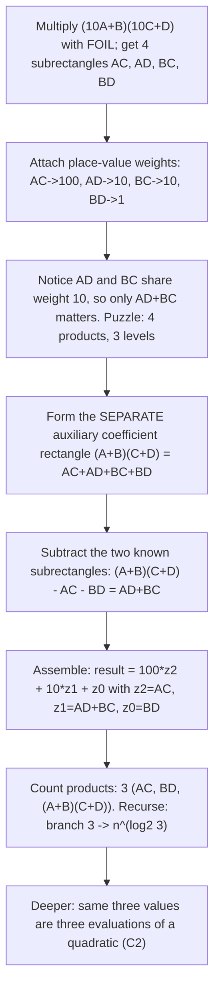

# Insight Discovery Brief — Karatsuba Multiplication

Stage 1 artifact of the [Insight Discovery Gate](./INSIGHT_DISCOVERY_GATE.md).
Goal: find and rank the "now it clicks" insights that materially change a
learner's mental model of Karatsuba — not the definition or the routine
derivation. The approved Stage 2 contract is [insights/karatsuba.md](./insights/karatsuba.md).

> Primary insight (after audit): **C1** — the two cross terms are needed only
> through their sum because they share one place-value level. The polynomial
> evaluation/interpolation view (**C2**) is the *deeper connection*, not the
> elementary explanation; tensor rank (**C6**) is an *expert bridge*.

Setup and notation used throughout. Two $n$-digit numbers are split at the middle
$m = n/2$:

$$x = a\cdot B^{m} + b, \qquad y = c\cdot B^{m} + d \qquad (B = \text{base, e.g. }10),$$

so that

$$xy = z_2\,B^{2m} + z_1\,B^{m} + z_0, \qquad z_2 = ac,\ \ z_1 = ad+bc,\ \ z_0 = bd.$$

The coefficients $z_2, z_1, z_0$ are the three place-value levels of the product.
Each may exceed a single $m$-digit block, so a final **carrying** pass normalizes
them into digits. Carrying is a separate, purely additive step from the algebraic
reconstruction and does not change the multiplication count.

Keep two size effects distinct. *Output carrying* (above) normalizes the $z_i$.
Separately, because $a+b$ can be $m+1$ digits wide, the recursive product
$(a+b)(c+d)$ may be slightly wider than $ac$ and $bd$; this *operand-width* growth
is absorbed by padding, uneven block lengths, or recursing on the larger width. It
adds no fourth multiplication, and the recurrence
$T(n)\le 3\,T(\lceil n/2\rceil+1)+O(n)$ still gives the exponent $\log_2 3$.

Naive splitting computes four half-size products $ac, ad, bc, bd$. Karatsuba
computes three — $z_2=ac$, $z_0=bd$, and $(a+b)(c+d)$ — then recovers the middle by
subtraction, $z_1=(a+b)(c+d)-z_2-z_0=ad+bc$. The recurrence changes from
$T(n)=4T(n/2)+\Theta(n)$ to $T(n)=3T(n/2)+\Theta(n)$, i.e. from $\Theta(n^2)$ to
$\Theta(n^{\log_2 3})\approx\Theta(n^{1.585})$.

---

## Candidate insights

### C1. The two cross terms are needed only through their sum (elementary breakthrough)

- Initial model: "A product of two split numbers needs all four FOIL pieces,
  because that's what expanding the brackets gives."
- Tension: the product has three place-value levels ($B^{2m}$, $B^{m}$, $B^0$) but
  the naive method produces four partial products. Something is redundant.
- Structural reveal: $ad$ and $bc$ both land on the same level $B^{m}$, so the
  result depends on them only through the sum $ad+bc$. You need the *combined*
  middle quantity, never its two halves separately.
- Minimal derivation: the *auxiliary coefficient rectangle* $(a+b)(c+d)=ac+ad+bc+bd$
  (dimensions $a+b$ by $c+d$, unweighted areas) is distinct from the *weighted
  multiplication rectangle* ($aB^m+b$ by $cB^m+d$) whose shared middle weight
  showed that only $ad+bc$ is needed. Subtract the two subrectangles $z_2=ac$ and
  $z_0=bd$ to leave exactly $ad+bc$: $z_1=(a+b)(c+d)-z_2-z_0$, one product and two
  subtractions.
- Visual/interactive: the auxiliary coefficient rectangle of width $a+b$, height
  $c+d$, partitioned into four subrectangles $ac, ad, bc, bd$. Shade it whole, then
  "peel off" the $ac$ and $bd$ subrectangles; the two remaining opposite-corner
  subrectangles are exactly the single quantity $ad+bc$ you actually needed.
- New prediction: the middle level is one product plus two subtractions, so an
  explicit three-product construction computes the whole result — three half-size
  multiplications instead of four.
- Transfers to: inclusion–exclusion, and any "measure the whole, subtract the
  known parts" reconstruction.

### C2. Deeper connection: the product is a quadratic, so three chosen evaluations determine it

- Initial model: multiplication is a digit-by-digit procedure.
- Tension: why exactly three products — could two work, or must it be four?
- Structural reveal: treat each number as a linear polynomial in $t=B^{m}$:
  $x(t)=at+b$, $y(t)=ct+d$. The product $x(t)y(t)$ is a quadratic with three
  coefficients, and a quadratic is determined by three suitable point-values.
  Karatsuba's three products are three such evaluations.
- Precision (audit): a quadratic having three coefficients means three suitable
  *evaluations* determine it. In Karatsuba, each evaluation is chosen so it can be
  obtained with **one** multiplication of two linear combinations of the input
  halves ($t=0\Rightarrow bd$, $t=1\Rightarrow(a+b)(c+d)$, leading $\Rightarrow ac$).
  Three coefficients alone do **not** universally imply that exactly three
  multiplications are sufficient or necessary — that requires the explicit
  construction (see C6 for why three is also a lower bound here).
- Minimal derivation: evaluate the factors (cheap additions) at three nodes,
  multiply the results (the three real multiplications), then interpolate the
  quadratic to read off $z_2, z_1, z_0$.
- Visual/interactive: plot the parabola $z=x(t)y(t)$; drag three sample points and
  watch the unique fitted parabola; a fourth sample lands on the curve
  automatically (visibly redundant).
- New prediction: with $k$-way splitting the product has degree $2k-2$, hence
  $2k-1$ coefficients, hence $2k-1$ chosen products (Toom-Cook).
- Transfers to: Toom-Cook, polynomial multiplication, and the evaluate → pointwise
  multiply → interpolate architecture shared with FFT multiplication.

### C3. The naive method computes information the result discards

- Initial model: "Every partial product is needed."
- Tension: four computed partials, three place-value levels of output.
- Structural reveal: $ad$ and $bc$ individually are intermediate information the
  result does not require; the answer is invariant to how $ad+bc$ is split between
  them. The naive algorithm pays for a distinction the output erases.
- Precision (audit): the redundancy shows the naive method computes information
  the final result discards. Karatsuba's explicit three-product bilinear
  construction demonstrates that this redundancy *can be exploited*. Ordinary
  rank–nullity alone does **not** establish multiplicative complexity: a
  one-dimensional "kernel" in the partials → coefficients map does not by itself
  prove one multiplication is removable. The removal is proven by exhibiting the
  construction (C1), and its optimality by the bilinear lower bound (C6).
- Minimal derivation (as motivation, not proof): moving $\varepsilon$ from $ad$ to
  $bc$ leaves $xy$ unchanged, so the answer sees only $ad+bc$. This motivates
  seeking a cheaper scheme; C1 supplies it.
- Visual/interactive: a slider that shifts value between the $ad$ and $bc$ tiles
  while the final product readout stays fixed — the discarded distinction made
  tangible.
- New prediction: expect a cheaper scheme to exist and look for an explicit
  construction; do not assume the count follows from redundancy alone.
- Transfers to: recognizing over-computation in any reconstruction; the discipline
  of separating "a sufficient construction exists" from "this is a lower bound."

### C4. The third evaluation node is a free choice (t = 1 is convenient, not magic)

- Initial model: "$(a+b)(c+d)$ is the special trick."
- Tension: why the sum $a+b$ specifically?
- Structural reveal: any suitable distinct node for which interpolation is valid
  and computationally useful works. Using $t=-1$:
  $(a-b)(c-d)=ac-(ad+bc)+bd$, so $ad+bc = ac+bd-(a-b)(c-d)$. The subtractions are
  interpolation with a different node.
- Minimal derivation: substitute $t=-1$ into $x(t)y(t)$ and solve for the middle
  coefficient; compare with the $t=1$ formula.
- Visual/interactive: a node-picker on the $t$-axis; the reconstruction formula
  updates live, showing that only the *count* of nodes (three) is fixed, not their
  location.
- New prediction: node choice is an engineering knob — pick nodes that keep
  intermediate sums small for better constants.
- Transfers to: Toom-Cook node selection; conditioning of interpolation.

### C5. Branching factor, not per-step savings, sets the exponent

- Initial model: "Saving one of four multiplies is a 25% speedup."
- Tension: 25% cannot explain $n^{1.585}$ vs $n^2$.
- Structural reveal: the saving compounds. The recursion tree has branching factor
  3 instead of 4, so it has $n^{\log_2 3}$ leaves instead of $n^{\log_2 4}=n^2$.
  A constant-looking trick becomes an *exponent* change because it recurs.
- Minimal derivation: Master theorem on $T(n)=3T(n/2)+\Theta(n)$: since
  $\log_2 3 > 1$, work is leaf-dominated and $T(n)=\Theta(n^{\log_2 3})$.
- Visual/interactive: side-by-side recursion trees (branch 4 vs branch 3) with a
  depth slider; a live leaf-count vs $n$ log-log plot showing the two slopes.
- New prediction: any divide-and-conquer that removes one sub-call changes the
  exponent to $\log_b(\text{branch})$, not just the constant.
- Transfers to: Strassen, master-theorem reasoning, all leaf-dominated recurrences.

### C6. Expert bridge: "three" is a bilinear rank — the same move as Strassen

- Initial model: multiplication is atomic; three just "happens to work."
- Tension: is three optimal, or could a cleverer scheme reach two?
- Structural reveal: multiplying two linear polynomials is a fixed bilinear map;
  the minimum number of scalar multiplications is the rank of its structure
  tensor, which is exactly 3. Karatsuba realizes that rank; that two is impossible
  is an accepted result in algebraic complexity. This is what turns C1's
  *sufficiency* into *optimality*.
- Minimal derivation: express each output coefficient as a bilinear form in
  $(a,b),(c,d)$; a rank-$r$ decomposition is $r$ products of linear combinations.
  Karatsuba exhibits $r=3$. That $r=2$ is impossible is an **accepted advanced
  result** (see the bilinear-complexity / tensor-rank literature); this brief does
  not prove it.
- Visual/interactive: show the three "recipes" (which combo of $a,b$ times which of
  $c,d$) as three rank-1 layers stacking to the full multiplication table.
- New prediction: the same move — cut the number of multiplications in a bilinear
  map — is what Strassen does for $2\times2$ matrices ($8\to7$, exponent
  $\log_2 7\approx2.807$).
- Transfers to: algebraic complexity, Strassen, fast matrix multiplication.
- Audit note: expert-level; not a prerequisite for the elementary lesson.

### C7. The trick spends cheap additions to buy expensive multiplications (and why there's a crossover)

- Initial model: "Fewer operations is always better."
- Tension: Karatsuba does *more* additions/subtractions; how is that a win?
- Structural reveal: it rebalances work from the superlinear operation
  (big-number multiply) to the linear one (add). This pays only once multiplies
  dominate, so there is a size threshold below which naive multiplication wins.
- Minimal derivation: per level Karatsuba adds $\Theta(n)$ addition work to remove
  $\Theta(1)$ of the four recursive multiplies; favorable exactly when the removed
  multiply exceeds the added $\Theta(n)$ — true for large $n$, false for small $n$
  (hence a base-case cutoff whose size depends on the implementation,
  representation, compiler, and hardware, not a fixed digit count).
- Visual/interactive: a cost dial for "multiply vs add"; the crossover $n$ moves as
  you change the ratio, making the base-case cutoff a consequence, not a hack.
- New prediction: implementations switch to schoolbook below a cutoff; the cutoff
  shifts with the relative cost of multiply vs add on the target platform.
- Transfers to: operation-cost accounting; hybrid-algorithm cutoffs.

### C8. Karatsuba, Toom-Cook, and FFT share one architecture

- Initial model: Karatsuba is a one-off number trick.
- Tension: is $\log_2 3$ the end of the road, and how does FFT multiplication
  relate?
- Structural reveal: Toom-Cook and FFT multiplication share the
  **evaluate → pointwise multiply → interpolate** architecture. Splitting into $k$
  parts gives a degree-$(2k-2)$ product, $2k-1$ coefficients, and $2k-1$ chosen
  products, exponent $\log_k(2k-1)$ (Toom-$k$). FFT-based multiplication is **not**
  simply "take $k$ toward $n$": it gains near-linear efficiency by choosing roots
  of unity as evaluation nodes and using the FFT to perform large-scale evaluation
  and interpolation recursively, giving $\Theta(n\log n)$ (with further refinements
  for integer multiplication).
- Minimal derivation: Toom-3 ($k=3$): degree-4 product, 5 coefficients, 5 chosen
  products, exponent $\log_3 5\approx1.465$ — the same evaluate/multiply/interpolate
  skeleton as C2 with more nodes.
- Visual/interactive: a $k$-slider showing exponent $\log_k(2k-1)$ decreasing, with
  FFT shown as a *different mechanism* (roots of unity + recursive FFT), not the
  literal limit of the slider.
- New prediction: you can name Toom-$k$ asymptotics before deriving them, and you
  know FFT multiplication reuses the same three-phase architecture.
- Transfers to: Toom-Cook family, FFT-based multiplication, convolution.

### C9. Expert: the recombination weights are an inverse Vandermonde

- Initial model: "$(a+b)(c+d)-ac-bd$ is a lucky cancellation."
- Tension: why *those* weights and no fudge factors?
- Structural reveal: recovering coefficients from point-values solves
  $V\mathbf{z}=\mathbf{p}$ with a Vandermonde matrix $V$ from the chosen nodes; the
  recombination weights are the rows of $V^{-1}$. For nodes $\{0,1,\infty\}$ the
  middle row is $(-1,1,-1)$.
- Minimal derivation: write the $3\times3$ Vandermonde for $\{0,1,\infty\}$, invert
  it, read off the middle row acting on $(ac,(a+b)(c+d),bd)$.
- Visual/interactive: display $V$, $V^{-1}$, and highlight the subtraction row;
  change nodes and watch the weights change deterministically.
- New prediction: for any node set you can *derive* the reconstruction formula;
  this is how Toom-Cook formulas are generated mechanically.
- Transfers to: linear systems, interpolation, change-of-basis / inverse maps.
- Audit note: expert-level; not required for the elementary lesson.

### C10. Expert: evaluating "at infinity" names the leading term

- Initial model: the three products look ad hoc ($bd$, a sum-product, $ac$).
- Tension: two are "evaluate the factor," but $ac$ looks different.
- Structural reveal: $ac$ is the leading coefficient, i.e. the value "at
  $t=\infty$." Framing nodes as $t=0,1,\infty$ makes all three products uniform.
- Minimal derivation: $\lim_{t\to\infty} x(t)y(t)/t^2 = ac$; $\infty$ is a
  legitimate (projective) interpolation node.
- Visual/interactive: the C2 parabola with a node sent to infinity, collapsing to
  the leading coefficient.
- New prediction: interpolation node sets include $\infty$; useful because it needs
  no addition.
- Transfers to: projective view of polynomials; Toom-Cook (which uses $\infty$).
- Audit note: expert-level notation; not a prerequisite.

### C11. The identity is base-agnostic (numbers are polynomials plus carrying)

- Initial model: Karatsuba is about decimal digits.
- Tension: does it depend on base 10, on integers, on bit-width?
- Structural reveal: the derivation is the polynomial identity $x(t)y(t)$; choosing
  $t=B^{m}$ and resolving carries turns it into integer multiplication. The
  multiplication scheme and the carrying are separate steps.
- Minimal derivation: prove the identity over a polynomial ring; substitution of a
  numeric $t$ plus carry propagation ($xy=z_2B^{2m}+z_1B^{m}+z_0$, then normalize)
  is a downstream additive pass.
- Visual/interactive: toggle between "polynomial coefficients" and "carried digits"
  views of the same computation.
- New prediction: the algebraic decomposition transfers across integers,
  big-floats, and polynomials, while carrying, coefficient arithmetic, precision,
  and implementation details differ per representation.
- Transfers to: the number ↔ polynomial dictionary behind fast arithmetic.

---

## Rejected as non-insights

- "Split each number in half" (definition/mechanics).
- Kolmogorov's $n^2$ conjecture and the 1960 seminar story (historical trivia).
- Grinding the four-product expansion by hand (routine derivation).
- "It's like sharing work between friends" (decorative analogy, no structure).

---

## Ranking of the strongest three

Criteria: (1) surprise before / inevitability after; (2) explanatory compression;
(3) transfer value; (4) mathematical correctness; (5) interactive teachability;
(6) fit to prerequisites (assumes: FOIL, place value, basic recursion).

### #1 — C1: the cross terms are needed only through their sum (elementary breakthrough)

- Surprise/inevitability: "four pieces but three levels" is a genuine puzzle;
  "$ad$ and $bc$ share a level, so only their sum matters" makes the saving
  inevitable and reconstructs it with one product plus two subtractions.
- Compression: one place-value observation yields the whole three-product scheme.
- Transfer: inclusion–exclusion; seeds C5 (why it matters) and C2 (deeper view).
- Correctness: exact and elementary; the construction is explicit (no reliance on
  rank–nullity to claim removability).
- Teachability: excellent — a four-tile rectangle, peel two subrectangles, keep the
  two opposite corners.
- Prerequisites: FOIL and place value only. Chosen primary.

### #2 — C5: branching factor sets the exponent

- Surprise/inevitability: "25% saving" vs measured $n^{1.585}$ creates tension; the
  branch-3 recursion tree resolves it decisively.
- Compression: a scary exponent becomes "count the leaves."
- Transfer: every divide-and-conquer analysis; Strassen; master theorem.
- Correctness: exact (leaf-dominated master-theorem case).
- Teachability: strong — animated trees plus a log-log slope comparison.
- Prerequisites: recursion trees; pairs naturally after C1.

### #3 — C2: the quadratic / evaluation–interpolation view (deeper connection)

- Surprise/inevitability: reframes "three" as "a quadratic needs three suitable
  evaluations," opening Toom-Cook and the FFT architecture.
- Compression: unifies the number trick with polynomial multiplication.
- Transfer: maximal toward fast arithmetic — but this is the *graduation* view, not
  the elementary explanation, and must carry the C2 precision caveat.
- Correctness: exact with the qualifier that three coefficients alone do not force
  three multiplications; the construction and lower bound live in C1/C6.
- Teachability: good (draggable parabola), but assumes "three points fix a
  parabola."
- Prerequisites: more than C1; hence ranked as the deeper connection.

Expert bridge (beyond the top three): **C6** (bilinear rank) supplies optimality —
why three cannot be reduced to two — and links to Strassen. Keep it as expert
material, not a prerequisite.

---

## Discovery sequence for the primary insight (C1)

Discover, don't tell. The learner should reconstruct the three-product scheme
themselves before the word "Karatsuba" is used, on a concrete 2-digit example.

Step detail:

1. Concrete FOIL. Multiply $(10A+B)(10C+D)$ and lay out the four subrectangles
   $AC, AD, BC, BD$.
2. Weigh them. Assign place-value weights: $AC\to100$, $AD\to10$, $BC\to10$,
   $BD\to1$, so
   $$(10A+B)(10C+D)=100\,AC+10\,AD+10\,BC+BD=100\,AC+10(AD+BC)+BD.$$
3. See the collapse. $AD$ and $BC$ share weight $10$, so the answer depends on them
   only through $AD+BC$. Puzzle made explicit: four products, three levels.
4. Recover the middle without splitting it. Form the *separate* auxiliary
   coefficient rectangle $(A+B)(C+D)=AC+AD+BC+BD$ (distinct from the weighted
   multiplication rectangle of step 1) and subtract the two known subrectangles:
   $$z_1=(A+B)(C+D)-\underbrace{AC}_{z_2}-\underbrace{BD}_{z_0}=AD+BC.$$
5. Reassemble. $\text{result}=100\,z_2+10\,z_1+z_0$, with $z_2=AC$, $z_0=BD$.
   Note the $z_i$ may exceed one digit; an output-carrying pass normalizes them
   (distinct from the operand-width growth of $A+B$).
6. Count and compound. Three products ($AC$, $BD$, $(A+B)(C+D)$) instead of four;
   recurse to get branching factor 3 and predict $n^{\log_2 3}$ (hand off to C5).
7. Deeper reframe (optional). The same three values are three evaluations of the
   product quadratic; this opens Toom-Cook and the FFT architecture (C2/C8),
   carrying the C2 precision caveat.

Exit test (predict, not recall), distinguishing the two size effects:
(a) give operands where $A+B$ carries into an extra digit; the learner should still
produce $z_1$ by subtraction and explain that the wider recursive product
$(A+B)(C+D)$ is absorbed by padding / uneven widths — **not** a fourth
multiplication; and (b) give a case where a coefficient $z_i$ overflows its block;
the learner should explain that *output carrying* normalizes it. The two effects
are distinct, and neither changes the three-way branching.
