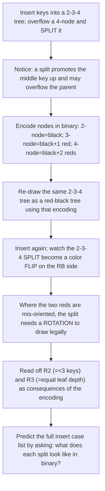

# Insight Discovery Brief — Red-Black Trees

Stage 1 artifact of the [Insight Discovery Gate](./INSIGHT_DISCOVERY_GATE.md).
Goal: find and rank the "now it clicks" insights that materially change a
learner's mental model of red-black trees — not the definition, the five
properties, or the routine rotation code. No Stage 2 contract or lesson plan is
produced here.

> Primary candidate (pre-audit): **C1** — a red-black tree *is* a binary encoding
> of a 2–3–4 tree, so every recolor and rotation is a 2–3–4 node split/merge/reshape
> seen through that encoding. This is the insight that makes the repair cases feel
> **inevitable** instead of memorized. **C2** (black height as a conserved quantity)
> and **C4** (repair moves a violation *token* upward) are the strongest supporting
> insights.

Setup and notation used throughout. A red-black tree is a binary search tree whose
nodes carry one color bit (red/black) satisfying: (R1) the root is black; (R2) a
red node has no red child ("no two reds in a row"); (R3) every root→leaf path
crosses the same number of black nodes — that count is the **black height** $bh$;
(R4, convention) `nil` leaves are black. Write $n$ for the number of internal keys.
The parallel structure throughout is the **2–3–4 tree**: a perfectly height-balanced
search tree whose nodes hold 1, 2, or 3 keys (2-, 3-, and 4-nodes) and whose leaves
are all at the same depth.

The correspondence that organizes this brief: **a black node together with any red
children it has is exactly one 2–3–4 node.** A lone black node is a 2-node; a black
node with one red child is a 3-node; a black node with two red children is a 4-node.
Under this lens the RB invariants are not five arbitrary rules — they are what it
takes to write a balanced 2–3–4 tree in binary with one extra bit.

---

## Candidate insights

### C1. A red-black tree is a binary encoding of a 2–3–4 tree (primary candidate)

- Initial model: "Red-black trees are balanced BSTs kept balanced by five color
  rules and a table of rotation cases you memorize."
- Tension: the five properties look unmotivated, and the insert/delete "cases"
  feel like an arbitrary list. Why *these* rules? Why exactly these rotations?
- Structural reveal: group each black node with its red children. That cluster is
  one node of a 2–3–4 tree (1, 2, or 3 keys). The RB tree is just that 2–3–4 tree
  written in binary, using red to mean "I am glued into my parent's node, not a
  new level." The color bit records node membership; it is not decoration.
- Minimal derivation: map 2-node → black; 3-node → black with one red child (two
  binary orientations); 4-node → black with two red children. Then (R2) "no two
  reds" ⇔ "a 2–3–4 node holds at most 3 keys" (a third red would be a 5-node);
  (R3) "equal black height" ⇔ "all 2–3–4 leaves are at the same depth"; $bh$ of the
  RB tree $=$ height of the 2–3–4 tree. Inserting into a full 4-node overflows it,
  forcing a **split**; that split, viewed in the encoding, *is* the recolor
  (promote the middle key = flip colors) and, where the reds are mis-oriented, a
  rotation. The "cases" are just the finite ways a 4-node can be drawn in binary.
- Visual/interactive: a synchronized split-screen — the 2–3–4 tree on the left, its
  binary red-black encoding on the right. The learner inserts a key; the 2–3–4 side
  splits an overflowing node, and the RB side performs the matching recolor/rotation
  in lockstep. A toggle "draw the 3-node leaning left / right" surfaces where a
  rotation (not just a recolor) is needed.
- New prediction: before being shown the RB insert cases, the learner can *derive*
  them by asking "what does a 2–3–4 split look like on the binary side?" — and can
  say why there are exactly the cases there are.
- Transfers to: B-trees / B+-trees (same overflow-and-split idea at higher order),
  any "encode a fat structure in a thin one with a tag bit," and the general move of
  changing representation to make an algorithm obvious.

### C2. Black height is a hidden conserved quantity

- Initial model: "Balance is enforced by constantly rebalancing; there's no single
  number holding it together."
- Tension: rotations and recolorings change the tree's shape and even its ordinary
  height — yet balance is maintained. What stays fixed?
- Structural reveal: the **black height** is invariant along every root→leaf path
  (R3) and is conserved by rotations (they move a black node sideways, not across a
  path's black count) and by a recolor-split (which raises $bh$ by one *uniformly*,
  everywhere at once). Red nodes are "free": they add keys without adding black
  height, which is exactly why a 2–3–4 node can hold several keys at one level.
- Minimal derivation: a subtree of black height $bh$ contains at least $2^{bh}-1$
  internal nodes (induction: each subtree has black height $\ge bh-1$). With (R2),
  the ordinary height is at most $2\,bh$. Combining, $bh \le \log_2(n+1)$, so
  every operation walks $O(\log n)$ nodes.
- Visual/interactive: shade nodes so only black nodes "count," and print the black
  height on each path; the learner watches it stay equal across paths through every
  operation, and jump by exactly one (globally) on a root split.
- New prediction: the learner can state why adding red nodes never breaks the height
  bound, and why a legal RB tree can never be more than twice as tall as a perfectly
  balanced tree.
- Transfers to: potential/invariant reasoning generally; loop invariants; the idea
  that a well-chosen conserved quantity makes a messy process analyzable.

### C3. Rotations preserve in-order traversal while changing shape

- Initial model: "A rotation is a shape-shuffling trick I apply in certain cases."
- Tension: if rotations rearrange nodes, why don't they corrupt the search tree?
- Structural reveal: a rotation is the unique local reshaping that keeps the BST
  in-order sequence identical while changing which node is the local root. It trades
  *height* between two subtrees without touching *order*. So the two invariants are
  orthogonal: rotations manage balance; the BST property is never at risk.
- Minimal derivation: for the pivot pair $(x, y)$ with $x$ the parent, the in-order
  reading $\langle A, x, B, y, C\rangle$ is preserved by both left and right
  rotation; only the parent/child links (and thus height distribution) change.
- Visual/interactive: pin the in-order key sequence as a fixed ruler at the bottom;
  as the learner rotates, the tree reshapes above while the ruler never moves.
- New prediction: the learner predicts that any repair built only from rotations +
  recolorings is automatically order-safe, so correctness reduces to *balance/color*
  reasoning alone.
- Transfers to: AVL trees, splay trees, treaps — every rotation-based balanced BST;
  and the general principle of separating invariants that can be reasoned about
  independently.

### C4. Recoloring moves a violation *token* upward rather than fixing it in place

- Initial model: "Insertion repair is a set of local patches applied where the
  problem is."
- Tension: sometimes one recolor doesn't finish the job — the problem seems to
  *move* rather than vanish.
- Structural reveal: a fresh red node can create a "double red" (a red-red edge).
  A recolor doesn't delete the violation; it **pushes an equivalent violation up one
  level** — exactly a 2–3–4 overflow promoting its middle key into the parent, which
  may now overflow. The violation is a conserved *token* that travels toward the
  root, where it is discharged (root recolor raises black height) or resolved by a
  rotation into a legal local shape.
- Minimal derivation: in the "red uncle" case, flip parent and uncle to black and
  grandparent to red — the local subtree is now legal but the grandparent may be
  red-red with *its* parent. Recurse upward. The number of steps is bounded by the
  black height, i.e. $O(\log n)$; rotations occur $O(1)$ times per insert.
- Visual/interactive: render the violation as a glowing token sitting on an edge;
  each recolor visibly slides it up one level; a rotation "cashes it in" and the glow
  disappears.
- New prediction: the learner predicts *which* case terminates immediately (uncle
  black → rotate, done) versus which propagates (uncle red → recolor, continue), and
  why propagation can reach the root but no further.
- Transfers to: carry propagation in addition; "bubbling" in heaps; any local rule
  whose repeated application discharges a defect at a boundary.

### C5. Insertion repair is local restoration of a global invariant

- Initial model: "To keep a global property you must check the whole structure."
- Tension: insert touches only a constant-size neighborhood, yet a *global* property
  (all paths balanced) is restored.
- Structural reveal: because black height is conserved except by uniform, global
  events (root splits), a purely local rule at the point of violation suffices — the
  rest of the tree already satisfies the invariant and is untouched. Global
  correctness follows from a local fix plus an invariant that only the local
  neighborhood could have broken.
- Minimal derivation: insert a red node (breaks at most R2 locally, never R3). Each
  repair step restores R2 locally while preserving R3 globally; termination gives a
  fully legal tree. Only $O(1)$ structural change per step, $O(\log n)$ steps.
- Visual/interactive: dim the entire tree except the constant-size window the repair
  actually inspects; show the rest provably unchanged, making "local implies global"
  tangible.
- New prediction: the learner predicts the repair's cost profile — $O(1)$ rotations,
  $O(\log n)$ recolorings — from "local fix + upward propagation" without memorizing
  it.
- Transfers to: union-find path rules, incremental invariant maintenance, database
  index maintenance — anywhere a bounded local operation must preserve a global
  guarantee.

### C6. The invariants *force* logarithmic height (nothing else needs enforcing)

- Initial model: "Logarithmic height is a separate fact you prove or take on faith."
- Tension: the color rules never mention height directly — how do they guarantee it?
- Structural reveal: "no two reds" (R2) caps how many red nodes a single path can
  stack; "equal black height" (R3) forces all paths to the same black length. Longest
  path $\le 2\times$ shortest, so height is within a factor of two of $\log_2 n$. The
  height bound is a *consequence* of the two color rules, not an extra requirement.
- Minimal derivation: shortest path $=bh$ (all black); longest $\le 2\,bh$ (reds and
  blacks alternating at most). With $n \ge 2^{bh}-1$, height $\le 2\log_2(n+1)$.
- Visual/interactive: a slider that tries to build the tallest legal tree for a given
  $n$; the "no two reds" rule visibly blocks any attempt to stretch a path past
  $2\,bh$.
- New prediction: the learner can argue why weakening either rule (allow red chains,
  or allow unequal black heights) destroys the bound.
- Transfers to: any structure where local degree/coloring constraints imply a global
  size or depth bound; expander/degree arguments in spirit.

### C7. Red nodes cannot form chains — because a red *is* an extra key, not a level

- Initial model: "'No two reds in a row' is just one of the rules to remember."
- Tension: why *this* rule and not, say, "no two blacks"?
- Structural reveal: a red node means "I'm an extra key inside my black parent's
  2–3–4 node." Two reds in a row would be a third extra key — a 5-node — which a
  2–3–4 tree forbids. So R2 is not arbitrary: it is the binary spelling of "a node
  holds at most three keys." Red chains are impossible because overflowing nodes
  *split* instead.
- Minimal derivation: black parent + 2 red children = 4-node (3 keys, full). A third
  red descendant would exceed capacity; the split rule fires first, so the chain
  never forms.
- Visual/interactive: attempt to add a third red under a black node; the UI shows the
  would-be 5-node and triggers the split, converting the attempted chain into a
  promoted key.
- New prediction: the learner predicts the maximum reds on any path ($\le bh$) and why
  a "left-then-right red" pattern needs a rotation to become a legal 4-node.
- Transfers to: capacity constraints in bucketed structures (hashing, B-trees);
  representation limits that manifest as local rules.

### C8. Local repair rules determine amortized/global cost

- Initial model: "Rebalancing could be expensive; each insert might rotate a lot."
- Tension: worst-case a single insert propagates up the tree, yet the structure is
  cheap in aggregate.
- Structural reveal: rotations per insert are $O(1)$ (repair terminates at the first
  rotation); only *recolorings* propagate, and their total is bounded by black
  height, giving $O(\log n)$ worst case and $O(1)$ **amortized** color changes over a
  sequence of insertions. The propagation length is governed by the same conserved
  black height from C2.
- Minimal derivation: define a potential counting nodes whose color is "about to
  flip"; each recolor step pays for itself; rotations are constant and terminal. The
  amortized recoloring cost per insert is $O(1)$.
- Visual/interactive: a running counter of rotations vs recolorings across many
  inserts; the rotation counter grows $\sim$ linearly (O(1)/op) while recolorings
  average out — the learner sees amortization empirically, then reasons about it.
- New prediction: the learner predicts that a workload of many inserts costs
  $\Theta(\log n)$ per op for search but near-constant *restructuring*, and can name
  which operation dominates.
- Transfers to: amortized analysis broadly (dynamic arrays, splay trees), the
  potential method, and "worst-case-per-op vs amortized" distinctions.

### C9. Deletion's "double black" is the exact mirror of insertion's "double red"

- Initial model: "Deletion is a separate, harder pile of cases."
- Tension: deletion looks unrelated to insertion, doubling the memorization burden.
- Structural reveal: removing a black node creates a **deficit** — a "double black"
  token marking a path that is now one black short. It is pushed upward and discharged
  by borrowing (rotation, a 2–3–4 key transfer between siblings) or merging (recolor,
  a 2–3–4 node fusion) — the precise dual of insertion's overflow token from C4. Both
  are one conserved token traveling toward the root under the 2–3–4 lens.
- Minimal derivation: a black deletion drops black height on one path by one; the
  double-black marker restores it by transferring blackness from a sibling (borrow)
  or by lowering the parent (merge), recursing upward $O(\log n)$ times.
- Visual/interactive: reuse C4's token UI with an "anti-token" (deficit) color; show
  borrow vs merge as the 2–3–4 sibling operations they encode.
- New prediction: the learner predicts deletion cases *from* insertion by duality
  (overflow↔deficit, split↔merge, promote↔borrow) rather than memorizing them.
- Transfers to: B-tree deletion; symmetry/duality as a case-reduction technique.

### C10. One color bit is the minimal extra state — and orientation choices are a
presentation artifact

- Initial model: "Red-black trees are intrinsically full of cases; that complexity
  is unavoidable."
- Tension: different textbooks show different numbers of cases for the *same*
  algorithm. If the cases were fundamental, why do they differ?
- Structural reveal: the cases come from the *freedom* in how a 3-node is drawn in
  binary (lean left or right). Fixing that freedom — e.g. always lean red left
  (left-leaning red-black trees) — collapses the case list, showing that much of the
  apparent complexity is a choice of canonical form, not intrinsic difficulty. The
  single color bit is the minimal state needed to tag 2–3–4 membership.
- Minimal derivation: enumerate the binary drawings of 3- and 4-nodes; impose a
  canonical orientation; the insert repair reduces to a short fixed sequence
  (rotate-left / rotate-right / flip) applied on the way up.
- Visual/interactive: a "canonicalize orientation" toggle that visibly merges
  mirror-image cases into one, shrinking the printed case table in real time.
- New prediction: the learner predicts that any two correct RB formulations differ
  only by orientation convention, not by the underlying 2–3–4 operations.
- Transfers to: canonical forms and normalization elsewhere (reduced automata,
  normal-form proofs); distinguishing essential from incidental complexity.

### C11. The search operation ignores color entirely

- Initial model: "Colors must matter throughout — including lookups."
- Tension: if colors are so central, why does `search` never read them?
- Structural reveal: color is *maintenance* metadata only. `search`/`successor`/
  in-order are plain BST operations; color exists solely to bound height and guide
  repair. This cleanly separates the read path (ordinary BST) from the write path
  (color-aware repair), reinforcing C3's orthogonality.
- Minimal derivation: the BST property (C3) is independent of color; lookups depend
  only on key comparisons; the height bound (C6) is what makes those lookups fast.
- Visual/interactive: gray out all colors during a `search` animation — the traversal
  is unchanged — then restore them for an `insert`.
- New prediction: the learner predicts that RB and any other balanced BST have
  identical search logic and differ only in how the write path preserves balance.
- Transfers to: separating read/write invariants; metadata-vs-data distinctions in
  systems.

---

## Rejected as non-insights

- "A red-black tree is a self-balancing BST" (definition).
- The verbatim list of the five color properties (routine statement, not a
  model change — becomes an insight only via C1/C7, which *explain* them).
- Hand-tracing a specific rotation's pointer updates (routine mechanics).
- The Guibas–Sedgewick 1978 origin story and the name's "railroad car color"
  anecdote (historical trivia).
- "It's like a family tree with colored relatives" (decorative analogy; no
  structure preserved).
- "Red-black trees are used in `std::map` / Linux schedulers" (true, but a usage
  fact, not a model-changing insight).

---

## Ranking of the strongest three

Criteria: (1) surprise / inevitability-after; (2) explanatory compression;
(3) transfer value; (4) correctness; (5) interactive teachability; (6) prerequisite
fit (assumes: BSTs, in-order traversal, basic big-O; 2–3–4 trees can be introduced
in-lesson).

### #1 — C1: red-black tree as a binary-encoded 2–3–4 tree

- Surprise/inevitability: highest. It converts "memorize the cases" into "read off
  the cases": each recolor/rotation is a 2–3–4 split/reshape. This is precisely the
  brief's goal — repair feels *inevitable*, not listed.
- Compression: one correspondence explains R2 (≤3 keys), R3 (equal leaf depth), the
  height bound, and every insert/delete case at once.
- Transfer: B-trees/B+-trees, representation-change as a problem-solving move.
- Correctness: exact and standard (RB ⇔ 2–3–4 is a classical bijection up to 3-node
  orientation).
- Teachability: excellent — the synchronized split-screen (2–3–4 ↔ RB) makes each
  repair self-evidently a node split.
- Prerequisites: needs 2–3–4 trees, introduced in-lesson before the encoding. Chosen
  primary.

### #2 — C2: black height as a conserved quantity

- Surprise/inevitability: strong — "what stays fixed while everything reshuffles?"
  has a crisp answer, and it underpins both the height bound and the repair target.
- Compression: a single number governs balance, the log-height proof, and the bound
  on repair propagation (C4/C8).
- Transfer: invariant/potential reasoning across algorithms.
- Correctness: exact ($n \ge 2^{bh}-1$, height $\le 2\,bh$).
- Teachability: strong — count-only-black shading with per-path black-height labels.
- Prerequisites: BSTs and basic induction; pairs naturally after C1.

### #3 — C4: repair moves a violation token upward

- Surprise/inevitability: strong — reframes repair from "patch in place" to "discharge
  a conserved defect at the root," which makes propagation vs termination predictable.
- Compression: unifies the insert cases (and, via C9, deletion) as one token-pushing
  process.
- Transfer: carry propagation, heap bubbling, boundary-discharge rules.
- Correctness: exact (recolor = promote; rotation = terminal reshape; steps bounded
  by $bh$).
- Teachability: excellent — the glowing token that slides up and is "cashed in."
- Prerequisites: builds directly on C1 and C2; best taught third.

Supporting (beyond the top three): **C3** (rotations preserve order) is the
foundational safety fact every repair relies on and should appear early; **C6**
(invariants force log height) and **C7** (no red chains) are near-immediate corollaries
of C1/C2; **C9** (deletion as the mirror) is the highest-leverage *extension* once C4
lands. Keep **C10/C11** as clarifying asides, not core beats.

---

## Discovery sequence for the primary insight (C1)

Discover, don't tell. The learner should *derive* the red-black insert cases as
2–3–4 splits before ever seeing the "five rules" or a rotation table.

Step detail:

1. **Overflow a 2–3–4 node.** Insert into a 2–3–4 tree until a 4-node overflows;
   split it, promoting the middle key to the parent. Let the learner feel that
   splitting can cascade upward.
2. **Introduce the encoding.** Define the binary spelling: 2-node → black; 3-node →
   black with one red child; 4-node → black with two red children. Stress that red
   means "same 2–3–4 node as my parent," black means "new level."
3. **Re-draw one tree both ways.** Show the same tree as a 2–3–4 tree and as its RB
   encoding, side by side.
4. **Insert on both sides at once.** The learner inserts a key; the 2–3–4 side splits
   an overflowing node while the RB side performs the matching **recolor** — the
   split *is* the color flip.
5. **Find where rotation is forced.** When a 3-node's red child leans the "wrong"
   way, the legal binary drawing requires a **rotation** before/with the flip. The
   rotation is not new magic — it is "draw this 2–3–4 node legally."
6. **Read the rules off the picture.** R2 ("no two reds") = "a node holds ≤ 3 keys";
   R3 ("equal black height") = "all 2–3–4 leaves are level." The five properties are
   consequences, not axioms.
7. **Predict the case list.** Ask the learner to enumerate the insert cases by
   drawing each 2–3–4 split in binary. They should reconstruct the standard cases —
   and explain *why there are exactly those* — before seeing any reference table.

Exit test (predict, not recall): give the learner a small red-black tree and a key to
insert, and ask them to (a) state which 2–3–4 node overflows, (b) predict whether the
repair is a pure recolor or needs a rotation, and (c) justify the answer from the
encoding — without consulting a case table. Optionally, hand them a 2–3–4 split and
ask them to produce the corresponding RB recolor/rotation, and vice versa.
