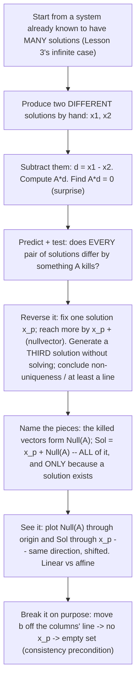

# Insight Discovery Brief — Solution Sets & Homogeneous Systems

Stage 1 artifact of the [Insight Discovery Gate](./INSIGHT_DISCOVERY_GATE.md).
Goal: find and rank the "now it clicks" insights that materially change a
learner's mental model of the solution set of \(A\mathbf{x}=\mathbf{b}\) — not the
definition ("the set of all solutions"), the procedure (row-reduce and read off),
or the routine parameterization of free variables. This is Lesson 5 of the
[course spine](./LINEAR_ALGEBRA_COURSE_SPINE.md); its prerequisite Lessons 3
(Systems) and 4 (Elimination) are built, and I inspected both to fix the entry
knowledge and available continuity below.

> One fact is fixed going in and nothing else: the spine's proposed sentence —
> *"every solution set is one particular solution plus all solutions of
> \(A\mathbf{x}=\mathbf{0}\)"* — was written for **course sequencing**, not
> produced by a completed gate. It enters this brief as **one candidate on equal
> footing** (C1), to be tested, not inherited. Where it lands is an *output* of the
> ranking below.

## What the learner already holds (entry knowledge, not re-taught)

From Lesson 3 (`systems.ts`) the learner has the row picture (each equation a line,
solution at the intersection) and the column picture
(\(A\mathbf{x}=x\mathbf{a}_1+y\mathbf{a}_2\); solving means blending the columns to
reach \(\mathbf{b}\)), the **trichotomy** (no / one / infinitely many), and two
crisp facts: a solution **exists** iff \(\mathbf{b}\) lies in the span of the
columns; it is **unique** iff the columns are independent. The `SystemsExplorer`
even sweeps a parameter \(t\) through the *dependent* case as "many recipes, one
target," pinning the endpoint at \(\mathbf{b}\) while the coefficients slide.

From Lesson 4 (`elimination.ts`) the learner can rewrite a system with reversible
row operations that **preserve the solution set**, drive it to **triangular** form,
back-substitute, and recognize the inconsistent case as a contradiction row
\(0=(\text{nonzero})\).

What the learner does **not** yet have, and what Lesson 5 owns: the homogeneous
system \(A\mathbf{x}=\mathbf{0}\) as an object; the word **free variable**; the
particular-plus-homogeneous **structure**; **affine vs linear** solution sets; and
the connection between the *shape* of the solution set and \(A\mathbf{x}=\mathbf{0}\).
Lesson 3 showed infinitely-many-solutions only as *coincident lines* and a family
\(\{(x,y):x=3-2y\}\); it never decomposed that family.

Notation: column vectors, standard basis \(\mathbf{e}_1,\mathbf{e}_2\); KaTeX only.
\(\operatorname{Null}(A)=\{\mathbf{x}:A\mathbf{x}=\mathbf{0}\}\) is the homogeneous
solution set; \(\operatorname{Sol}(A,\mathbf{b})=\{\mathbf{x}:A\mathbf{x}=\mathbf{b}\}\)
the general one.

---

## 1a. The cognitive obstacle

The conventional presentation teaches the **procedure before the structure**:
row-reduce \(A\mathbf{x}=\mathbf{b}\) to reduced form, split columns into pivot and
free, set each free variable to a parameter, solve the pivot variables, and *then*
re-group the answer as \(\mathbf{x}_p+\text{(homogeneous part)}\). Presented this
way the decomposition arrives as a **cosmetic re-grouping of algebra the learner
already finished** — it looks like a coincidence of that particular reduction, not
a necessity.

Naming the obstacles from the gate's list:

- **Missing mathematical structure (primary).** The load-bearing fact — that the
  whole solution set is a single object (\(\operatorname{Null}(A)\)) *slid* to pass
  through one solution — is *present but hidden* by the procedure-first order. It is
  discovered last, so it reads as appended rather than inevitable.
- **Incorrect prior mental model.** "Infinitely many solutions" is held as a
  *shapeless* "lots of answers," not as a structured set with a definite shape
  (point / line / plane) and dimension. Lesson 3's "coincident lines" reinforces
  "a line happened," not "a translate of the null directions."
- **Missing purpose** (specific to the homogeneous system). \(A\mathbf{x}=\mathbf{0}\)
  looks pointless — its obvious answer is \(\mathbf{0}\) — so the learner has no
  reason to study the one object that actually controls every inhomogeneous system's
  multiplicity.
- **Inability to predict/transfer.** The learner cannot predict the *shape* of a
  solution set, or *why* uniqueness of \(A\mathbf{x}=\mathbf{b}\) is governed by
  \(A\mathbf{x}=\mathbf{0}\), before grinding the reduction.

"Procedural overload" is real but is a *symptom* of the ordering, not the root
obstacle. The difficulty is **structural and representational**, not semantic:
these are abstract objects with no natural real-world goal to import, so I do
**not** manufacture a themed analogy. The representational lever that *does* fit is
a picture of the actual mathematics (below), and the honest 1c comparison here is
not abstract-vs-story but **procedure-first vs structure-first ordering of the same
mathematics** — an alternative presentation that preserves every mathematical
relation, not a formal isomorphism.

## 1c. Conventional vs alternative presentation — same mathematics, two discovery orders

| | Procedure-first (conventional) | Structure-first (candidate order) |
| --- | --- | --- |
| First move | Row-reduce \(A\mathbf{x}=\mathbf{b}\); classify columns pivot/free | Take a system already known to have many solutions; exhibit **two** actual solutions |
| Middle | Parameterize free variables; solve pivots | Notice their **difference is killed by \(A\)**; test that this always holds |
| Decomposition | Re-group the finished answer into \(\mathbf{x}_p+\text{homog.}\) | The decomposition is **forced**: fix one solution, every other is it plus a null vector |
| Learner's state | Has computed *an* answer; the structure is an afterthought | Predicts non-uniqueness and a further solution, *before* any formula |

**Unchanged mathematically:** identical solution sets, identical
\(\operatorname{Null}(A)\), identical role of free variables. **Easier to infer in
the structure-first order:** *why* the pieces combine, and the consistency caveat
(no \(\mathbf{x}_p\) exists ⇒ empty set — visible up front, not a special case
bolted on). **Introduced knowledge:** none external — this is reorganization, not
grounding. **Transfer:** the structure-first habit ("difference of two solutions is
homogeneous") is exactly the move behind uniqueness/injectivity, rank–nullity, and
later least-squares residuals, so it is likely to transfer.

---

## 1b. Raw insight leads

Eleven raw leads in the gate's compact form — a before → after **model change**,
the **new predictive capability** it grants, and its **mechanism(s)**. Full core
fields (minimal derivation, visuals, transfer, grounding, abstraction return) are
developed for the consolidated **packages** in §1d, not repeated per lead. Related
leads are clustered before ranking (see [clustering](#candidate-clustering)).

### C1. Every solution set is one particular solution plus all of \(\operatorname{Null}(A)\) — *the spine sentence, tested*

- Model change: "infinitely many solutions is a shapeless list you compute" →
  "**if consistent**, the whole set is one solution \(\mathbf{x}_p\) translated by
  all of \(\operatorname{Null}(A)\); if inconsistent, it is empty."
- New capability: from \(\operatorname{Null}(A)\) plus one solution, describe the
  entire solution set for any consistent \(\mathbf{b}\).
- Mechanism: structural compression. *(Formal synthesis; must never be stated
  without the consistency condition.)*

### C2. Any two solutions differ by a homogeneous solution — *the engine under C1*

- Model change: "two answers to a system are unrelated points" → "any two solutions
  differ by a vector \(A\) sends to \(\mathbf{0}\) (a homogeneous solution)."
- New capability: given **two distinct** solutions, produce a **third without
  solving** and conclude the system is **non-unique** with **at least an affine
  line** of solutions. *(Pinning the full shape needs \(\operatorname{Null}(A)\) or
  its dimension — see the Package 1 derivation.)*
- Mechanism: operational + predictive.

### C3. The solution set is the null space *carried off the origin* — affine vs linear made visible

- Model change: "the homogeneous and inhomogeneous problems are separate exercises"
  → "the solution set is \(\operatorname{Null}(A)\) rigidly **translated** to pass
  through one solution — an **affine** set, not a subspace."
- New capability: predict that \(\operatorname{Sol}\) and \(\operatorname{Null}\)
  are parallel, same-shape, offset by \(\mathbf{x}_p\); classify linear vs affine.
- Mechanism: representational change (+ structural).

### C4. \(A\mathbf{x}=\mathbf{0}\) is the universal uniqueness detector — *this is what it's for*

- Model change: "the homogeneous system is trivial/pointless" → "\(A\mathbf{x}=\mathbf{b}\)
  is unique **for every** \(\mathbf{b}\) iff \(\operatorname{Null}(A)=\{\mathbf{0}\}\)
  — so \(A\mathbf{x}=\mathbf{0}\) alone decides uniqueness for the whole family."
- New capability: test uniqueness once by solving \(A\mathbf{x}=\mathbf{0}\),
  ignoring \(\mathbf{b}\).
- Mechanism: structural + predictive.

### C5. Two solutions force infinitely many — the "no exactly two" of Lesson 3, now *explained*

- Model change: "a system might have a couple of solutions" → "two distinct
  solutions force an entire **line** of solutions (hence infinitely many)."
- New capability: on seeing two distinct solutions, assert infinitely many with certainty.
- Mechanism: predictive (a corollary of C2).

### C6. Free variables are coordinates on the null space; their count is the set's dimension

- Model change: "free variables are leftover columns after reducing (bookkeeping)" →
  "each free variable is an **independent null direction**; their count \(=\)
  \(\dim\operatorname{Null}(A)\) \(=\) the solution set's dimension."
- New capability: read the *shape* (point / line / plane) off the count of free
  variables before finishing the arithmetic.
- Mechanism: structural + predictive.

### C7. Existence and multiplicity are two independent axes

- Model change: "'how many solutions' is one question" → "two independent
  questions: **existence** (is \(\mathbf{b}\) in the column span?) and
  **multiplicity** (what is \(\operatorname{Null}(A)\)?)."
- New capability: predict that changing \(\mathbf{b}\) toggles existence on/off but
  **never** changes the shape when the set is nonempty.
- Mechanism: structural reorganization.

### C8. The homogeneous system is *always* consistent — pure multiplicity, existence guaranteed

- Model change: "solving always risks having no answer" → "\(A\mathbf{x}=\mathbf{0}\)
  is **never** inconsistent (\(A\mathbf{0}=\mathbf{0}\)); only trivial-vs-nontrivial remains."
- New capability: study \(\operatorname{Null}(A)\) freely — "does the homogeneous
  system have a solution?" is a non-question.
- Mechanism: structural.

### C9. The recipe-freedom in the column picture is an *affine translate* of the null space (Lesson 3 continuity)

- Model change: "the `SystemsExplorer` \(t\)-sweep is a display trick" → "the
  recipes reaching \(\mathbf{b}\) form an **affine translate**
  \(\mathbf{x}_p+\operatorname{Null}(A)\); only the sweep's **direction** is a null vector."
- New capability: predict that the freedom exists iff the columns are dependent;
  independent columns ⇒ a single recipe (translate collapses to a point).
- Mechanism: representational (recasts an existing interaction) + structural.

### C10. Row-picture reading: the solution set is the intersection of constraints, shifted off the origin

- Model change: "the row and homogeneous pictures are unrelated line drawings" →
  "\(A\mathbf{x}=\mathbf{0}\) is the **same** constraint lines slid to the origin;
  the original intersection is that set shifted by \(\mathbf{x}_p\)."
- New capability: read the solution set off shifted-but-parallel constraints (the
  row-view of C3).
- Mechanism: representational (row-picture twin of C3).

### C11. Consistency is a *precondition*, not part of the decomposition

- Model change: "'particular + homogeneous' applies to any system" → "the
  decomposition presupposes a solution exists; when \(\mathbf{b}\) is unreachable the
  set is **empty**, not \(\mathbf{0}+\operatorname{Null}(A)\)."
- New capability: refuse to write \(\mathbf{x}_p+\operatorname{Null}(A)\) for an
  inconsistent system; identify it as empty.
- Mechanism: structural (a correctness guardrail).

---

## Rejected as non-insights

- "A solution set is the set of all \(\mathbf{x}\) satisfying the system"
  (definition, not a model change).
- "Row-reduce to reduced form and read off the answer" (procedure/mechanics).
- "Assign a parameter to each free variable and solve" as a *bare* step (procedure;
  becomes an insight only via C6's reframe as null coordinates).
- "Infinitely many solutions look like a line/plane" *without* the shifted-null-space
  structure or the shape↔nullity link (decoration — a picture with no predictive
  content).
- Historical/notation trivia (who named the null space, echelon-form conventions).

---

## Candidate clustering

The eleven leads are discovery material, not eleven independent insights. They
cluster into **three candidate packages**, each stating one distinct before/after
learner model. The clustering is **not a strict partition** — a lead may support
more than one package:

- **Package 1** anchors on {C1, C2, C3, C5, C11}. **C9** (column picture) and
  **C10** (row picture) are the coefficient-space and row-space *instances* of
  Package 1's translated-null-space model, so they support Package 1 as much as
  Package 3.
- **Package 2** anchors on {C4, C7, C8}.
- **Package 3** anchors on {C6, C9, C10}, borrowing C9/C10 as its representational
  bridges.
- **C7** (existence axis) and **C11** (consistency) are shared guardrails that any
  package must respect.

---

## 1d. Ranking — three candidate packages

Ranked against the gate's criteria — (1) surprise before / inevitability after;
(2) explanatory compression; (3) transfer; (4) mathematical correctness (a gate);
(5) interactive teachability; (6) prerequisite fit; (7) semantic/cognitive
leverage; (8) abstraction return. Criterion (7) is low for every package (no
real-world semantic bridge). Criterion (8) **applies to Packages 1 and 3**, which
both use **representational bridges** (a picture / sliders standing in for the
algebra), and is rated **strong** for each (return paths below); Package 2 is
**purely structural**, so (8) is N/A there. The contest is therefore decided mainly
on (1)–(6), and no order was assumed in advance. The spine sentence (C1) was tested
on equal footing: it lands **inside** Package 1 as the formal synthesis, not as the
driver — reasoning recorded below so the outcome is auditable.

### Package 1 (primary) — "The null space carried off the origin," discovered by differencing solutions

Members: **C2** (driver) → **C1** (synthesis) → **C3** (representation), with **C5**
(consequence) and **C11** (guardrail); realized in the column/row pictures by
**C9**/**C10**.

**Core fields.**

- Initial mental model: infinitely many solutions is a shapeless list you compute,
  and two answers to the same system are unrelated points.
- Tension: Lesson 3's infinite case was a whole *line*, not shapeless; and two
  solutions of one system cannot be unrelated — both satisfy the same constraints.
- Structural reveal (model change): any two solutions differ by a homogeneous vector
  (C2); so, fixing one solution \(\mathbf{x}_p\), every solution is \(\mathbf{x}_p\)
  plus a member of \(\operatorname{Null}(A)\). When the system is **consistent**,
  \(\operatorname{Sol}(A,\mathbf{b})=\mathbf{x}_p+\operatorname{Null}(A)\): the single
  object \(\operatorname{Null}(A)\), translated to pass through \(\mathbf{x}_p\) (C1),
  pictured as two parallel same-shape sets — one through the origin (C3). When
  inconsistent, the set is empty (C11).
- Minimal derivation:
  - **Difference is homogeneous:** \(A\mathbf{x}_1=\mathbf{b}\), \(A\mathbf{x}_2=\mathbf{b}\)
    \(\Rightarrow A(\mathbf{x}_1-\mathbf{x}_2)=\mathbf{0}\).
  - **Set equality (both inclusions):** if \(\mathbf{x}_h\in\operatorname{Null}(A)\)
    then \(A(\mathbf{x}_p+\mathbf{x}_h)=\mathbf{b}\) (⊇); if \(A\mathbf{x}=\mathbf{b}\)
    then \(A(\mathbf{x}-\mathbf{x}_p)=\mathbf{0}\), so \(\mathbf{x}=\mathbf{x}_p+\mathbf{x}_h\)
    with \(\mathbf{x}_h\in\operatorname{Null}(A)\) (⊆).
  - **Scope of a single difference (correctness caveat):** two distinct solutions
    give **one** null vector \(\mathbf{d}=\mathbf{x}_1-\mathbf{x}_2\), which generates
    only the **affine line** \(\{\mathbf{x}_1+t\mathbf{d}\}\subseteq\operatorname{Sol}(A,\mathbf{b})\).
    That line is the *entire* solution set only when \(\dim\operatorname{Null}(A)=1\).
    In general the whole set needs **all** of \(\operatorname{Null}(A)\) — e.g. for
    \(A=\mathbf{0}\), \(\mathbf{b}=\mathbf{0}\) in \(\mathbb{R}^2\), two solutions give
    one line but \(\operatorname{Sol}\) is the whole plane. So "differencing" proves
    **non-uniqueness and at least a line**; the full shape is a separate step
    (Package 3 / \(\operatorname{Null}(A)\)).
- Visual/interactive: two solution dots on Lesson 3's infinite line; the arrow
  between them is a null vector; overlay \(\operatorname{Null}(A)\) through the origin
  and \(\operatorname{Sol}\) through \(\mathbf{x}_p\) (parallel, same shape). The
  column-picture recipe sweep (C9) and the row constraints slid to the origin (C10)
  are the same fact in the two Lesson-3 pictures.
- New prediction: given two distinct solutions, produce a third without solving and
  assert non-uniqueness (at least a line); given \(\operatorname{Null}(A)\) and
  consistency, describe the entire set and its shape.
- Adjacent transfer: cosets of a linear map; linear ODEs (particular + homogeneous);
  the residual/normal-equation logic of least squares (L13); general
  \(L\mathbf{x}=\mathbf{b}\).
- Mechanism(s): operational + predictive (driver C2), structural compression
  (synthesis C1), representational change (C3).

**Grounding (representational bridge, C3).**

- The bridge: the parallel-lines picture — \(\operatorname{Null}(A)\) through the
  origin, \(\operatorname{Sol}\) through \(\mathbf{x}_p\).
- Preserved correspondences: the direction(s) and dimension of the set map exactly;
  the offset is exactly \(\mathbf{x}_p\).
- Analogy limits / not over-claimed: the solution set is **affine, not a subspace**
  — it contains \(\mathbf{0}\) and is closed under scaling only when
  \(\mathbf{b}=\mathbf{0}\); do not read "same shape" as "same closure."
- Abstraction return (**strong**): from the two translated sets → read off the
  offset \(\mathbf{x}_p\) and the null directions → recover
  \(\operatorname{Sol}(A,\mathbf{b})=\mathbf{x}_p+\operatorname{Null}(A)\)
  symbolically. Detects a learner who can slide the picture but cannot write the
  symbolic decomposition or handle \(\dim\operatorname{Null}(A)\ge 2\).

**Ranking rationale.**

- Surprise/inevitability: highest of the three. Subtracting two answers and finding
  \(A\) annihilates the difference is a small, checkable surprise that **forces** the
  decomposition rather than announcing it. C1 *alone* — "solution \(=\) particular
  \(+\) homogeneous" — is correct and compressive but **low on inevitability**
  (nothing makes the learner predict before being told), analogous to how the gate's
  calibration treats implication's "forbidden corner" as formal structure, not the
  motivating model.
- Compression: one identity (C2) generates C1 (decomposition) and C5 (2 ⇒ ∞) and
  feeds Package 2's uniqueness detector; C3 delivers the affine-vs-linear goal.
- Correctness: exact and elementary — one subtraction and linearity; the affine-line
  scope caveat is stated; the consistency precondition is built in (C11).
- Teachability: excellent — two concrete solutions on Lesson 3's existing infinite
  system, verify the difference is null by hand, then two parallel lines (one through
  the origin).
- Prerequisites: only \(A\mathbf{x}=\mathbf{b}\) and linearity (Lessons 2–3), plus
  the elementary closure of \(\operatorname{Null}(A)\) under addition and scaling,
  which is **derived from linearity during the package** (C3) — *not* a prerequisite
  borrowed from Package 2. (Package 2's C8 establishes only \(A\mathbf{0}=\mathbf{0}\),
  i.e. that \(A\mathbf{x}=\mathbf{0}\) is always consistent; it does **not** supply closure.)
- Chosen primary: it delivers the lesson's core goals — particular + homogeneous,
  affine vs linear, and the consistency precondition — in a single discovery arc.
- What could make Package 1 lose (falsifiable comparison): it would fall to
  **Package 3** if learner testing showed that differencing two solutions is
  experienced as an **isolated algebra trick** that does not generalize, while
  manipulating **free-variable coordinates** reliably caused learners to predict the
  translated-null-space structure and transfer it to unfamiliar systems. Absent that
  evidence, C2's differencing move is the more direct route to the model change.

### Package 2 — "\(A\mathbf{x}=\mathbf{0}\) governs multiplicity for the whole family" (purpose + the existence/multiplicity split)

Members: **C4** (uniqueness detector), **C8** (homogeneous always consistent),
**C7** (existence vs multiplicity as independent axes).

**Core fields.**

- Initial mental model: "how many solutions" is one question tied to each
  \(\mathbf{b}\), and \(A\mathbf{x}=\mathbf{0}\) is trivial/pointless.
- Tension: Lesson 3 blurred existence with count; and why study a system whose
  obvious answer is \(\mathbf{0}\)?
- Structural reveal: existence (is \(\mathbf{b}\) in the column span?) and
  multiplicity (what is \(\operatorname{Null}(A)\)?) are **independent axes** (C7);
  \(A\mathbf{x}=\mathbf{0}\) is always consistent, so it is *pure multiplicity* (C8);
  and \(A\mathbf{x}=\mathbf{b}\) is unique **for every** \(\mathbf{b}\) iff
  \(\operatorname{Null}(A)=\{\mathbf{0}\}\) (C4) — the homogeneous system decides
  uniqueness for the whole family at once.
- Minimal derivation: a nonzero \(\mathbf{x}_h\) yields two solutions
  \(\mathbf{x}_p,\mathbf{x}_p+\mathbf{x}_h\) (non-unique); a trivial null space forces
  \(\mathbf{x}_1=\mathbf{x}_2\) (unique). Consistency is a statement about
  \(\mathbf{b}\) and the columns; multiplicity about \(\operatorname{Null}(A)\) alone.
  \(A\mathbf{0}=\mathbf{0}\) always.
- Visual/interactive: a 2×2 outcome grid (reachable? × trivial null space?) → {empty,
  point, line, plane}; shrink \(\operatorname{Null}(A)\) to the origin and watch every
  consistent system collapse to one solution.
- New prediction: test uniqueness once by solving \(A\mathbf{x}=\mathbf{0}\), ignoring
  \(\mathbf{b}\); changing \(\mathbf{b}\) toggles existence but never the shape when
  the set is nonempty.
- Adjacent transfer: injectivity → invertibility (L6/L7), column/null space (L8),
  rank–nullity (L9).
- Mechanism(s): structural + predictive.
- Abstraction return: **N/A** — purely structural. Its light visuals (grid,
  collapsing null space) are aids, not load-bearing bridges; nothing to return *from*.

**Ranking rationale.** Moderate–high surprise (it gives \(A\mathbf{x}=\mathbf{0}\) a
purpose) and the deepest onward transfer; exact. **Why not primary:** it is more a
*uniqueness* story than the solution-set breakthrough itself, and reads best as
Package 1's **payoff** — "now that the set is \(\mathbf{x}_p+\operatorname{Null}(A)\),
\(\operatorname{Null}(A)\) alone decides uniqueness for every reachable
\(\mathbf{b}\)." C7's consistency axis is a mandatory downstream guardrail regardless
of packaging.

### Package 3 — "Free variables are coordinates on the null space" (procedure → structure, reading the set)

Members: **C6** (free variables as null-space coordinates; dimension), **C9**
(column-picture recipe-freedom as an affine translate), **C10** (row-picture
constraints shifted to the origin). C9/C10 are **shared** with Package 1 — here they
tie the translated-null-space model to the free-variable *reading* of the set.

**Core fields.**

- Initial mental model: free variables are "leftover columns after reducing"
  (bookkeeping); the recipe sweep is a display trick; the row and homogeneous
  pictures are unrelated.
- Tension: why exactly those variables, and why does each add a whole dimension of solutions?
- Structural reveal: each free variable is an **independent null direction**; the
  count of free variables \(=\dim\operatorname{Null}(A)=\) the solution set's
  dimension. The column-picture recipe freedom is an affine translate of
  \(\operatorname{Null}(A)\) (C9); the row picture is the constraints slid to the
  origin (C10) — both instances of the translated-null-space model.
- Minimal derivation: set one free variable to \(1\) and the rest to \(0\);
  back-substitution yields one null basis vector \(\mathbf{v}_i\); independence across
  the free variables gives a basis of \(\operatorname{Null}(A)\), and
  \(\#\text{free} = n-\operatorname{rank}\) (rank–nullity foreshadowed). The general
  solution is \(\mathbf{x}=\mathbf{x}_p+t_1\mathbf{v}_1+\cdots+t_k\mathbf{v}_k\).
- Visual/interactive: one slider per free variable, each sweeping the solution set
  along one null direction; the recipe sweep (C9); the constraints sliding to the
  origin (C10).
- New prediction: read the shape (point / line / plane) off the count of free
  variables *before* finishing the arithmetic; freedom exists iff the columns are dependent.
- Adjacent transfer: rank–nullity (L9), column/null space (L8), parameterizing subspaces.
- Mechanism(s): structural + predictive, delivered through representational bridges.

**Grounding (representational bridges: sliders, recipe sweep, constraint-shift).**

- The bridge: one slider per free-variable direction; the column recipe sweep; the
  row constraint-shift.
- Preserved correspondences: each slider ↔ one independent null basis vector; slider
  **count** ↔ dimension of the set; the sweep's *step* ↔ a null vector.
- Analogy limits / not over-claimed: the recipe/solution set is an **affine
  translate**, not \(\operatorname{Null}(A)\) itself — only the step/direction is null;
  a single slider ranges over one coordinate, not the whole set unless it is the only
  free variable.
- Abstraction return (**strong**): slider motions and shifted constraints →
  independent null directions \(\mathbf{v}_1,\dots,\mathbf{v}_k\) →
  \(\mathbf{x}=\mathbf{x}_p+t_1\mathbf{v}_1+\cdots+t_k\mathbf{v}_k\). Detects a learner
  who can drag sliders but cannot write the parameterized symbolic form or state the
  dimension.

**Ranking rationale.** Reframes a bookkeeping artifact as *directions of freedom*,
with maximal transfer toward L8/L9 and strong teachability (one slider per null
direction); exact (C9 corrected so the recipe set is an affine translate, only its
direction null). **Why not primary:** heaviest prerequisite load — it needs Lesson
4's reduced form to *see* free variables — so it is the deeper **reading/continuity**
package, best sequenced *after* the Package 1 breakthrough rather than as the opening move.

---

## Discovery sequence for the primary package (Package 1: C2 → C1, delivered with C3)

Discover, don't tell. The learner should reconstruct
\(\operatorname{Sol}(A,\mathbf{b})=\mathbf{x}_p+\operatorname{Null}(A)\) — and see it
as a shifted null space — *before* the formula or the words "homogeneous," "null
space," or "affine" are stated, and starting from a system they already know has
many solutions. A consistent system that genuinely has a line of solutions is the
right stage; whether that is Lesson 3's dependent system or a fresh one is a Stage 3
decision, chosen there for whichever makes the difference-of-solutions move cleanest.

Step detail:

1. **Start where infinity is already known.** Reuse a system the learner has already
   classified as having infinitely many solutions, so the question is *what
   organizes them*, not *are there many*.
2. **Get two solutions.** Produce two distinct solutions concretely (e.g. from a
   one-constraint family, read off two points).
3. **Subtract — the surprise.** Form \(\mathbf{d}=\mathbf{x}_1-\mathbf{x}_2\) and
   compute \(A\mathbf{d}\); it is \(\mathbf{0}\). The difference of two solutions is
   killed by \(A\).
4. **Predict, then test the invariant.** Ask whether *every* pair does this; test
   another pair; establish \(A(\mathbf{x}_1-\mathbf{x}_2)=\mathbf{0}\) from linearity.
5. **Reverse the move (inevitability).** Fix one solution \(\mathbf{x}_p\); reach
   further solutions by adding a killed vector. Have the learner **produce a third
   solution without solving** and conclude the system is **non-unique with at least a
   line** of solutions — the predict-not-recall core.
6. **Name and state — the whole set, with the precondition.** The killed vectors are
   \(\operatorname{Null}(A)\); the *entire* set is
   \(\operatorname{Sol}(A,\mathbf{b})=\mathbf{x}_p+\operatorname{Null}(A)\) — obtained
   by adding **all** of \(\operatorname{Null}(A)\), not just the one difference. State
   that this holds **only because a solution exists** (consistency).
7. **See it (C3).** Plot \(\operatorname{Null}(A)\) through the origin and the
   solution set through \(\mathbf{x}_p\): same direction, shifted — linear vs affine.
8. **Break it on purpose (C11).** Move \(\mathbf{b}\) off the columns' line: no
   \(\mathbf{x}_p\), empty set. The decomposition is withheld exactly when
   consistency fails.

**Exit test (predict, not recall).**
(a) Given **two distinct** solutions of some \(A\mathbf{x}=\mathbf{b}\), produce a
**third** without solving, and conclude the system is **non-unique** — its solution
set contains **at least an affine line**. *(To pin down the full shape, the learner
must also produce \(\operatorname{Null}(A)\) or its dimension; two solutions alone
give only one null direction.)* — tests C2 without the over-claim.
(b) Given \(\operatorname{Null}(A)\) for a matrix, predict the **shape** of
\(\operatorname{Sol}(A,\mathbf{b})\) for a *consistent* \(\mathbf{b}\) and whether it
is unique — tests C1/C3/C4 as prediction, and supplies the null-space information
part (a) deliberately withholds.
(c) Given an **inconsistent** system, the learner must **refuse** to write
\(\mathbf{x}_p+\operatorname{Null}(A)\) and identify the set as empty — tests the C11
consistency guardrail, a question a memorized formula answers wrongly.

---

## Stage 1 verdict

The top-ranked package (**Package 1**), driven by **C2** and delivered with **C3**,
is a genuine model-changing insight: mathematically exact, teachable from the
learner's existing knowledge, ranked #1 with a discover-don't-tell sequence and a
predict-not-recall exit test, and it makes the decomposition **inevitable** rather
than appended. The spine sentence (C1) was tested on equal footing and sits **inside
Package 1 as the formal synthesis the breakthrough produces**, not as the driver; the
consistency precondition (C11) is built into Package 1, and the
existence-vs-multiplicity split (C7, Package 2) is mandatory in any downstream lesson.
Packages 1 and 3 use **representational bridges** (C3's translated-line picture;
Package 3's free-variable sliders / recipe sweep / constraint-shift), and each
carries a **strong** abstraction return back to the symbolic form
(\(\operatorname{Sol}(A,\mathbf{b})=\mathbf{x}_p+\operatorname{Null}(A)\), and its
parameterized \(\mathbf{x}_p+t_1\mathbf{v}_1+\cdots+t_k\mathbf{v}_k\)); Package 2 is
purely structural (return N/A). No package relies on real-world grounding, so no
themed-scenario abstraction return is required.

**Gate result (Stage 1): PASS.**

Primary insight (to carry into a Stage 2 contract, *not started here*): *Any two
solutions of a consistent \(A\mathbf{x}=\mathbf{b}\) differ by a solution of
\(A\mathbf{x}=\mathbf{0}\); so, once one solution exists, the entire solution set is
that one solution translated by **all** of \(\operatorname{Null}(A)\) — the null space
carried off the origin — and the set is empty exactly when no solution exists.*

**Do not advance to Stage 2.** No Approved Insight Contract, lesson plan, guided
scene, explorer, exercises, tests, or code are produced by this brief; the only
artifact is this file.
