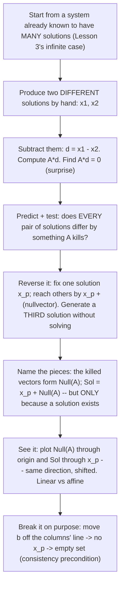

# Insight Discovery Brief — Solution Sets & Homogeneous Systems

Stage 1 artifact of the [Insight Discovery Gate](./INSIGHT_DISCOVERY_GATE.md).
Goal: find and rank the "now it clicks" insights that materially change a
learner's mental model of the solution set of \(A\mathbf{x}=\mathbf{b}\) — not the
definition ("the set of all solutions"), the procedure (row-reduce and read off),
or the routine parameterization of free variables. This is Lesson 5 of the
[course spine](./LINEAR_ALGEBRA_COURSE_SPINE.md); its prerequisite Lessons 3
(Systems) and 4 (Elimination) are built, and I inspected both to fix the entry
knowledge and available continuity below.

> One fact is fixed going in and nothing else: the spine's proposed sentence —
> *"every solution set is one particular solution plus all solutions of
> \(A\mathbf{x}=\mathbf{0}\)"* — was written for **course sequencing**, not
> produced by a completed gate. It enters this brief as **one candidate on equal
> footing** (C1), to be tested, not inherited. Where it lands is an *output* of the
> ranking below.

## What the learner already holds (entry knowledge, not re-taught)

From Lesson 3 (`systems.ts`) the learner has the row picture (each equation a line,
solution at the intersection) and the column picture
(\(A\mathbf{x}=x\mathbf{a}_1+y\mathbf{a}_2\); solving means blending the columns to
reach \(\mathbf{b}\)), the **trichotomy** (no / one / infinitely many), and two
crisp facts: a solution **exists** iff \(\mathbf{b}\) lies in the span of the
columns; it is **unique** iff the columns are independent. The `SystemsExplorer`
even sweeps a parameter \(t\) through the *dependent* case as "many recipes, one
target," pinning the endpoint at \(\mathbf{b}\) while the coefficients slide.

From Lesson 4 (`elimination.ts`) the learner can rewrite a system with reversible
row operations that **preserve the solution set**, drive it to **triangular** form,
back-substitute, and recognize the inconsistent case as a contradiction row
\(0=(\text{nonzero})\).

What the learner does **not** yet have, and what Lesson 5 owns: the homogeneous
system \(A\mathbf{x}=\mathbf{0}\) as an object; the word **free variable**; the
particular-plus-homogeneous **structure**; **affine vs linear** solution sets; and
the connection between the *shape* of the solution set and \(A\mathbf{x}=\mathbf{0}\).
Lesson 3 showed infinitely-many-solutions only as *coincident lines* and a family
\(\{(x,y):x=3-2y\}\); it never decomposed that family.

Notation: column vectors, standard basis \(\mathbf{e}_1,\mathbf{e}_2\); KaTeX only.
\(\operatorname{Null}(A)=\{\mathbf{x}:A\mathbf{x}=\mathbf{0}\}\) is the homogeneous
solution set; \(\operatorname{Sol}(A,\mathbf{b})=\{\mathbf{x}:A\mathbf{x}=\mathbf{b}\}\)
the general one.

---

## 1a. The cognitive obstacle

The conventional presentation teaches the **procedure before the structure**:
row-reduce \(A\mathbf{x}=\mathbf{b}\) to reduced form, split columns into pivot and
free, set each free variable to a parameter, solve the pivot variables, and *then*
re-group the answer as \(\mathbf{x}_p+\text{(homogeneous part)}\). Presented this
way the decomposition arrives as a **cosmetic re-grouping of algebra the learner
already finished** — it looks like a coincidence of that particular reduction, not
a necessity.

Naming the obstacles from the gate's list:

- **Missing mathematical structure (primary).** The load-bearing fact — that the
  whole solution set is a single object (\(\operatorname{Null}(A)\)) *slid* to pass
  through one solution — is *present but hidden* by the procedure-first order. It is
  discovered last, so it reads as appended rather than inevitable.
- **Incorrect prior mental model.** "Infinitely many solutions" is held as a
  *shapeless* "lots of answers," not as a structured set with a definite shape
  (point / line / plane) and dimension. Lesson 3's "coincident lines" reinforces
  "a line happened," not "a translate of the null directions."
- **Missing purpose** (specific to the homogeneous system). \(A\mathbf{x}=\mathbf{0}\)
  looks pointless — its obvious answer is \(\mathbf{0}\) — so the learner has no
  reason to study the one object that actually controls every inhomogeneous system's
  multiplicity.
- **Inability to predict/transfer.** The learner cannot predict the *shape* of a
  solution set, or *why* uniqueness of \(A\mathbf{x}=\mathbf{b}\) is governed by
  \(A\mathbf{x}=\mathbf{0}\), before grinding the reduction.

"Procedural overload" is real but is a *symptom* of the ordering, not the root
obstacle. The difficulty is **structural and representational**, not semantic:
these are abstract objects with no natural real-world goal to import, so I do
**not** manufacture a themed analogy. The representational lever that *does* fit is
a picture of the actual mathematics (below), and the honest "isomorphic
presentation" comparison for 1c is not abstract-vs-story but **procedure-first vs
structure-first ordering of the same mathematics**.

## 1c. Isomorphic presentations — same mathematics, two discovery orders

| | Procedure-first (conventional) | Structure-first (candidate order) |
| --- | --- | --- |
| First move | Row-reduce \(A\mathbf{x}=\mathbf{b}\); classify columns pivot/free | Take a system already known to have many solutions; exhibit **two** actual solutions |
| Middle | Parameterize free variables; solve pivots | Notice their **difference is killed by \(A\)**; test that this always holds |
| Decomposition | Re-group the finished answer into \(\mathbf{x}_p+\text{homog.}\) | The decomposition is **forced**: fix one solution, every other is it plus a null vector |
| Learner's state | Has computed *an* answer; the structure is an afterthought | Predicts the set's shape and that a third solution exists, *before* any formula |

**Unchanged mathematically:** identical solution sets, identical
\(\operatorname{Null}(A)\), identical role of free variables. **Easier to infer in
the structure-first order:** *why* the pieces combine, the set's shape/dimension,
and the consistency caveat (no \(\mathbf{x}_p\) exists ⇒ empty set — visible up
front, not a special case bolted on). **Introduced knowledge:** none external —
this is reorganization, not grounding. **Transfer:** the structure-first habit
("difference of two solutions is homogeneous") is exactly the move behind
uniqueness/injectivity, rank–nullity, and later least-squares residuals, so it is
likely to transfer.

---

## 1b. Candidate insights

Concise sketches; the core fields (initial model, tension, reveal, minimal
derivation, visual/interactive, new prediction, transfer, mechanism) are recorded
for each, with fuller treatment reserved for the strongest in §1d. Candidates that
lean on a **representational** bridge (a picture standing in for the algebra) also
record the conditional grounding fields; no candidate uses a real-world semantic
bridge, so those grounding notes are light and never import an outside property.

### C1. Every solution set is one particular solution plus all of \(\operatorname{Null}(A)\) — *the spine sentence, tested*

- Initial model: infinitely many solutions is a shapeless list you compute.
- Tension: the list is not shapeless — Lesson 3's infinite case was a whole *line*.
  What organizes it, and is it the *same* organization for every \(\mathbf{b}\)?
- Structural reveal: **if the system is consistent**, pick any one solution
  \(\mathbf{x}_p\); then \(\operatorname{Sol}(A,\mathbf{b})=\mathbf{x}_p+\operatorname{Null}(A)\)
  — the single object \(\operatorname{Null}(A)\), translated to pass through
  \(\mathbf{x}_p\). If inconsistent, the set is empty and there is no \(\mathbf{x}_p\).
- Minimal derivation (both inclusions): if \(A\mathbf{x}_h=\mathbf{0}\) then
  \(A(\mathbf{x}_p+\mathbf{x}_h)=\mathbf{b}+\mathbf{0}=\mathbf{b}\) (⊇); if
  \(A\mathbf{x}=\mathbf{b}\) then \(A(\mathbf{x}-\mathbf{x}_p)=\mathbf{0}\), so
  \(\mathbf{x}=\mathbf{x}_p+\mathbf{x}_h\) with \(\mathbf{x}_h\in\operatorname{Null}(A)\) (⊆).
- Visual/interactive: two parallel lines — \(\operatorname{Null}(A)\) through the
  origin, \(\operatorname{Sol}(A,\mathbf{b})\) through \(\mathbf{x}_p\).
- New prediction: knowing \(\operatorname{Null}(A)\) once tells the shape of
  \(\operatorname{Sol}(A,\mathbf{b})\) for *every* consistent \(\mathbf{b}\).
- Transfer: general linear equations \(L\mathbf{x}=\mathbf{b}\), linear ODEs
  (particular + homogeneous), affine subspaces.
- Mechanism: structural compression.
- Audit caution: this is the **formal statement**. Stated bare it is close to a
  definition to memorize — correct but not obviously the *motivating* breakthrough;
  its honest role is decided in §1d, and it must **never** be stated without the
  consistency condition.

### C2. Any two solutions differ by a homogeneous solution — *the engine under C1*

- Initial model: two answers to the same system are just two unrelated points.
- Tension: they cannot be unrelated — both satisfy the same constraints.
- Structural reveal: if \(A\mathbf{x}_1=\mathbf{b}\) and \(A\mathbf{x}_2=\mathbf{b}\)
  then \(A(\mathbf{x}_1-\mathbf{x}_2)=\mathbf{0}\): **every** pair of solutions
  differs by a vector \(A\) sends to \(\mathbf{0}\). So once you have one solution,
  all the others are reachable by adding things in \(\operatorname{Null}(A)\).
- Minimal derivation: subtract the two equations; \(A\) is linear.
- Visual/interactive: pick two solution dots on Lesson 3's solution line; draw the
  arrow between them; verify it lands in \(\operatorname{Null}(A)\) (through origin).
- New prediction: given two solutions, produce a third **without solving** —
  \(\mathbf{x}_1+(\mathbf{x}_1-\mathbf{x}_2)\) is one; the difference generates the
  whole set. This *forces* C1 rather than asserting it.
- Transfer: injectivity ⇔ trivial null space; the residual/normal-equation logic of
  least squares; "solutions of a linear equation form a coset."
- Mechanism: operational + predictive (a process the learner can run and check).

### C3. The solution set is the null space *carried off the origin* — affine vs linear made visible

- Initial model: the homogeneous and inhomogeneous problems are separate exercises.
- Tension: why do their pictures look identical except for position?
- Structural reveal: \(\operatorname{Null}(A)\) is a **subspace** — it contains
  \(\mathbf{0}\), and is closed under sums and scaling (a point/line/plane *through
  the origin*). \(\operatorname{Sol}(A,\mathbf{b})\) is the **same directions**
  rigidly translated so it passes through one solution — an **affine** set, *not* a
  subspace (it misses the origin unless \(\mathbf{b}=\mathbf{0}\)).
- Minimal derivation: closure of \(\operatorname{Null}(A)\) from linearity; the
  translate structure is C1.
- Visual/interactive: overlay the null line (through origin) and the solution line
  (through \(\mathbf{x}_p\)); they are parallel, same slope, offset by \(\mathbf{x}_p\).
- New prediction: the solution set "looks like" the null space but shifted;
  "linear" and "affine" are the with/without-origin versions of one shape.
- Transfer: affine subspaces, cosets, the geometry behind change of variables.
- Mechanism: representational change (+ structural).
- Grounding (representational bridge): the *picture* is the mathematics itself.
  **Preserved:** direction/dimension of the set. **Must be discarded / not
  over-claimed:** the solution line is **not** a subspace — do not let "same shape"
  imply it contains \(\mathbf{0}\) or is closed under scaling. **Return:** read the
  offset off as \(\mathbf{x}_p\) and the directions off as \(\operatorname{Null}(A)\).

### C4. \(A\mathbf{x}=\mathbf{0}\) is the universal uniqueness detector — *this is what it's for*

- Initial model: the homogeneous system is trivial (answer \(\mathbf{0}\)), so why study it?
- Tension: Lesson 3 said uniqueness depends on the columns, per \(\mathbf{b}\); is
  there a single object that settles it once?
- Structural reveal: \(A\mathbf{x}=\mathbf{b}\) has **at most one** solution *for
  every* \(\mathbf{b}\) **iff** \(\operatorname{Null}(A)=\{\mathbf{0}\}\). The
  homogeneous system alone decides uniqueness for the entire family at once — that
  is its purpose.
- Minimal derivation: a nonzero \(\mathbf{x}_h\) gives two solutions
  \(\mathbf{x}_p,\mathbf{x}_p+\mathbf{x}_h\) (from C2/C1); conversely trivial null
  space forces \(\mathbf{x}_1=\mathbf{x}_2\).
- Visual/interactive: shrink \(\operatorname{Null}(A)\) to the single origin point
  and watch every consistent system collapse to one solution.
- New prediction: test uniqueness by solving \(A\mathbf{x}=\mathbf{0}\) *once*,
  ignoring \(\mathbf{b}\); nontrivial null direction ⇒ never unique for any reachable \(\mathbf{b}\).
- Transfer: injectivity, invertibility (with existence, foreshadows L6/L7), rank.
- Mechanism: structural + predictive.

### C5. Two solutions force infinitely many — the "no exactly two" of Lesson 3, now *explained*

- Initial model: a system might have "a couple of" solutions.
- Tension: Lesson 3 asserted the count is never exactly two but did not say why.
- Structural reveal: if \(\mathbf{x}_1\neq\mathbf{x}_2\) both solve it, then
  \(\mathbf{d}=\mathbf{x}_1-\mathbf{x}_2\neq\mathbf{0}\) is null (C2), and
  \(\mathbf{x}_1+t\mathbf{d}\) solves it for **every** real \(t\) — an entire line.
- Minimal derivation: \(A(\mathbf{x}_1+t\mathbf{d})=\mathbf{b}+t\mathbf{0}=\mathbf{b}\).
- Visual/interactive: drop two solution dots; the whole line through them lights up as solutions.
- New prediction: "2 ⇒ ∞" as a certainty; the trichotomy's missing middle explained.
- Transfer: why linear solution sets are never finite-but-plural; convexity/affine combinations.
- Mechanism: predictive (a corollary of C2).

### C6. Free variables are coordinates on the null space; their count is the set's dimension

- Initial model: free variables are "the leftover columns after reducing," a
  bookkeeping artifact.
- Tension: why exactly those, and why does each add a whole dimension of solutions?
- Structural reveal: each free variable is an **independent direction you may move
  without leaving the solution set** — a basis direction of \(\operatorname{Null}(A)\).
  Their number \(=\) dimension of \(\operatorname{Null}(A)\) \(=\) dimension of the
  solution set (foreshadows rank–nullity in L9).
- Minimal derivation: setting one free variable to \(1\) and the rest to \(0\),
  back-substitution yields one null basis vector; independence across free variables
  gives a basis.
- Visual/interactive: a slider per free variable; each sweeps the solution set along
  one null direction.
- New prediction: read the *shape* (point / line / plane) off the count of free
  variables before finishing the arithmetic.
- Transfer: rank–nullity, dimension, parameterizing subspaces.
- Mechanism: structural (connects L4 procedure to structure) + predictive.

### C7. Existence and multiplicity are two independent axes

- Initial model: "how many solutions" is a single question.
- Tension: Lesson 3 kept blurring "is there one?" with "how many?"
- Structural reveal: two independent questions — **existence** (is \(\mathbf{b}\) in
  the column span? — Lesson 3) and **multiplicity** (what is \(\operatorname{Null}(A)\)?).
  Their product gives the whole outcome table: empty (b unreachable), or a translate
  of \(\{\mathbf{0}\}\) / line / plane (b reachable).
- Minimal derivation: consistency is a statement about \(\mathbf{b}\) and the
  columns; multiplicity is a statement about \(\operatorname{Null}(A)\) alone,
  independent of \(\mathbf{b}\).
- Visual/interactive: a 2×2 grid (reachable? × trivial null space?) with the four outcomes.
- New prediction: changing \(\mathbf{b}\) can switch existence on/off but **never**
  changes the shape when a solution does exist.
- Transfer: column space vs null space (L8), rank–nullity, the structure of linear maps.
- Mechanism: structural reorganization. Houses the consistency guardrail explicitly.

### C8. The homogeneous system is *always* consistent — pure multiplicity, existence guaranteed

- Initial model: solving is always a gamble on whether an answer exists.
- Tension: is there a system that can never fail to have a solution?
- Structural reveal: \(A\mathbf{0}=\mathbf{0}\) always, so \(A\mathbf{x}=\mathbf{0}\)
  is **never** inconsistent; its only question is *trivial vs nontrivial*. It
  isolates multiplicity with existence removed.
- Minimal derivation: immediate from linearity.
- Visual/interactive: the origin always sits on the null set; \(\mathbf{b}\) has no such guarantee.
- New prediction: you may always study \(\operatorname{Null}(A)\); "does a
  homogeneous system have a solution?" is a non-question.
- Transfer: why null space is the clean object to define first (L8).
- Mechanism: structural (clarifies why C4/C7 split cleanly).

### C9. The recipe-freedom in the column picture *is* a column dependency (Lesson 3 continuity)

- Initial model: the `SystemsExplorer` \(t\)-sweep ("many recipes, one target") is a display trick.
- Tension: what is the sweep *made of*?
- Structural reveal: the coefficient vectors that all reach \(\mathbf{b}\) differ by
  exactly the null combinations of the columns — i.e. the dependency
  \(x\mathbf{a}_1+y\mathbf{a}_2=\mathbf{0}\). The "many recipes" sweep is literally a
  sweep through \(\operatorname{Null}(A)\).
- Minimal derivation: two recipes reaching \(\mathbf{b}\) differ by a coefficient
  vector mixing the columns to \(\mathbf{0}\) (C2 read in the column picture).
- Visual/interactive: reuse the existing sweep, now labeled as the null direction.
- New prediction: the freedom exists iff the columns are dependent; independent
  columns ⇒ a single recipe.
- Transfer: column space / null space duality (L8).
- Mechanism: representational (recasts an existing interaction) + structural.
- Grounding (representational): **preserved** — the endpoint stays at \(\mathbf{b}\)
  while coefficients vary. **Not over-claimed:** the sweep is of *coefficients*
  (input space), not of outputs; keep the two spaces distinct as Lesson 3 does.

### C10. Row-picture reading: the solution set is the intersection of constraints, shifted off the origin

- Initial model: the row and homogeneous pictures are unrelated line drawings.
- Tension: how does the homogeneous picture relate to the original lines?
- Structural reveal: \(A\mathbf{x}=\mathbf{0}\) uses the **same** constraint lines
  translated to pass through the origin (same normals/slopes, right-hand sides set to
  \(0\)); their intersection is \(\operatorname{Null}(A)\), and the original
  intersection is that set shifted by \(\mathbf{x}_p\).
- Minimal derivation: subtract \(\mathbf{x}_p\) from every point of every constraint.
- Visual/interactive: slide the constraint lines to the origin; the crossing pattern is preserved, only translated.
- New prediction: parallel-but-shifted constraints ⇒ the solution set is a shifted null set (agrees with C3 from the row view).
- Transfer: hyperplanes, affine geometry.
- Mechanism: representational (row-picture twin of C3).

### C11. Consistency is a *precondition*, not part of the decomposition

- Initial model: "solution = particular + homogeneous" applies to any system.
- Tension: what if no particular solution exists?
- Structural reveal: the decomposition presupposes **one** solution exists; when
  \(\mathbf{b}\) is unreachable there is no \(\mathbf{x}_p\), and the set is **empty**
  — not \(\mathbf{0}+\operatorname{Null}(A)\). Consistency (a column-space question)
  must be checked *first*.
- Minimal derivation: the ⊆/⊇ argument of C1 both start "let \(\mathbf{x}_p\) be a
  solution"; with none, the argument does not begin.
- Visual/interactive: Lesson 3's \(\mathbf{b}\) off the columns' line — the recipe
  endpoint slides but never touches \(\mathbf{b}\); nothing to translate.
- New prediction: an inconsistent system has an empty solution set; never write
  \(\mathbf{x}_p+\operatorname{Null}(A)\) for it.
- Transfer: least squares (what to do when consistency fails — L13).
- Mechanism: structural (a correctness guardrail promoted to a candidate).

---

## Rejected as non-insights

- "A solution set is the set of all \(\mathbf{x}\) satisfying the system"
  (definition, not a model change).
- "Row-reduce to reduced form and read off the answer" (procedure/mechanics).
- "Assign a parameter to each free variable and solve" as a *bare* step (procedure;
  becomes an insight only via C6's reframe as null coordinates).
- "Infinitely many solutions look like a line/plane" *without* the shifted-null-space
  structure or the shape↔nullity link (decoration — a picture with no predictive
  content).
- Historical/notation trivia (who named the null space, echelon-form conventions).

---

## 1d. Ranking of the strongest three

Ranked against the gate's criteria — (1) surprise before / inevitability after;
(2) explanatory compression; (3) transfer; (4) mathematical correctness (a gate);
(5) interactive teachability; (6) prerequisite fit; (7) semantic/cognitive leverage;
(8) abstraction return. Here (7) is low for all candidates and (8) is N/A — the
topic is structural/representational with no real-world grounding, so the contest is
decided on (1)–(6), and no order was assumed in advance. I evaluated the spine
sentence (C1) as a genuine contender for #1 and it did not win; the reasoning is
recorded so the outcome is auditable.

**Why C1 (spine) is not the top breakthrough, though it is essential.** Stated on
its own, "solution \(=\) particular \(+\) homogeneous" is the *formal structure* —
correct, compressive, but delivered as a fact to accept. It scores high on
compression and transfer but **low on surprise/inevitability**, because nothing in
it makes the learner *predict* before being told; it is the target the breakthrough
should make inevitable, analogous to how the gate's calibration treats the
"forbidden corner" of implication as formal structure rather than the motivating
model. So C1 is retained as the synthesis the winner produces — not discarded, not
crowned.

### #1 — C2: any two solutions differ by a homogeneous solution

- Surprise/inevitability: subtracting two answers and finding \(A\) annihilates the
  difference is a small, checkable surprise that immediately **forces** C1 — fix one
  solution and every other is it plus a null vector. Highest inevitability of the set.
- Compression: generates C1 (decomposition), C4 (uniqueness detector), C5 (2 ⇒ ∞)
  from one identity.
- Transfer: injectivity ⇔ trivial null space; least-squares residuals; cosets of
  linear maps.
- Correctness: exact and elementary — one subtraction and linearity.
- Teachability: excellent — two concrete solutions on Lesson 3's existing infinite
  system; verify the difference is null by hand.
- Prerequisites: only \(A\mathbf{x}=\mathbf{b}\) and linearity (Lessons 2–3).
- Chosen primary — but its most persuasive delivery **pairs it with C3** (below), so
  the learner both *derives* the structure and *sees* it. The gate explicitly allows
  a candidate that is strongest in combination.

### #2 — C3: the solution set is the null space carried off the origin (affine vs linear)

- Surprise/inevitability: "the two pictures are the same shape, only shifted" makes
  affine-vs-linear self-evident; strong inevitability once C2 supplies the *why*.
- Compression: unifies homogeneous and inhomogeneous into one object plus an offset;
  delivers the "linear vs affine" learning goal directly.
- Transfer: affine subspaces, cosets, later change-of-variables geometry.
- Correctness: exact, provided the representation does **not** imply the solution
  line is a subspace (it is not, unless \(\mathbf{b}=\mathbf{0}\)) — flagged in its
  grounding note.
- Teachability: excellent — two parallel lines, one through the origin.
- Prerequisites: subspace-closure of \(\operatorname{Null}(A)\), which C8 supplies.

### #3 — C6: free variables are coordinates on the null space (dimension of the set)

- Surprise/inevitability: reframes a bookkeeping artifact ("leftover columns") as
  *directions of freedom*; the count predicting the shape is a genuine reorganization.
- Compression: ties the Lesson 4 procedure to the structure and previews rank–nullity
  with one idea.
- Transfer: maximal toward L8 (null space) and L9 (rank–nullity) — the deepest
  onward reach of the three.
- Correctness: exact; each free variable yields one independent null basis vector.
- Teachability: strong — one slider per free variable, each a null direction.
- Prerequisites: needs Lesson 4's reduced/triangular form to *see* the free
  variables; hence ranked third (heaviest prerequisite load), the "deeper connection"
  rather than the opening breakthrough.

**Strong supporting insights (beyond the top three).** **C4** (uniqueness detector)
supplies the homogeneous system's *purpose* and its onward link to invertibility —
a strong candidate that ranks just below the top three because it is more a
uniqueness story than the solution-set breakthrough itself; keep it as the payoff
that answers "why study \(A\mathbf{x}=\mathbf{0}\)." **C7** and **C11** carry the
consistency/existence guardrail and must appear in the lesson regardless of the
winner. **C5** is the most vivid *consequence* to exhibit. **C9/C10** are continuity
recastings (column and row pictures) to be used only where they genuinely sharpen
C2/C3, not for their own sake.

---

## Discovery sequence for the primary insight (C2, delivered with C3)

Discover, don't tell. The learner should reconstruct
\(\operatorname{Sol}(A,\mathbf{b})=\mathbf{x}_p+\operatorname{Null}(A)\) — and see it
as a shifted null space — *before* the formula or the words "homogeneous," "null
space," or "affine" are stated, and starting from a system they already know has
many solutions. A consistent system that genuinely has a line of solutions is the
right stage; whether that is Lesson 3's dependent system or a fresh one is a Stage 3
decision, chosen there for whichever makes the difference-of-solutions move cleanest.

Step detail:

1. **Start where infinity is already known.** Reuse a system the learner has already
   classified as having infinitely many solutions, so the question is *what
   organizes them*, not *are there many*.
2. **Get two solutions.** Produce two distinct solutions concretely (e.g. from a
   one-constraint family, read off two points).
3. **Subtract — the surprise.** Form \(\mathbf{d}=\mathbf{x}_1-\mathbf{x}_2\) and
   compute \(A\mathbf{d}\); it is \(\mathbf{0}\). The difference of two solutions is
   killed by \(A\).
4. **Predict, then test the invariant.** Ask whether *every* pair does this; test
   another pair; establish \(A(\mathbf{x}_1-\mathbf{x}_2)=\mathbf{0}\) from linearity.
5. **Reverse the move (inevitability).** Fix one solution \(\mathbf{x}_p\); reach any
   other by adding a killed vector. Have the learner **produce a third solution
   without solving** — the predict-not-recall core.
6. **Name and state — with the precondition.** The killed vectors are
   \(\operatorname{Null}(A)\); \(\operatorname{Sol}(A,\mathbf{b})=\mathbf{x}_p+\operatorname{Null}(A)\).
   State plainly that this holds **only because a solution exists** (consistency).
7. **See it (C3).** Plot \(\operatorname{Null}(A)\) through the origin and the
   solution set through \(\mathbf{x}_p\): same direction, shifted — linear vs affine.
8. **Break it on purpose (C11).** Move \(\mathbf{b}\) off the columns' line: no
   \(\mathbf{x}_p\), empty set. The decomposition is withheld exactly when
   consistency fails.

**Exit test (predict, not recall).**
(a) Given **two** solutions of some \(A\mathbf{x}=\mathbf{b}\), produce a **third**
without solving, and state the shape of the full set — tests C2 directly.
(b) Given \(\operatorname{Null}(A)\) for a matrix, predict the **shape** of
\(\operatorname{Sol}(A,\mathbf{b})\) for a *consistent* \(\mathbf{b}\) and whether it
is unique — tests C1/C3/C4 as prediction.
(c) Given an **inconsistent** system, the learner must **refuse** to write
\(\mathbf{x}_p+\operatorname{Null}(A)\) and identify the set as empty — tests the C11
consistency guardrail, a question a memorized formula answers wrongly.

---

## Stage 1 verdict

At least one candidate (**C2**, delivered with **C3**) is a genuine model-changing
insight: mathematically exact, teachable from the learner's existing knowledge,
ranked #1 with a discover-don't-tell sequence and a predict-not-recall exit test,
and it makes the decomposition **inevitable** rather than appended. The spine
sentence (C1) was tested on equal footing and placed as the **formal synthesis the
breakthrough produces**, not the breakthrough itself; the consistency precondition
(C11) and the existence-vs-multiplicity split (C7) are mandatory in any downstream
lesson. No candidate relies on real-world grounding, so the abstraction-return
requirement is N/A.

**Gate result (Stage 1): PASS.**

Primary insight (to carry into a Stage 2 contract, *not started here*): *Any two
solutions of a consistent \(A\mathbf{x}=\mathbf{b}\) differ by a solution of
\(A\mathbf{x}=\mathbf{0}\); so, once one solution exists, the entire solution set is
that solution translated by all of \(\operatorname{Null}(A)\) — the null space carried
off the origin — and the set is empty exactly when no solution exists.*

**Do not advance to Stage 2.** No Approved Insight Contract, lesson plan, guided
scene, explorer, exercises, tests, or code are produced by this brief; the only
artifact is this file.
